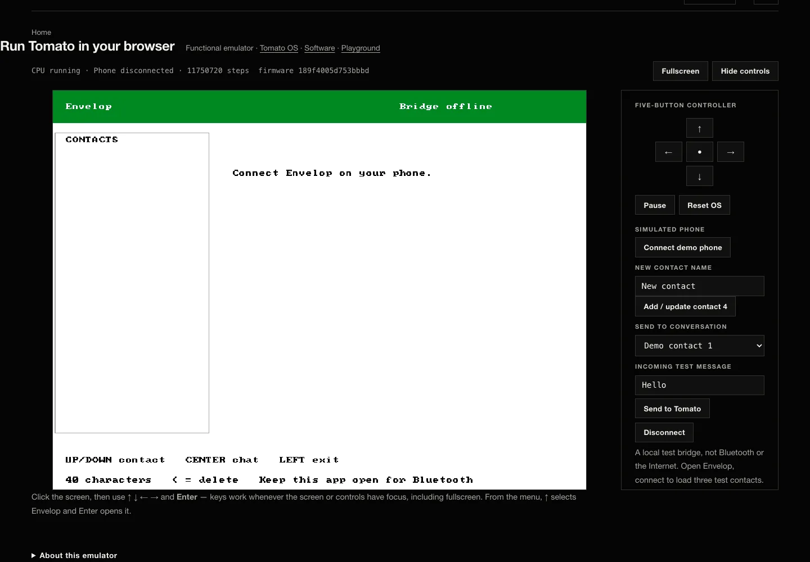

<h1 align="center">Tomato</h1>
<p align="center"><strong>A 32-bit computer architecture built from copper to browser.</strong></p>
<p align="center">
  <a href="https://github.com/tmarhguy/tomato/actions/workflows/documentation.yml"></a>
  <a href="docs/status.md"></a>
  <a href="docs/architecture.md"></a>
  <a href="docs/isa/README.md"></a>
  <a href="LICENSE"></a>
</p>

<p align="center">
  
  
</p>
<p align="center"><em>Left: the physically assembled discrete ALU slice. Right: Tomato OS on the complete FPGA machine.</em></p>

<p align="center">
  
</p>
<p align="center"><em>Envelop inside the current OS image in the browser CPU emulator. This is virtual execution with simulated peripherals, not an FPGA or online-bridge result.</em></p>

Tomato is one architecture expressed at several layers:

- a physically built **74xx Dual-LUT ALU slice**;
- a complete **FPGA Tomato** on the Nexys A7-100T, capable of booting Tomato OS;
- **TOMATO OS v3.0**, written in Tomato assembly, with 14 menu entries;
- a functional **Virtual Tomato** ISA emulator in the browser;
- editable Digital schematics, KiCad boards, RTL, an assembler, and focused verification.

The complete discrete computer remains a goal. The assembled ALU slice is real
hardware, but it is not a complete discrete machine. The complete running
computer in this repository is the FPGA implementation.

**Explore:** [architecture](docs/architecture.md) ·
[current status](docs/status.md) ·
[Tomato OS](software/os/README.md) ·
[ISA](docs/isa/README.md) ·
[compute](docs/compute.md) ·
[documentation index](docs/README.md) ·
[project site](https://tomato.tmarhguy.com/)

## What runs now

| Layer | Current, repository-backed statement |
|---|---|
| Architecture | 32-bit datapath and instruction word |
| ALU | Two LUT3 functions feed an adder: `f(a,b,c) + g(a,b,c) + carry` |
| ISA | **61 instructions plus NOP, 62 burned rows** in a 512-row control ROM |
| Registers | **256 × 32-bit**, eight banks of 32; `r0` is hardwired to zero |
| FPGA | 100 MHz board input; **6.25 MHz** default CPU and 25 MHz pixel clocks; 90 MHz is only the nextpnr timing target |
| OS | **TOMATO OS v3.0**, with 14 menu entries including Envelop |
| Browser | Functional ISA-level emulation; not cycle-accurate RTL or physical execution |

For evidence paths and the distinction between source-complete,
hardware-dependent, and deployed behavior, use
[`docs/status.md`](docs/status.md). Historical journal entries can describe
earlier designs and counts; they do not override current sources.

## See it, run it, inspect it

### Browser

Open the [Tomato site](https://tomato.tmarhguy.com/) and choose the Virtual
Tomato experience. Its checked-in OS image is generated from the assembly and
control data in this repository. Results there must be labeled virtual.

### Local RTL simulation

Icarus Verilog can boot the OS and print its framebuffer without an FPGA:

```bash
make -C hardware/fpga/core os
```

Run the focused core regression:

```bash
make -C hardware/fpga/core test
```

These commands prove simulation behavior, not a currently programmed board.

### Assemble a Tomato program

```bash
python3 software/assembler.py software/asm/counter.s \
  -o /tmp/counter.mem --list
python3 software/assembler.py --selftest
```

The assembler reads the burned ISA and pseudo-instruction CSVs rather than
carrying a private opcode table.

### FPGA build

The default flow is Yosys → nextpnr-xilinx → Project X-Ray. An optional Linux
Vivado batch target is also provided. Building a bitstream does not prove that
a board is currently programmed.

```bash
make fpga-setup
make fpga
```

Programming is intentionally a separate, hardware-changing action; see
[`hardware/fpga/README.md`](hardware/fpga/README.md).

## Proof across the stack

<table>
  <tr>
    <td width="33%"></td>
    <td width="33%"></td>
    <td width="33%"></td>
  </tr>
</table>

- **Physical scope:** [`hardware/kicad/boards/07_alu/`](hardware/kicad/boards/07_alu/)
- **Editable logic:** [`hardware/digital/`](hardware/digital/)
- **Complete FPGA machine:** [`hardware/fpga/core/`](hardware/fpga/core/)
- **Machine software:** [`software/`](software/)
- **Verification:** [`verification/`](verification/)
- **Evidence and asset provenance:** [`docs/assets.md`](docs/assets.md)

## Envelop and compute

Envelop is a separate messaging project. Its Tomato-side client and bounded
compute executor are linked into Tomato OS; its user clients, backend, and
nearby bridge live outside this repository.

The intended hardware message path is:

`person → Envelop web app → backend queue → nearby verified bridge → Envelop in Tomato OS → Tomato CPU → labeled reply`

Source in a repository is not evidence that a bridge is active or that a reply
ran on hardware. Virtual previews are explicit, separate, and labeled. See
[`docs/compute.md`](docs/compute.md) for the current boundary.

## Repository map

| Path | Purpose |
|---|---|
| [`docs/`](docs/) | Canonical guides, ISA contracts, and historical journal |
| [`hardware/digital/`](hardware/digital/) | Editable architecture schematics |
| [`hardware/kicad/`](hardware/kicad/) | PCB designs and assembly records |
| [`hardware/fpga/`](hardware/fpga/) | Complete machine, board harness, and simulation |
| [`software/`](software/) | Assembler, programs, and Tomato OS |
| [`microcode/`](microcode/) | Control-ROM packaging |
| [`verification/`](verification/) | ALU and implementation checks |
| [`web/`](web/) | Project site and browser emulator |

## Documentation and history

Start with [`docs/README.md`](docs/README.md). It separates current canonical
guidance from the dated [`docs/log/`](docs/log/) engineering record. The
journal preserves decisions, wrong turns, and superseded designs as history;
use the [current journal index](docs/log/README.md) to navigate it.

Documentation authority and terminology are defined in
[`docs/documentation-policy.md`](docs/documentation-policy.md). When prose and
executable sources disagree, that policy determines which source wins.

## License and author

Tomato is licensed under the [Solderpad Hardware License 2.1](LICENSE).
Architecture and project by **Tyrone Marhguy**, Computer Engineering ’28,
University of Pennsylvania.

[Contributing](CONTRIBUTING.md) · [security](SECURITY.md) ·
[citation](CITATION.cff) · [third-party notices](THIRD_PARTY_NOTICES.md)
