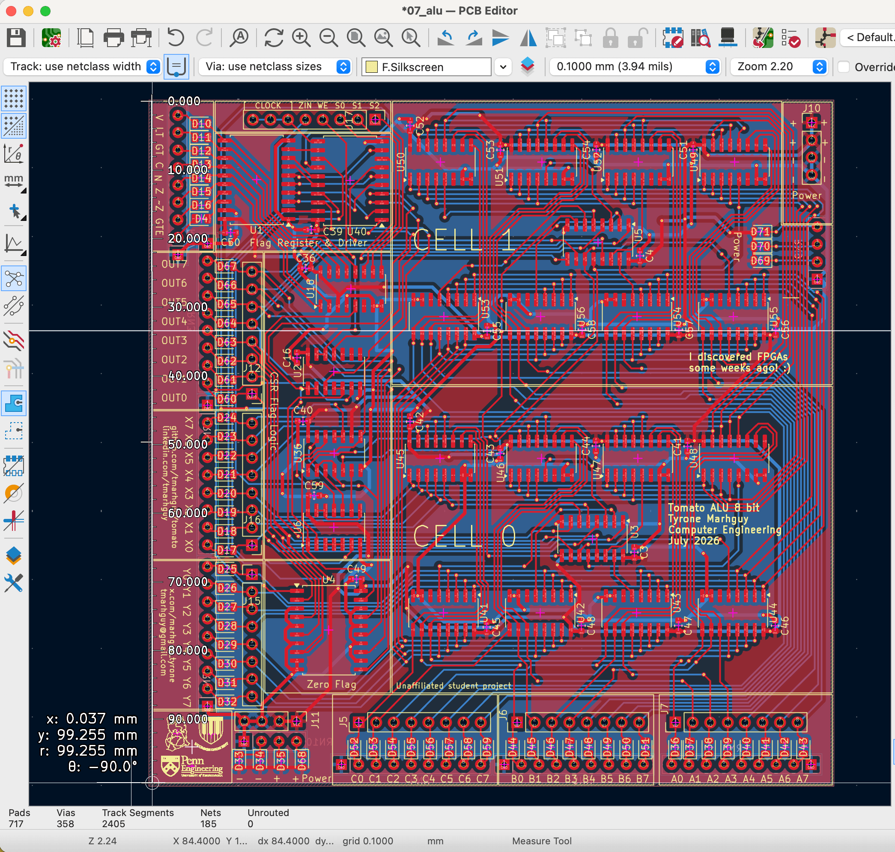

# Tomato


A homebrew **32-bit** CPU built from 74xx logic — not a soft core, not an FPGA toy first. Tomato started at the transistor and kept climbing: gates, slices, boards, a CPU that can *speak* dozens of foreign ISAs while remaining one physical machine underneath.

The ALU is **two independent 3-input LUTs plus a ripple adder per 4-bit nibble**: `out = f(a,b,c) + g(a,b,c) + cin`. A **512-row opcode ROM** fans out into modular control boards that sit next to the hardware they actually drive. The [design journal](docs/log/) is where the arguments live; this README is the map.

<p align="center">
  
</p>

The dual-LUT slice is **routed and fab-ready** on KiCad board `07_alu` — see the [07 ALU board doc](hardware/kicad/boards/07_alu/README.md) for schematics, layout figures, and connector pinout.

---

## Why Tomato

Tomato is intentionally a **build log machine**. Every odd choice is documented somewhere in [docs/log/](docs/log/) — what was tried, what broke routing, what was too slow on the bench, what got deleted to recover PCB real estate. If you love computers because you like *how* they are built, not just what they run, that journal is the real entry point. Start with [Welcome to Tomato 32](docs/log/Welcome%20to%20Tomato%2032.md).

**The ALU is the center.** Most CPUs hide a small ALU behind a conventional encoding. Tomato flipped it: the bit-slice is a programmable logic plane — half a million theoretical `(lutA, lutB, csel)` programs per slice — with an adder wired through it. The opcode ROM names a *practical* subset. Matching every LUT pair to its own instruction was never the goal; [dark silicon](docs/log/2026-07-31%20-%20Falling%20back%20to%2032b.md) stays in the catalogs until a program actually needs it.

**Building beats spreadsheets.** Instruction width, bank counts, and profile matrices are fun to expand. Copper, EEPROMs, and weeks at the wire wrap are not. When a wider word width doubled the explanation burden without doubling silicon on the bench, the answer was to [fall back to 32b](docs/log/2026-07-31%20-%20Falling%20back%20to%2032b.md) and ship what already routes.

**Decode travels with the datapath.** One central microcode blob is elegant in simulation and miserable on a breadboard — shift controls leaving the ALU board, flag writes leaving memory control, PC fields split across ROM bytes. Tomato split decode into [small boards](docs/log/2026-06-16%20-%20Microcode%20Control%20Modularization.md) with local EEPROMs so ribbons stay short and each slice can be brought up alone.

**Clever, but only at the right scale.** Naïve `shift → add` multiply is easy and takes forever — “slower than I am when half-asleep.” A Wallace tree is fast and eats the board. The answer was a [priority-encoder loop](docs/log/2026-06-15%20-%20Multiplication%20and%20Division.md) that jumps over zero bits. Same story for the display: K-map gates were *correct* and physically absurd; one shared ROM plus latches made sharing invisible ([segment display log](docs/log/2026-06-19%20-%20ALU%20segment%20display%20design.md)).

**One machine, many dialects.** [60+ ISA profiles](docs/isa/profiles.csv) map RV32, MIPS, x86, Z80, and others onto native opcodes at assembly level. The hardware stays Tomato; the mnemonics are costumes.

---

## Table of Contents

- [Why Tomato](#why-tomato)
- [Architecture at a glance](#architecture-at-a-glance)
- [Source of truth](#source-of-truth)
- [Repository map](#repository-map)
- [Key hardware modules](#key-hardware-modules)
- [ISA and opcodes](#isa-and-opcodes)
- [Run in Digital](#run-in-digital)
- [Project status](#project-status)
- [Documentation index](#documentation-index)
- [Conventions](#conventions)
- [License](#license)
- [Author](#author)

---

## Architecture at a glance

### 32-bit instruction word

Fetch, IR, ALU datapath, and register operands are **32-bit**. The instruction layout is tight: **9-bit opcode**, four **5-bit** register indices, and a **3-bit** bank select fill the word — with low bits often double-booked as immediate or branch/jump mode overlay depending on the mnemonic.

Typical field packing (ALU register ops):

| Field | Bits | Slice | Role |
|-------|------|-------|------|
| Opcode | 9 | `[31:23]` | Indexes microcode ROM (**512 rows**) |
| `rd` | 5 | `[22:18]` | Destination (5-bit index within bank) |
| `rA` | 5 | `[17:13]` | ALU operand A |
| `rB` | 5 | `[12:8]` | ALU operand B |
| `rC` | 5 | `[7:3]` | ALU operand C |
| `BANK` | 3 | `[2:0]` | Bank select (8 banks → 32 GPR × 8 = 256 regs) |

Each operand is **5 + 3b bank** in address terms: a 5-bit GPR index within the bank selected by `BANK[2:0]`.

```
[31:23]  opcode
[22:18]  rd
[17:13]  rA
[12: 8]  rB / imm-high
[ 7: 3]  rC
[ 2: 0]  BANK (+ mode bits for branches/jumps)
```

**Overlay encodings** (same slices reinterpreted by microcode):

| Mnemonic class | Overlay | Notes |
|----------------|---------|-------|
| Branches | `[2:0]` = `COND` | Taken when selected flag is set |
| Jumps / calls | `[0]` abs vs PC-rel | `0` = absolute target in low bits; `1` = PC + offset |
| `ADDI` / imm12 | `[12:8]` imm-high | Immediate high nibble; low pieces in other fields |
| Load / store offset | `[12:8]` imm-high | Address = `rA` + sign-extended immediate |

Native ALU syntax (conceptual):

```asm
opcode  rd, rA, rB, rC    ; rd = f(a,b,c) + g(a,b,c) + cin
```

See [opcode-map.csv](docs/opcode-map.csv) for mnemonic layout and [Load Store Pipeline Analysis](docs/log/2026-06-11%20-%20Load%20Store%20Pipeline%20Analysis.md) for the 48-bit microcode control fields.

### Register file

**32 GPR × 8 banks = 256** addressable registers. Not the full theoretical address space the LUT catalog could name — enough for real programs and modular board bring-up without widening the datapath.

### Datapath and control

```
Program Counter ──► Memory ──► Instruction Register (32b)
                                      │
          ┌───────────────────────────┼───────────────────────────┐
          │                           │                           │
          ▼                           ▼                           ▼
   Register File 3R1W            alu-control              mem-io / mem-bus
          │                           │                           │
          ▼                           ▼                           ▼
   Dual-LUT ALU 32b ◄──────── (drives)                   Memory ◄── pc-control ──► PC
          │
          ▼
   Writeback Mux ─────────────────► Register File

   IR ──► shift-mul-control ──► ALU
```

Control is split into small boards (each with a local EEPROM) that decode the same opcode from the IR. See [Microcode Control Modularization](docs/log/2026-06-16%20-%20Microcode%20Control%20Modularization.md). For Mermaid diagrams in Cursor, install extension `bierner.markdown-mermaid` (listed in [.vscode/extensions.json](.vscode/extensions.json)).

### ALU bit-slice

```
alu_out = adder( f(a, b, c), g(a, b, c), carry_in )
```

Per bit-slice there are **524,288** theoretical `(lutA, lutB, csel)` combinations; the **512-row** opcode ROM exposes what programs need today. The LUT3 feeds the adder directly — [no mode mux at the end of the slice](docs/log/2026-06-27%20-%20Elimination%20of%20Mode%20Multiplexers.md) — logic rides the arithmetic path instead of racing it. Carry select uses **74251** muxes where **74151** cost routing and drive strength ([74251 note](docs/log/2026-06-26%20-%20ALU%20-%20Redesign%20with%2074251.md)). Catalog: [docs/isa/alu8.csv](docs/isa/alu8.csv).

---

## Source of truth

| Layer | Authority | Consumers |
|-------|-----------|-----------|
| Logic / timing | [hardware/digital/modules/*.dig](hardware/digital/modules/) | KiCad bring-up, Verilog export |
| Opcode mnemonics | [docs/opcode-map.csv](docs/opcode-map.csv) | Assembly reference, ROM programming |
| Microcode fields | [docs/isa/opcodes.csv](docs/isa/opcodes.csv) | Per-board ROM extraction |
| LUT programs | [docs/isa/alu8.csv](docs/isa/alu8.csv) | ALU primitive catalog |
| Control ROM images | [microcode/*.hex](microcode/) | Digital control boards |
| Physical PCB | [hardware/kicad/boards/](hardware/kicad/boards/) | Fab / assembly |
| ALU sign-off | [verification/](verification/) | Digital export → `rtl/*.v` → formal + directed + UVM |

**Policy:** Digital `.dig` schematics are editable source. Exported Verilog in `verification/rtl/` is **read-only** — copy from Digital, then run sign-off.

---

## Repository map

```
tomato/
├── docs/
│   ├── isa/              # opcodes, alu8 catalog, profiles
│   ├── log/              # Design journal (Obsidian vault)
│   └── alu/              # LaTeX ALU reference docs
├── hardware/
│   ├── digital/modules/  # Digital schematics (.dig) — logic source of truth
│   ├── kicad/boards/     # Numbered PCB designs (01_alu … 08_display)
│   ├── fpga/             # Vivado projects (FSM, hex display)
│   └── verilog/          # Export policy (read-only netlists)
├── microcode/            # Per-board control ROM hex images
├── verification/         # ALU harness: formal, directed, UVM
├── firmware/             # Stub — not started
├── software/             # Stub — not started
└── media/                # Screenshots, PCB photos, schematic exports
```

---

## Key hardware modules

### Digital schematics

| Module | Role |
|--------|------|
| [main.dig](hardware/digital/modules/main.dig) | Top-level CPU integration |
| [alu-32b-final.dig](hardware/digital/modules/alu-32b-final.dig) | 32-bit ALU |
| [alu-control.dig](hardware/digital/modules/alu-control.dig), [ir-reg-control.dig](hardware/digital/modules/ir-reg-control.dig), [mem-bus-control.dig](hardware/digital/modules/mem-bus-control.dig), [mem-io-control.dig](hardware/digital/modules/mem-io-control.dig), [pc-control.dig](hardware/digital/modules/pc-control.dig), [shift-mul-control.dig](hardware/digital/modules/shift-mul-control.dig) | Modular decode ROM boards |
| [register.dig](hardware/digital/modules/register.dig), [program-counter.dig](hardware/digital/modules/program-counter.dig), [mul-div.dig](hardware/digital/modules/mul-div.dig) | Datapath slices |
| [alu-display-control.dig](hardware/digital/modules/alu-display-control.dig) | 32-digit hex display for bring-up |

ALU verification ladder: `alu-1b-final` → 2x `alu-4b` → 4x `alu-8b` → `alu-32b-final`.

<p align="center">
  
</p>

<p align="center"><em>KiCad <code>07_alu</code> — two 4-bit cells, flag logic, opcode/operand LED bring-up (<a href="hardware/kicad/boards/07_alu/README.md">full ALU board doc</a>).</em></p>

### KiCad boards

| Board | Path | Role | Status |
|-------|------|------|--------|
| 01 | [01_alu/](hardware/kicad/boards/01_alu/) | Early ALU experiments | Historical |
| 02 | [02_shift_encoder/](hardware/kicad/boards/02_shift_encoder/) | Shift encoder + mul-div control | In design |
| 03 | [03_memory/](hardware/kicad/boards/03_memory/) | Memory, byte-lane decoder, VGA | In design |
| 04 | [04_register/](hardware/kicad/boards/04_register/) | Register file, IR | In design |
| 05 | [05_program_counter/](hardware/kicad/boards/05_program_counter/) | PC, stack pointer | In design |
| 06 | [06_data_bus/](hardware/kicad/boards/06_data_bus/) | Data bus, wb_mux, bus arbitration | In design |
| 07 | [07_alu/](hardware/kicad/boards/07_alu/) | Dual-LUT ALU PCB — **[board doc + figures](hardware/kicad/boards/07_alu/README.md)** | Routed, fab-ready |
| 08 | [08_alu_fsm/](hardware/kicad/boards/08_alu_fsm/), [08_display/](hardware/kicad/boards/08_display/) | FSM bring-up, display | In design |

---

## ISA and opcodes

**512-row opcode ROM** — enough for native ALU ops, load/store, branches, shifts, and mul/div without empty decode fanout.

| Resource | Path | Role |
|----------|------|------|
| Mnemonic cheat sheet | [docs/opcode-map.csv](docs/opcode-map.csv) | 32-bit encoding, syntax, groups |
| Microcode catalog | [docs/isa/opcodes.csv](docs/isa/opcodes.csv) | Control fields per ROM address |
| ALU programs | [docs/isa/alu8.csv](docs/isa/alu8.csv) | Practical 8-bit LUT programs |
| ISA profiles | [docs/isa/profiles.csv](docs/isa/profiles.csv) | 60+ external ISAs mapped at assembly level |

Profiles (RV32, MIPS, x86, …) are assembly-level mappings onto native opcodes — not separate hardware ISAs.

---

## Run in Digital

1. Install [Digital](https://github.com/hneemann/Digital) by Heinrich Hneemann — download `Digital.zip` from [Releases](https://github.com/hneemann/Digital/releases), unpack, run `Digital.jar` (Java required).
2. In Digital: **File → Open** → `hardware/digital/modules/main.dig`.
3. Press **Run** (or single-step with the clock controls).

Other entry points: [alu-32b-final.dig](hardware/digital/modules/alu-32b-final.dig) (ALU only), [alu-display-control.dig](hardware/digital/modules/alu-display-control.dig) (display bring-up). ALU sign-off: [verification/README.md](verification/README.md).

---

## Project status

**As of July 2026**

| Area | Status | Notes |
|------|--------|-------|
| Architecture | **32-bit** | See [Falling back to 32b](docs/log/2026-07-31%20-%20Falling%20back%20to%2032b.md) |
| ALU PCB (`07_alu`) | Routed, fab-ready | [Board doc + media](hardware/kicad/boards/07_alu/README.md) |
| Opcode ROM | 512 rows (planned) | Down from 1024-row budget |
| Register file | 32 GPR × 8 banks | 256 addressable registers |
| `main.dig` + control boards | In progress | Modular decode on bench |
| ALU verification | Passing on 32b export | [verification/](verification/) |
| ALU ASIC characterization | Sky130 HD mapped | [6531 µm², 512 cells, ~210 MHz est.](verification/synthesis/README.md) |
| Peripheral PCBs | In design | Register, memory, PC, data bus |
| Firmware / software | Not started | README stubs only |

**Bring-up direction:** Build peripherals and modular control boards — not a throwaway FSM that becomes Tomato anyway. The ALU PCB can be exercised through `alu-display-control` and simulation vectors while fab runs ([lingering catch](docs/log/2026-07-31%20-%20The%20lingering%20thoughts.md)).

---

## Documentation index

### Architecture decisions

| Log | Topic |
|-----|-------|
| [Falling back to 32b](docs/log/2026-07-31%20-%20Falling%20back%20to%2032b.md) | Revert to 32-bit — current direction |
| [The lingering catch](docs/log/2026-07-31%20-%20The%20lingering%20thoughts.md) | FSM vs full control unit bring-up |
| [Microcode Control Modularization](docs/log/2026-06-16%20-%20Microcode%20Control%20Modularization.md) | Split decode boards |
| [Elimination of Mode Multiplexers](docs/log/2026-06-27%20-%20Elimination%20of%20Mode%20Multiplexers.md) | LUT3 pass-through into adder |

### Datapath deep dives

| Log | Topic |
|-----|-------|
| [Multiplication and Division](docs/log/2026-06-15%20-%20Multiplication%20and%20Division.md) | Priority-encoder mul/div |
| [Load Store Pipeline Analysis](docs/log/2026-06-11%20-%20Load%20Store%20Pipeline%20Analysis.md) | Microcode bit fields, cycle timing |
| [ALU segment display design](docs/log/2026-06-19%20-%20ALU%20segment%20display%20design.md) | 32-digit multiplexed display |
| [ALU — Redesign with 74251](docs/log/2026-06-26%20-%20ALU%20-%20Redesign%20with%2074251.md) | Carry mux routing tradeoff |

### Subsystem READMEs

| README | Content |
|--------|---------|
| [verification/README.md](verification/README.md) | ALU sign-off harness |
| [hardware/kicad/README.md](hardware/kicad/README.md) | KiCad overview |
| [07_alu board doc](hardware/kicad/boards/07_alu/README.md) | Dual-LUT ALU PCB — schematics, layout, pinout |
| [hardware/digital/README.md](hardware/digital/README.md) | Digital simulation |
| [microcode/README.md](microcode/README.md) | Control ROM packing |

### Full design journal

[docs/log/](docs/log/) — build log from discrete gates through multi-ISA coverage. Origin: [Welcome to Tomato 32](docs/log/Welcome%20to%20Tomato%2032.md).

---

## Conventions

| Change type | Workflow |
|-------------|----------|
| Architecture / tradeoff | New entry in `docs/log/` — the default way decisions get made |
| Opcode / mnemonic | Update `opcode-map.csv` and microcode hex |
| Microcode fields | Edit `docs/isa/opcodes.csv`, extract per-board ROM images |
| Logic / timing | Edit Digital `.dig` → export Verilog → `make signoff` |
| Physical board | KiCad in `hardware/kicad/boards/` |

---

## License

Tomato is licensed under **[Solderpad Hardware License 2.1](LICENSE)** (SHL-2.1,
`Apache-2.0 WITH SHL-2.1`) — open hardware + RTL + scripts + docs. You may
study, build, fork, and commercialize **with attribution**; do not strip
copyright or present the dual-LUT architecture as unrelated work.

| Document | Content |
|----------|---------|
| [LICENSE](LICENSE) | SHL-2.1 terms |
| [LICENSE-APACHE](LICENSE-APACHE) | Apache 2.0 (incorporated under SHL-2.1) |
| [NOTICE](NOTICE) | Copyright and attribution |
| [THIRD_PARTY_NOTICES.md](THIRD_PARTY_NOTICES.md) | PDK and tool licenses |

**Architecture credit:** Tomato dual-LUT bit-slice datapath — Tyrone Marhguy /
Tomato project.

---

## Author

**Tyrone Marhguy** — Computer Engineering '28, [University of Pennsylvania](https://www.upenn.edu/)

Tomato is a solo hardware architecture project: discrete-logic CPU design, KiCad PCBs, Digital simulation, and a public build log. Questions, collabs, or “why did you route it that way?” — reach out.

| | |
|---|---|
| Email | [tmarhguy@gmail.com](mailto:tmarhguy@gmail.com) · [tmarhguy@engineering.upenn.edu](mailto:tmarhguy@engineering.upenn.edu) |
| Twitter | [@marhguy_tyrone](https://twitter.com/marhguy_tyrone) |
| Instagram | [@tmarhguy](https://instagram.com/tmarhguy) |
| Substack | [@tmarhguy](https://substack.com/@tmarhguy) |
| GitHub | [@tmarhguy](https://github.com/tmarhguy) |


