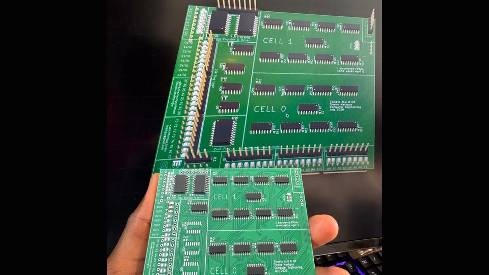
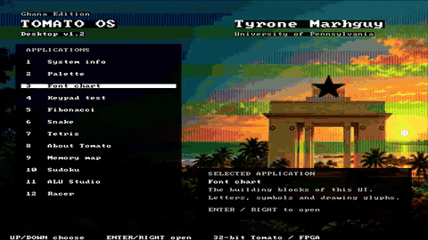

<h1 align="center">Tomato</h1>
<p align="center"><strong>A 32-bit computer architecture built from copper to browser.</strong></p>
<p align="center">
  <a href="https://github.com/tmarhguy/tomato/actions/workflows/documentation.yml"></a>
  <a href="docs/status.md"></a>
  <a href="docs/architecture.md"></a>
  <a href="docs/isa/README.md"></a>
  <a href="LICENSE"></a>
</p>

<p align="center">
  
  <a href="web/assets/os/tomato-demo-os.mp4"></a>
</p>
<p align="center"><em>Physical ALU slice · <a href="web/assets/os/tomato-demo-os.mp4">FPGA Tomato OS recording (4× preview)</a></em></p>

The animation is a sped-up preview of the complete FPGA machine.

Tomato is one architecture expressed at several layers:

- a fabricated and soldered **8-bit 74xx Dual-LUT ALU slice**;
- a complete **FPGA Tomato** on the Nexys A7-100T that boots the
  assembly-written Tomato OS;
- **TOMATO OS v3.0**, written in Tomato assembly, with 14 menu entries;
- a functional **Virtual Tomato** ISA emulator in the browser;
- editable Digital schematics, KiCad boards, RTL, an assembler, and focused verification.

The complete discrete computer remains a goal. The assembled ALU slice is real
hardware, but it is not a complete discrete machine. The complete running
computer in this repository is the FPGA implementation.

**Explore:** [architecture](docs/architecture.md) ·
[current status](docs/status.md) ·
[Tomato OS](software/os/README.md) ·
[ISA](docs/isa/README.md) ·
[compute](docs/compute.md) ·
[documentation index](docs/README.md) ·
[project site](https://tomato.tmarhguy.com/)

## Architecture at a glance

These curated diagrams explain the system; the
[interactive GitDiagram](https://gitdiagram.com/tmarhguy/tomato) provides a
zoomable, generated map of the public repository's default branch.

**Visual entry points:** [interactive repository map](https://gitdiagram.com/tmarhguy/tomato) ·
[architecture guide](docs/architecture.md) ·
[web architecture](https://tomato.tmarhguy.com/architecture.html) ·
[ISA reference](https://tomato.tmarhguy.com/isa.html) ·
[run Virtual Tomato](https://tomato.tmarhguy.com/virtual.html)

### One architecture, several realizations

<picture>
  <source media="(prefers-color-scheme: dark)" srcset="web/assets/gallery/diagrams/system-realizations-dark.svg">
  
</picture>

The four realization boxes are deliberately separate. The assembled discrete
hardware proves the ALU slice; the FPGA is the complete machine; Icarus runs
the RTL locally; and the browser is a functional ISA emulator.
[Diagram source](docs/diagrams/system-realizations.mmd).

### From source files to runnable artifacts

<picture>
  <source media="(prefers-color-scheme: dark)" srcset="web/assets/gallery/diagrams/artifact-pipeline-dark.svg">
  
</picture>

The generated FPGA burn and browser image share the same OS and control data.
They do not share an execution engine: the FPGA and Icarus execute Verilog,
while `tomato-cpu.js` mirrors the ISA-level behavior in JavaScript.
[Diagram source](docs/diagrams/artifact-pipeline.mmd).

### Inside FPGA Tomato

<picture>
  <source media="(prefers-color-scheme: dark)" srcset="web/assets/gallery/diagrams/fpga-datapath-dark.svg">
  
</picture>

The board harness owns clocks, pins, keypad debounce, glyph rendering, DVI, and
seven-segment output. The machine core exposes those facilities as ports and
memory-mapped windows, keeping board-specific wiring outside the CPU RTL.
[Diagram source](docs/diagrams/fpga-datapath.mmd).

### Authority and state boundaries

- **Edit:** Digital schematics, ISA CSVs, assembly sources, and FPGA/browser
  implementation source.
- **Regenerate:** `.mem` images, `rtl/burn/*.vh`, `tomato-os.bin`, and
  bitstreams. These are derived artifacts, not design authorities.
- **Runtime state:** FPGA RAM, registers, framebuffer, compiler, radio mailbox,
  and the browser machine are volatile. Reset or reload restores the compiled
  image; this repository has no application database.
- **External systems:** Envelop clients, durable queues, hosted services, and
  the nearby bridge belong to the separate Envelop project.

## What runs now

| Layer | Current, repository-backed statement |
|---|---|
| Architecture | 32-bit datapath and instruction word |
| ALU | Custom three-source Dual-LUT ALU: two LUT3 functions feed an adder, `f(a,b,c) + g(a,b,c) + carry` |
| ISA | **61 instructions plus NOP, 62 burned rows** in a 512-row control ROM |
| Register array | **256 × 32-bit physical entries**, addressed as 3 bank bits plus a 5-bit register field; `r0` is hardwired to zero |
| FPGA | 100 MHz board input; **6.25 MHz** default CPU and 25 MHz pixel clocks; 90 MHz is only the nextpnr timing target |
| OS | The complete FPGA computer boots assembly-written **TOMATO OS v3.0**, with 14 menu entries including Envelop |
| Browser | Functional ISA-level emulation; not cycle-accurate RTL or physical execution |
| Hardware compiler | Counter FSM searches all **65,536 LUT pairs** for one fixed A/B/C/carry/output example; a hit verifies that example, not a general function |
| ALU verification | A **130-billion-vector** 32-bit ALU run is recorded and its harness is reproducible; the full run log is not checked in |

The 256-entry FPGA array is an implementation and ISA choice, not a documented
Artix-7 capacity limit. Its asynchronous 3-read/1-write shape maps to
distributed RAM. The historical 32,768-register proposal instead used mirrored
external SRAM plus a seven-bit superbank and `SETBANK2`; neither the superbank
nor that instruction exists in the current FPGA RTL and burned ISA.

For evidence paths and the distinction between source-complete,
hardware-dependent, and deployed behavior, use
[`docs/status.md`](docs/status.md). Historical journal entries can describe
earlier designs and counts; they do not override current sources.

## See it, run it, inspect it

### Browser

Open the [Tomato site](https://tomato.tmarhguy.com/) and choose the Virtual
Tomato experience. Its checked-in OS image is generated from the assembly and
control data in this repository. Results there must be labeled virtual.

<p align="center">
  <a href="https://tomato.tmarhguy.com/virtual.html"></a>
</p>
<p align="center"><strong><a href="https://tomato.tmarhguy.com/virtual.html">Play with Virtual Tomato →</a></strong><br><em>Functional ISA emulation with simulated peripherals—not FPGA or discrete-hardware execution.</em></p>

### Local RTL simulation

Icarus Verilog can boot the OS and print its framebuffer without an FPGA:

```bash
make -C hardware/fpga/core os
```

Run the focused core regression:

```bash
make -C hardware/fpga/core test
```

These commands prove simulation behavior, not a currently programmed board.

### Assemble a Tomato program

```bash
python3 software/assembler.py software/asm/counter.s \
  -o /tmp/counter.mem --list
python3 software/assembler.py --selftest
```

The assembler reads the burned ISA and pseudo-instruction CSVs rather than
carrying a private opcode table.

### FPGA build

The default flow is Yosys → nextpnr-xilinx → Project X-Ray. An optional Linux
Vivado batch target is also provided. Building a bitstream does not prove that
a board is currently programmed.

```bash
make fpga-setup
make fpga
```

Programming is intentionally a separate, hardware-changing action; see
[`hardware/fpga/README.md`](hardware/fpga/README.md).

## Proof across the stack

<table>
  <tr>
    <td width="33%" align="center" valign="middle"></td>
    <td width="33%" align="center" valign="middle"></td>
    <td width="33%" align="center" valign="middle"></td>
  </tr>
</table>

- **Physical scope:** [`hardware/kicad/boards/07_alu/`](hardware/kicad/boards/07_alu/)
- **Editable logic:** [`hardware/digital/`](hardware/digital/)
- **Complete FPGA machine:** [`hardware/fpga/core/`](hardware/fpga/core/)
- **Machine software:** [`software/`](software/)
- **Verification:** [`verification/`](verification/)
- **Evidence and asset provenance:** [`docs/assets.md`](docs/assets.md)

## Envelop and compute

Envelop is a separate messaging project. Its Tomato-side client and bounded
compute executor are linked into Tomato OS; its user clients, backend, and
nearby bridge live outside this repository.

The intended hardware message path is:

`person → Envelop web app → backend queue → nearby verified bridge → Envelop in Tomato OS → Tomato CPU → labeled reply`

<picture>
  <source media="(prefers-color-scheme: dark)" srcset="web/assets/gallery/diagrams/envelop-boundary-dark.svg">
  
</picture>

Source in a repository is not evidence that a bridge is active or that a reply
ran on hardware. Bridge software is available in the separate Envelop project,
but a nearby authenticated bridge and completed FPGA job require live evidence.
Virtual previews are explicit, separate, and labeled. See
[`docs/compute.md`](docs/compute.md) for the current boundary.
[Diagram source](docs/diagrams/envelop-boundary.mmd).

## Repository map

| Path | Purpose |
|---|---|
| [`docs/`](docs/) | Canonical guides, ISA contracts, and historical journal |
| [`hardware/digital/`](hardware/digital/) | Editable architecture schematics |
| [`hardware/kicad/`](hardware/kicad/) | PCB designs and assembly records |
| [`hardware/fpga/`](hardware/fpga/) | Complete machine, board harness, and simulation |
| [`software/`](software/) | Assembler, programs, and Tomato OS |
| [`microcode/`](microcode/) | Control-ROM packaging |
| [`verification/`](verification/) | ALU and implementation checks |
| [`web/`](web/) | Project site and browser emulator |

## Documentation and history

Start with [`docs/README.md`](docs/README.md). It separates current canonical
guidance from the dated [`docs/log/`](docs/log/) engineering record. The
journal preserves decisions, wrong turns, and superseded designs as history;
use the [current journal index](docs/log/README.md) to navigate it.

Documentation authority and terminology are defined in
[`docs/documentation-policy.md`](docs/documentation-policy.md). When prose and
executable sources disagree, that policy determines which source wins.

## License and author

Tomato is licensed under the [Solderpad Hardware License 2.1](LICENSE).
Architecture and project by **Tyrone Marhguy**, Computer Engineering ’28,
University of Pennsylvania.

[Contributing](CONTRIBUTING.md) · [security](SECURITY.md) ·
[citation](CITATION.cff) · [third-party notices](THIRD_PARTY_NOTICES.md)
