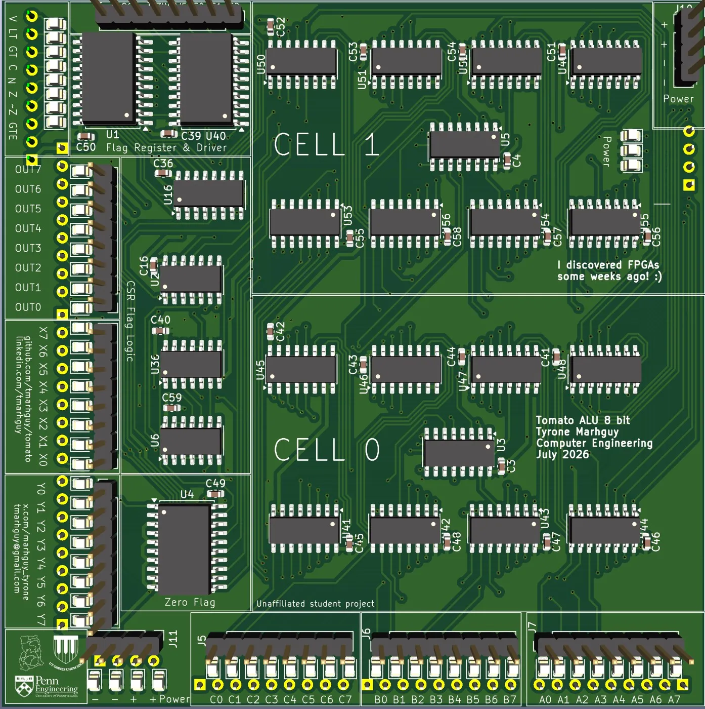
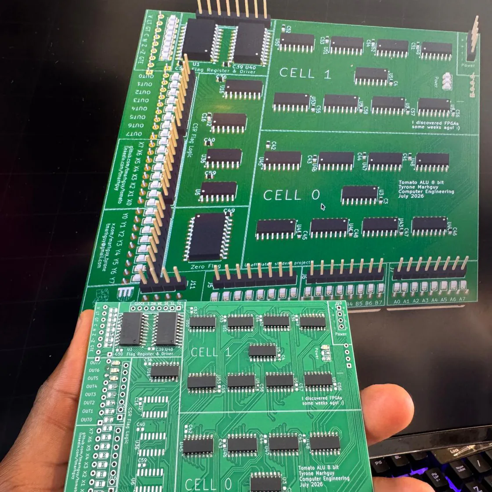
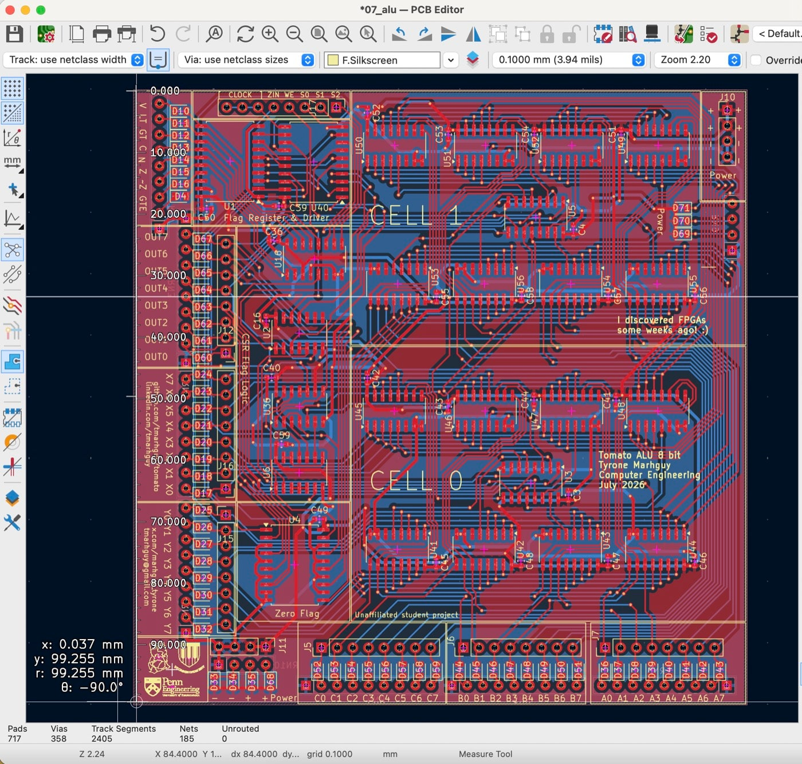
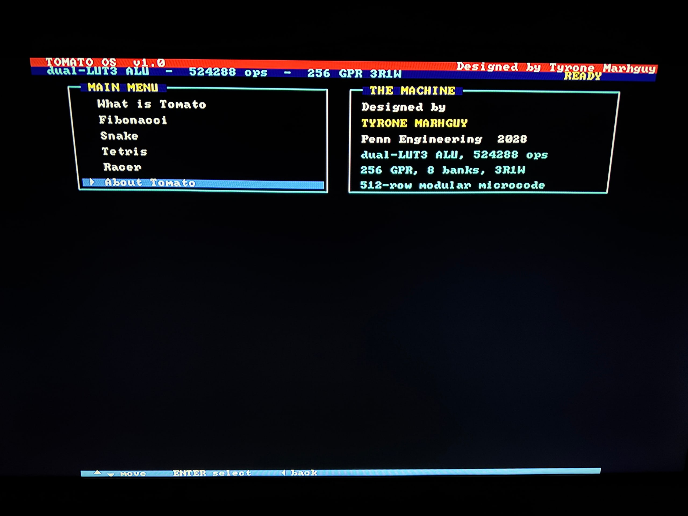
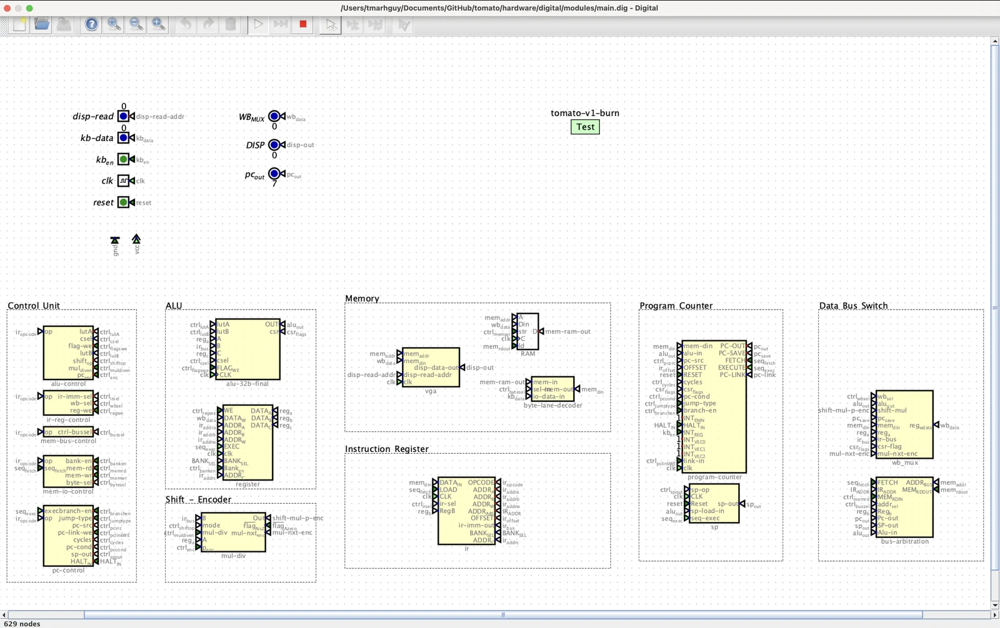

<h1 align="center">Tomato - 32b Discrete Computer</h1>
<p align="center"><strong>32-bit Computer. The oddest machine built in a dorm.</strong></p>

   

   

**Before Tomato, there was the transistor board.**
Same story, same narrative—but this time, it had to be smarter.

<p align="center"><em>By Tyrone Marhguy · Computer Engineering ’28</em></p>

Before Tomato, there was an [8-bit ALU](https://alu.tmarhguy.com) built from roughly **3,488 discrete CMOS transistors** across a massive **270×270 mm** board. It was a beast in its own right: capable of **19 operations**, sporting **5 flags**, and power hungry.

But for a solo dorm-room project, the manufacturing costs ballooned exponentially, so I needed a pivot. Same story, same narrative—but this time, it had to be smarter. **Welcome to Tomato!**

The paper: **[tomato.tmarhguy.com](https://tomato.tmarhguy.com/)** · the site: **[web/README](web/README.md)** · the vault: **[docs/log/](docs/log/)**.

<table align="center">
  <tr>
    <td align="center" width="33%"></td>
    <td align="center" width="33%"></td>
    <td align="center" width="33%"></td>
  </tr>
</table>
<p align="center"><em>Lot 07 Dual-LUT PCB · board · on the iron · top copper · <a href="https://tomato.tmarhguy.com/software.html">software</a> · <a href="https://tomato.tmarhguy.com/playground.html">playground</a></em></p>

Tomato grew as a revolution: a **65k operational space** (**~3,500×** operation increase than the earlier 8bit board for less area) from a **[dual-LUT3](<docs/log/2026-06-27%20-%20Elimination%20of%20Mode%20Multiplexers.md>)** fused into an adder, built for linear scale. The ALU is **two independent 3-input LUTs plus a ripple adder per 4-bit nibble**: `out = f(a,b,c) + g(a,b,c) + cin`. A **[512-row opcode ROM](docs/isa/tomato.v1.csv)** fans out into modular control boards that sit next to the hardware they actually drive. The [design journal](docs/log/) is where the arguments live; this README is the map.

The dual-LUT slice is **[on the iron](<docs/log/2026-08-18 - First Phase of Assembly.md>)** — muxes and adders down on one [`07_alu`](hardware/kicad/boards/07_alu/README.md) board.

*See log: [First Phase of Assembly](<docs/log/2026-08-18 - First Phase of Assembly.md>)*

| Metric | Transistor Board (Previous) | Tomato ALU (Current) | Optimization Achieved |
|--------|-----------------------------|----------------------|-----------------------|
| **Architecture** | 8-bit | 32-bit | 4× datapath width |
| **Logic Base** | ~3,488 discrete CMOS transistors | Dual-LUT3 + Ripple Adder | Massive density increase |
| **Ops Space** | 19 operations | ~65k combinations | **~3,500×** expansion |
| **Footprint** | Single massive 270×270 mm PCB | Modular 4-bit slice boards | Better routing, linear cost |
| **Control** | Fixed decode logic | 512-row microcode ROM | Programmable ISA overlay |

---

## It boots

Tomato runs as synthesizable Verilog on a Nexys A7, paints a 640×480 monitor, and boots an OS written in Tomato assembly.

**[Tomato OS](https://tomato.tmarhguy.com/software.html)** is an 80×60 text desktop: menu, machine card, and six screens — *What is Tomato*, *Fibonacci*, *Snake*, *Tetris*, *Racer*, and *About Tomato*. Five buttons are the keyboard. Every instruction that draws the screen is a row of [tomato.v1.csv](docs/isa/tomato.v1.csv).

<p align="center">
  
</p>
<p align="center"><em>Tomato OS on the glass · D-pad is the keyboard · <a href="https://tomato.tmarhguy.com/software.html">software sheet</a></em></p>

| Layer     | What it is                                                | Where                                                        |
| --------- | --------------------------------------------------------- | ------------------------------------------------------------ |
| CPU       | Multi-cycle Von Neumann core, 6.25 MHz on Artix-7          | [hardware/fpga/core/rtl/](hardware/fpga/core/rtl/)            |
| ISA       | 51 burned opcodes out of 512 ROM rows                      | [docs/isa/tomato.v1.csv](docs/isa/tomato.v1.csv)              |
| Vocabulary| 19 pseudo-instructions that expand into burned opcodes      | [docs/isa/tomato.v1.pseudo.csv](docs/isa/tomato.v1.pseudo.csv) |
| Assembler | Two-pass, driven by those CSVs                             | [software/assembler.py](software/assembler.py)                |
| OS        | Desktop, menu, and four games, in Tomato assembly          | [software/os/tomato_os.s](software/os/tomato_os.s)            |
| Tests     | 20 module benches plus boot, menu, and games end-to-end    | `make -C hardware/fpga/core test`                             |
| Paper     | Architecture · ISA · Software                              | [tomato.tmarhguy.com](https://tomato.tmarhguy.com/)           |

---

## Why Tomato

Tomato is intentionally a **[build log machine](<docs/log/Welcome to Tomato 32.md>)**. Every odd choice is documented somewhere in [docs/log/](docs/log/) — what was tried, what broke routing, what was too slow on the bench, what got deleted to recover PCB area. If you love computers because you like *how* they are built, not just what they run, that journal is the real entry point. Start with [Welcome to Tomato 32](<docs/log/Welcome%20to%20Tomato%2032.md>).

**The ALU is the center.** Most CPUs hide a small ALU behind a conventional encoding. Tomato flipped it: the bit-slice is a programmable logic plane — half a million theoretical `(lutA, lutB, csel)` programs per slice — with an adder wired through it. The opcode ROM names a *practical* subset. Matching every LUT pair to its own instruction was never the goal; [dark silicon](<docs/log/2026-07-31%20-%20Falling%20back%20to%2032b.md>) stays in the catalogs until a program actually needs it.

**Building beats spreadsheets.** Instruction width, bank counts, and profile matrices are fun to expand. Copper, EEPROMs, and weeks at the wire wrap are not. When a wider word width doubled the explanation burden without doubling silicon on the bench, the answer was to [fall back to 32b](<docs/log/2026-07-31%20-%20Falling%20back%20to%2032b.md>) and ship what already routes.

**Decode travels with the datapath.** One central microcode blob is elegant in simulation and miserable on a breadboard — shift controls leaving the ALU board, flag writes leaving memory control, PC fields split across ROM bytes. Tomato split decode into [small boards](<docs/log/2026-06-16%20-%20Microcode%20Control%20Modularization.md>) with local EEPROMs so ribbons stay short and each slice can be brought up alone.

**Clever, but only at the right scale.** Naïve `shift → add` multiply is easy and takes forever — “slower than I am when half-asleep.” A Wallace tree is fast and eats the board. The answer was a [priority-encoder loop](<docs/log/2026-06-15%20-%20Multiplication%20and%20Division.md>) that jumps over zero bits. Same story for the display: K-map gates were *correct* and physically absurd; one shared ROM plus latches made sharing invisible ([segment display log](<docs/log/2026-06-19%20-%20ALU%20segment%20display%20design.md>)).

**ISA as a wire.** Tomato is a [parametric datapath](<docs/log/2026-08-15%20-%20ISA%20as%20a%20Wire.md>): the overlay word, immediate box, and dual-LUT absorb a foreign encoding as a map onto muxes — not an emulator. A casual family count sits around **~37** ([profiles.csv](docs/isa/profiles.csv) has more rows because variants are listed separately). The integer is not a ceiling; it moves as the datapath does.

---

## Table of Contents

- [Why Tomato](#why-tomato)
- [It boots](#it-boots)
- [Architecture at a glance](#architecture-at-a-glance)
- [Source of truth](#source-of-truth)
- [Repository map](#repository-map)
- [Key hardware modules](#key-hardware-modules)
- [ISA and opcodes](#isa-and-opcodes)
- [Run in Digital](#run-in-digital)
- [Project status](#project-status)
- [Documentation index](#documentation-index)
- [Conventions](#conventions)
- [License](#license)
- [Author](#author)

The paper is **[tomato.tmarhguy.com](https://tomato.tmarhguy.com/)**. Site notes: **[web/README](web/README.md)**.

---

## Architecture at a glance

### 32-bit instruction word

Fetch, IR, ALU datapath, and register operands are **32-bit**. The instruction layout is tight: **9-bit opcode**, four **5-bit** register indices, and a **3-bit** bank select fill the word — with low bits often double-booked as immediate or branch/jump mode overlay depending on the mnemonic.

Typical field packing (ALU register ops):

| Field    | Bits | Slice       | Role                                            |
| -------- | ---- | ----------- | ----------------------------------------------- |
| Opcode   | 9    | `[31:23]` | Indexes microcode ROM (**512 rows**)      |
| `rd`   | 5    | `[22:18]` | Destination (5-bit index within bank)           |
| `rA`   | 5    | `[17:13]` | ALU operand A                                   |
| `rB`   | 5    | `[12:8]`  | ALU operand B                                   |
| `rC`   | 5    | `[7:3]`   | ALU operand C                                   |
| `BANK` | 3    | `[2:0]`   | Bank select (8 banks → 32 GPR × 8 = 256 regs) |

Each operand is **5 + 3b bank** in address terms: a 5-bit GPR index within the bank selected by `BANK[2:0]`.

```
[31:23]  opcode
[22:18]  rd
[17:13]  rA
[12: 8]  rB
[ 7: 3]  rC
[ 2: 0]  BANK (+ mode bits for branches/jumps)
```

**Overlay encodings** (same slices reinterpreted by microcode):

| Mnemonic class      | Overlay               | Notes                                                    |
| ------------------- | --------------------- | -------------------------------------------------------- |
| Branches            | `[2:0]` = `COND`  | Taken when selected flag is set                          |
| Jumps / calls       | `[0]` abs vs PC-rel | `0` = absolute target in low bits; `1` = PC + offset |
| `ADDI` / imm12    | `[12:8]` imm-high   | Immediate high nibble; low pieces in other fields        |
| Load / store offset | `[12:8]` imm-high   | Address =`rA` + sign-extended immediate                |

Native ALU syntax (conceptual):

```asm
opcode  rd, rA, rB, rC    ; rd = f(a,b,c) + g(a,b,c) + cin
```

See [opcode-map.csv](docs/opcode-map.csv) for mnemonic layout and [Load Store Pipeline Analysis](<docs/log/2026-06-11%20-%20Load%20Store%20Pipeline%20Analysis.md>) for the 48-bit microcode control fields.

### Register file

**32 GPR × 8 banks = 256** addressable registers. Not the full theoretical address space the LUT catalog could name — enough for real programs and modular board bring-up without widening the datapath.

### Datapath and control

```
Program Counter ──► Memory ──► Instruction Register (32b)
                                      │
          ┌───────────────────────────┼───────────────────────────┐
          │                           │                           │
          ▼                           ▼                           ▼
   Register File 3R1W            alu-control              mem-io / mem-bus
          │                           │                           │
          ▼                           ▼                           ▼
   Dual-LUT ALU 32b ◄──────── (drives)                   Memory ◄── pc-control ──► PC
          │
          ▼
   Writeback Mux ─────────────────► Register File

   IR ──► shift-mul-control ──► ALU
```

Control is split into small boards (each with a local EEPROM) that decode the same opcode from the IR. See [Microcode Control Modularization](<docs/log/2026-06-16%20-%20Microcode%20Control%20Modularization.md>). For Mermaid diagrams in Cursor, install extension `bierner.markdown-mermaid` (listed in [.vscode/extensions.json](.vscode/extensions.json)).

### ALU bit-slice

```
alu_out = adder( f(a, b, c), g(a, b, c), carry_in )
```

Per bit-slice there are **524,288** theoretical `(lutA, lutB, csel)` combinations; the **512-row** opcode ROM exposes what programs need today. The LUT3 feeds the adder directly — [no mode mux at the end of the slice](<docs/log/2026-06-27%20-%20Elimination%20of%20Mode%20Multiplexers.md>) — logic rides the arithmetic path instead of racing it. Carry select uses **74251** muxes where **74151** cost routing and drive strength ([74251 note](<docs/log/2026-06-26%20-%20ALU%20-%20Redesign%20with%2074251.md>)). Authority: [docs/isa/tomato.v1.csv](docs/isa/tomato.v1.csv).

---

## Source of truth

| Layer              | Authority                                                  | Consumers                                               |
| ------------------ | ---------------------------------------------------------- | ------------------------------------------------------- |
| Logic / timing     | [hardware/digital/modules/*.dig](hardware/digital/modules/) | KiCad bring-up, Verilog export                          |
| Opcode mnemonics   | [docs/opcode-map.csv](docs/opcode-map.csv)                  | Assembly reference, ROM programming                     |
| Microcode fields   | [docs/isa/tomato.v1.csv](docs/isa/tomato.v1.csv)            | Single ISA / ROM authority                              |
| LUT programs       | [docs/isa/lut.csv](docs/isa/lut.csv)                        | ALU primitive catalog                                   |
| Control ROM images | [microcode/*.hex](microcode/)                               | Digital control boards                                  |
| Physical PCB       | [hardware/kicad/boards/](hardware/kicad/boards/)            | Fab / assembly                                          |
| ALU sign-off       | [verification/](verification/)                              | Digital export →`rtl/*.v` → formal + directed + UVM |

**Policy:** Digital `.dig` schematics are editable source. Exported Verilog in `verification/rtl/` is **read-only** — copy from Digital, then run sign-off.

---

## Repository map

```
tomato/
├── docs/
│   ├── isa/              # opcodes, alu8 catalog, profiles
│   ├── log/              # Design journal (Obsidian vault)
│   └── alu/              # LaTeX ALU reference docs
├── hardware/
│   ├── digital/modules/  # Digital schematics (.dig) — logic source of truth
│   ├── kicad/boards/     # Numbered PCB designs (01_alu … 08_display)
│   ├── fpga/             # Nexys A7 — core (CPU + Tomato OS), hdmi_test (DVI PMOD)
│   └── verilog/          # Export policy (read-only netlists)
├── microcode/            # Per-board control ROM hex images
├── verification/         # ALU harness: formal, directed, UVM
├── firmware/             # Stub — not started
├── software/             # Stub — not started
└── web/                  # Broadsheet — tomato.tmarhguy.com (assets/ = all plates)
```

---

## Key hardware modules

### Digital schematics

| Module                                                                                                                                                                                                                                                                                                                                                                                               | Role                              |
| ---------------------------------------------------------------------------------------------------------------------------------------------------------------------------------------------------------------------------------------------------------------------------------------------------------------------------------------------------------------------------------------------------- | --------------------------------- |
| [main.dig](hardware/digital/modules/main.dig)                                                                                                                                                                                                                                                                                                                                                         | Top-level CPU integration         |
| [alu-32b-final.dig](hardware/digital/modules/alu-32b-final.dig)                                                                                                                                                                                                                                                                                                                                       | 32-bit ALU                        |
| [alu-control.dig](hardware/digital/modules/alu-control.dig), [ir-reg-control.dig](hardware/digital/modules/ir-reg-control.dig), [mem-bus-control.dig](hardware/digital/modules/mem-bus-control.dig), [mem-io-control.dig](hardware/digital/modules/mem-io-control.dig), [pc-control.dig](hardware/digital/modules/pc-control.dig), [shift-mul-control.dig](hardware/digital/modules/shift-mul-control.dig) | Modular decode ROM boards         |
| [register.dig](hardware/digital/modules/register.dig), [program-counter.dig](hardware/digital/modules/program-counter.dig), [mul-div.dig](hardware/digital/modules/mul-div.dig)                                                                                                                                                                                                                         | Datapath slices                   |
| [alu-display-control.dig](hardware/digital/modules/alu-display-control.dig)                                                                                                                                                                                                                                                                                                                           | 32-digit hex display for bring-up |

<p align="center">
  
</p>
<p align="center"><em>main.dig · tomato-v1-burn · control, ALU, memory, IR, PC, and bus on one sheet · <a href="hardware/digital/modules/main.dig">open in Digital</a></em></p>

ALU verification ladder: `alu-1b-final` → 2x `alu-4b` → 4x `alu-8b` → `alu-32b-final`.

### KiCad boards

| Board | Path                                                                                             | Role                                                                                      | Status            |
| ----- | ------------------------------------------------------------------------------------------------ | ----------------------------------------------------------------------------------------- | ----------------- |
| 01    | [01_alu/](hardware/kicad/boards/01_alu/)                                                          | Early ALU experiments                                                                     | Historical        |
| 02    | [02_shift_encoder/](hardware/kicad/boards/02_shift_encoder/)                                      | Shift encoder + mul-div control                                                           | In design         |
| 03    | [03_memory/](hardware/kicad/boards/03_memory/)                                                    | Memory, byte-lane decoder, VGA                                                            | In design         |
| 04    | [04_register/](hardware/kicad/boards/04_register/)                                                | Register file, IR                                                                         | In design         |
| 05    | [05_program_counter/](hardware/kicad/boards/05_program_counter/)                                  | PC, stack pointer                                                                         | In design         |
| 06    | [06_data_bus/](hardware/kicad/boards/06_data_bus/)                                                | Data bus, wb_mux, bus arbitration                                                         | In design         |
| 07    | [07_alu/](hardware/kicad/boards/07_alu/)                                                          | Dual-LUT ALU PCB —**[board doc + figures](hardware/kicad/boards/07_alu/README.md)** | Populating        |
| 08    | [08_alu_fsm/](hardware/kicad/boards/08_alu_fsm/), [08_display/](hardware/kicad/boards/08_display/) | FSM bring-up, display                                                                     | In design         |

<p align="center">
  
  
</p>
<p align="center"><em>Lot 07 · left: board render · right: routed top copper · two 4-bit cells, flag logic, opcode/operand LED bring-up (<a href="hardware/kicad/boards/07_alu/README.md">full ALU board doc</a>)</em></p>

---

## ISA and opcodes

**512-row opcode ROM** — enough for native ALU ops, load/store, branches, shifts, and mul/div without empty decode fanout. See **[ISA as a Wire](<docs/log/2026-08-15%20-%20ISA%20as%20a%20Wire.md>)**.

| Resource             | Path                                            | Role                                                                                        |
| -------------------- | ----------------------------------------------- | ------------------------------------------------------------------------------------------- |
| Mnemonic cheat sheet | [docs/opcode-map.csv](docs/opcode-map.csv)       | 32-bit encoding, syntax, groups                                                             |
| Microcode catalog    | [docs/isa/tomato.v1.csv](docs/isa/tomato.v1.csv) | **Source of truth** — burn opcodes + ROM map                                         |
| ALU programs         | [docs/isa/lut.csv](docs/isa/lut.csv)             | LUT primitive catalog                                                                       |
| ISA maps             | [docs/isa/profiles.csv](docs/isa/profiles.csv)   | Parametric maps onto native opcodes.**~37 families**; CSV rows are the sweep database |

An ISA is a mapping from an external encoding onto the overlay word, immediate box, and dual-LUT — not a separate hardware ISA, and not an interpreter.

---

## Run in Digital

1. Install [Digital](https://github.com/hneemann/Digital) by Heinrich Hneemann — download `Digital.zip` from [Releases](https://github.com/hneemann/Digital/releases), unpack, run `Digital.jar` (Java required).
2. In Digital: **File → Open** → `hardware/digital/modules/main.dig`.
3. Press **Run** (or single-step with the clock controls).

Other entry points: [alu-32b-final.dig](hardware/digital/modules/alu-32b-final.dig) (ALU only), [alu-display-control.dig](hardware/digital/modules/alu-display-control.dig) (display bring-up). ALU sign-off: [verification/README.md](verification/README.md).

---

## Project status

**As of July 2026**

| Area                          | Status                | Notes                                                                             |
| ----------------------------- | --------------------- | --------------------------------------------------------------------------------- |
| Architecture                  | **32-bit**      | See[Falling back to 32b](<docs/log/2026-07-31%20-%20Falling%20back%20to%2032b.md>) |
| ALU PCB (`07_alu`)          | Populating            | [First phase of assembly](<docs/log/2026-08-18 - First Phase of Assembly.md>)      |
| Opcode ROM                    | 512 rows (planned)    | Down from 1024-row budget                                                         |
| Register file                 | 32 GPR × 8 banks     | 256 addressable registers                                                         |
| `main.dig` + control boards | In progress           | Modular decode on bench                                                           |
| ALU verification              | Passing on 32b export | [verification/](verification/)                                                     |
| ALU ASIC characterization     | Sky130 HD mapped      | [6531 µm², 512 cells, ~210 MHz est.](verification/synthesis/README.md)           |
| Peripheral PCBs               | In design             | Register, memory, PC, data bus                                                    |
| Firmware / software           | Not started           | README stubs only                                                                 |

**Bring-up direction:** Build peripherals and modular control boards — not a throwaway FSM that becomes Tomato anyway. The ALU PCB can be exercised through `alu-display-control` and simulation vectors while fab runs ([lingering catch](<docs/log/2026-07-31%20-%20The%20lingering%20thoughts.md>)).

---

## Documentation index

### Architecture decisions

| Log                                                                                                      | Topic                                             |
| -------------------------------------------------------------------------------------------------------- | ------------------------------------------------- |
| [Web Optimization](<docs/log/2026-08-16%20-%20Web%20Optimization.md>) | What actually ships in the paper’s 3D |
| [ISA as a Wire](<docs/log/2026-08-15%20-%20ISA%20as%20a%20Wire.md>)                                       | Parametric datapath — ISA is a first-class input |
| [Falling back to 32b](<docs/log/2026-07-31%20-%20Falling%20back%20to%2032b.md>)                           | Revert to 32-bit — current direction             |
| [The lingering catch](<docs/log/2026-07-31%20-%20The%20lingering%20thoughts.md>)                          | FSM vs full control unit bring-up                 |
| [Microcode Control Modularization](<docs/log/2026-06-16%20-%20Microcode%20Control%20Modularization.md>)   | Split decode boards                               |
| [Elimination of Mode Multiplexers](<docs/log/2026-06-27%20-%20Elimination%20of%20Mode%20Multiplexers.md>) | LUT3 pass-through into adder                      |

### Datapath deep dives

| Log                                                                                              | Topic                              |
| ------------------------------------------------------------------------------------------------ | ---------------------------------- |
| [Multiplication and Division](<docs/log/2026-06-15%20-%20Multiplication%20and%20Division.md>)     | Priority-encoder mul/div           |
| [Load Store Pipeline Analysis](<docs/log/2026-06-11%20-%20Load%20Store%20Pipeline%20Analysis.md>) | Microcode bit fields, cycle timing |
| [ALU segment display design](<docs/log/2026-06-19%20-%20ALU%20segment%20display%20design.md>)     | 32-digit multiplexed display       |
| [ALU — Redesign with 74251](<docs/log/2026-06-26%20-%20ALU%20-%20Redesign%20with%2074251.md>)    | Carry mux routing tradeoff         |

### Subsystem READMEs

| README                                                    | Content                                        |
| --------------------------------------------------------- | ---------------------------------------------- |
| [verification/README.md](verification/README.md)           | ALU sign-off harness                           |
| [hardware/kicad/README.md](hardware/kicad/README.md)       | KiCad overview                                 |
| [07_alu board doc](hardware/kicad/boards/07_alu/README.md) | Dual-LUT ALU PCB — schematics, layout, pinout |
| [hardware/digital/README.md](hardware/digital/README.md)   | Digital simulation                             |
| [hardware/fpga/README.md](hardware/fpga/README.md)       | Nexys A7 — Tomato OS on a monitor, open-source flow |
| [microcode/README.md](microcode/README.md)                 | Control ROM packing                            |

### Full design journal

[docs/log/](docs/log/) — build log from discrete gates through the parametric datapath. Origin: [Welcome to Tomato 32](<docs/log/Welcome%20to%20Tomato%2032.md>). The paper: [web/README](web/README.md).

---

## Conventions

| Change type             | Workflow                                                                              |
| ----------------------- | ------------------------------------------------------------------------------------- |
| Architecture / tradeoff | New entry in`docs/log/` — the default way decisions get made                       |
| Opcode / mnemonic       | Update`opcode-map.csv` and microcode hex                                            |
| Microcode fields        | Edit`docs/isa/tomato.v1.csv`, then `python3 tools/gen_microcode_v1.py --pack-rom` |
| Logic / timing          | Edit Digital`.dig` → export Verilog → `make signoff`                            |
| Physical board          | KiCad in`hardware/kicad/boards/`                                                    |

---

## License

Tomato is licensed under **[Solderpad Hardware License 2.1](LICENSE)** (SHL-2.1,
`Apache-2.0 WITH SHL-2.1`) — open hardware + RTL + scripts + docs. You may
study, build, fork, and commercialize **with attribution**; do not strip
copyright or present the dual-LUT architecture as unrelated work.

[](LICENSE) [](LICENSE-APACHE) [](NOTICE) [](THIRD_PARTY_NOTICES.md)

**Architecture credit:** Tomato dual-LUT bit-slice datapath — Tyrone Marhguy /
Tomato project.

---

## Author

**Tyrone Marhguy** — Computer Engineering '28, [University of Pennsylvania](https://www.upenn.edu/)

Tomato is a solo hardware architecture project: discrete-logic CPU design, KiCad PCBs, Digital simulation, and a public build log. Questions, collabs, or “why did you route it that way?” — reach out.

[](mailto:tmarhguy@gmail.com) [](mailto:tmarhguy@engineering.upenn.edu) [](https://twitter.com/marhguy_tyrone)

 [](https://instagram.com/tmarhguy) [](https://substack.com/@tmarhguy) [](https://tomato.tmarhguy.com/) [](https://github.com/tmarhguy)

  
