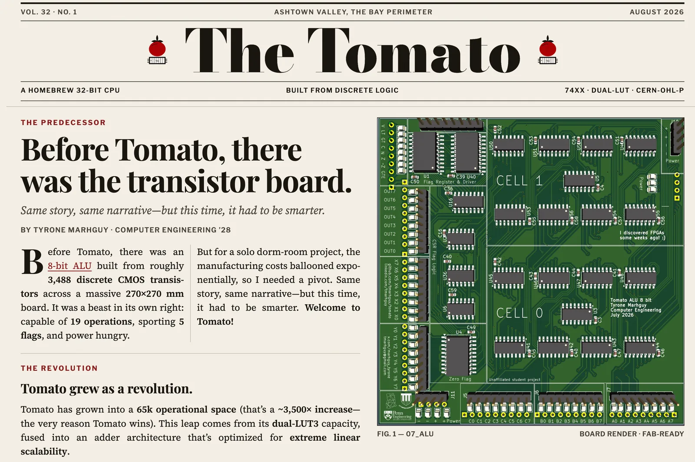

# Tomato — Documentation

<strong>ISA tables · design journal · ALU notes · history windback.</strong>

 

Doc index for the repo. Arguments live in the journal; tables live under `isa/`; the paper typesets both at [tomato.tmarhguy.com](https://tomato.tmarhguy.com/).

**Project map:** [Root README](../README.md) · [ISA](isa/README.md) · [Journal](log/) · Paper: [web/README](../web/README.md)

  

<em>The paper typesets this vault · <a href="https://tomato.tmarhguy.com/">tomato.tmarhguy.com</a></em>

| Path | Content |
|------|---------|
| [`isa/`](isa/) | Opcode ROM, pseudos, LUT catalog, profiles |
| [`log/`](log/) | Design journal (Obsidian vault) — start with [Welcome to Tomato 32](<log/Welcome%20to%20Tomato%2032.md>) |
| [`alu/`](alu/) | LaTeX ALU reference (control map, bit-slice) |
| [`history/`](history/) | Chat-to-paper windback (Tectonic) |

**Conventions:** architecture decisions → new `docs/log/` entry. Opcode / microcode → `isa/tomato.v1.csv`. Assembler vocabulary → `isa/tomato.v1.pseudo.csv`.
