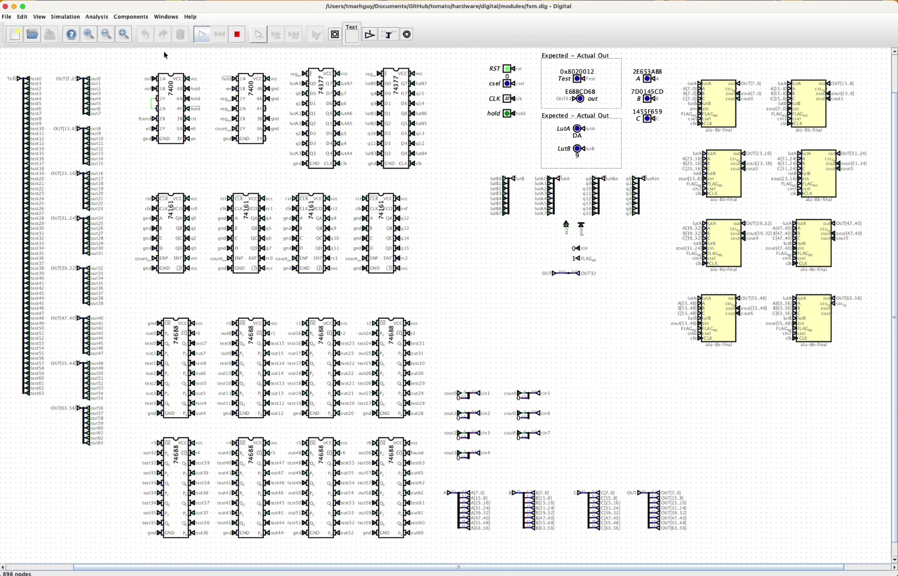
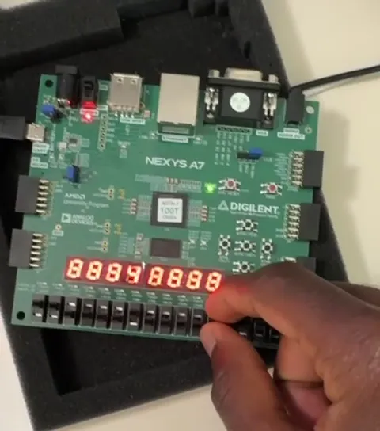

# Tomato — ISA

<p align="center"><strong>512-row opcode ROM · assembler vocabulary · parametric maps.</strong></p>

 

**Burn authority:** [`tomato.v1.csv`](tomato.v1.csv) — the microcode ROM.  
**Assembler vocabulary:** [`tomato.v1.pseudo.csv`](tomato.v1.pseudo.csv) — mnemonics that expand into burns (no new ROM rows).

**Project map:** [Root README](../../README.md) · [Software](../../software/README.md) · [Microcode](../../microcode/README.md) · Paper: [isa.html](https://tomato.tmarhguy.com/isa.html)

<p align="center">
  
  
</p>
<p align="center"><em>Opcode sweep · sim and FPGA · rows of <code>tomato.v1.csv</code></em></p>

| File | Role |
|------|------|
| `tomato.v1.csv` | Microcode ROM rows — burn opcodes + unused NOP slots |
| `tomato.v1.pseudo.csv` | Pseudos (`CALL`, `BEQZ`, `LI`, …) for the assembler |
| `datapath-audit.csv` | Derived checklist vs FPGA RTL (keep in sync with v1) |
| `lut.csv` | ALU LUT primitive catalog (hardware reference) |
| `profiles/` + `profiles.csv` | Parametric maps onto Tomato (CSV rows are the sweep database) |

---

## Pack and check

```bash
python3 tools/gen_microcode_v1.py --pack-rom   # regenerate v1 + .mem
cd hardware/fpga/core && make burn             # embed into rtl/burn/
python3 software/assembler.py --selftest       # vocabulary vs burns
```

**Policy:** solidified burn ops stay. Add new burns in `burn_core_rows()` when you need them. Empty ROM rows are `status=nop`. Pseudos never invent opcodes.

---

## Locked decisions

- **Not a ~20-opcode lean map.** v1 ships **52 burned opcodes** (instruction set proper; idle `NOP` at row 0 sits beside them in the ROM). Unused rows are `status=nop` (no growth phantoms).
- **No tile VPU.** Display is CPU-painted tile RAM + independent VGA scanout (`software/os/DISPLAY.md`). Games stay software; a future rect blitter is optional.
- **ISA is a first-class input.** Overlay word + immediate box + dual-LUT absorb foreign encodings as maps onto muxes. Casual family count ~37 (CSV has more rows). See [ISA as a Wire](../log/2026-08-15%20-%20ISA%20as%20a%20Wire.md). Maps cover compute, shift, and register-access; not x86 segmentation or ARM TrustZone.
- **Software sheet.** OS, assembler, and stack live on [tomato.tmarhguy.com/software.html](https://tomato.tmarhguy.com/software.html) and in [`software/`](../../software/).
