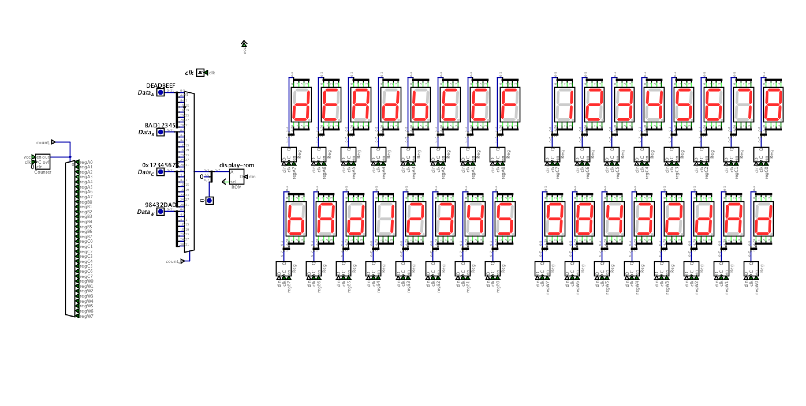

Four 32-bit values on screen at once—the three LUT3 operand buses plus the ALU writeback. Each row is eight hex digits; thirty-two seven-segment displays total, live as the datapath moves. The display is not a separate gadget bolted on: `alu-display-control.dig` mirrors the slice—`Data_A`, `Data_B`, `Data_C` in, `Data_W` (ALU out) out.

#### The goal

| Row | Input | Registers | LUT3 role |
|-----|-------|-----------|-----------|
| 1 | `Data_A` | `regA0`–`regA7` | Operand A |
| 2 | `Data_B` | `regB0`–`regB7` | Operand B |
| 3 | `Data_C` | `regC0`–`regC7` | Operand C |
| 4 | `Data_W` | `regW0`–`regW7` | ALU result / write port |

128 bits in the pool → thirty-two nibbles → thirty-two digits. Sim defaults baked into the schematic: `0xDEADBEEF`, `0xBAD12345`, `0x12345678`, `0x98432DAD`.

#### Attempt 1 — 74HC4511 BCD decoder

The textbook move. `74HC4511` takes 4-bit BCD in, drives seven segments out.

Problem discovered immediately: it only decodes 0–9. Inputs above nine (`0xA`–`0xF`) blank. Useless for hex.

**Decision:** Rejected. Cannot display A–F.

#### Attempt 2 — 74HC4543

Maybe a variant handles hex?

Same story—BCD only, different package. Blanks above nine.

**Decision:** Rejected. Same problem as Attempt 1.

#### Attempt 3 — Boolean minimization (K-map approach)

Derive segment drive equations from first principles. Karnaugh maps, pure gate logic.

Truth table for nibble `D3:D0` → segments `a`–`g`:

| Nibble | D3 D2 D1 D0 | a b c d e f g | Char |
|--------|-------------|---------------|------|
| 0 | 0 0 0 0 | 1 1 1 1 1 1 0 | 0 |
| 1 | 0 0 0 1 | 0 1 1 0 0 0 0 | 1 |
| 2 | 0 0 1 0 | 1 1 0 1 1 0 1 | 2 |
| 3 | 0 0 1 1 | 1 1 1 1 0 0 1 | 3 |
| 4 | 0 1 0 0 | 0 1 1 0 0 1 1 | 4 |
| 5 | 0 1 0 1 | 1 0 1 1 0 1 1 | 5 |
| 6 | 0 1 1 0 | 1 0 1 1 1 1 1 | 6 |
| 7 | 0 1 1 1 | 1 1 1 0 0 0 0 | 7 |
| 8 | 1 0 0 0 | 1 1 1 1 1 1 1 | 8 |
| 9 | 1 0 0 1 | 1 1 1 1 0 1 1 | 9 |
| A | 1 0 1 0 | 1 1 1 0 1 1 1 | A |
| B | 1 0 1 1 | 0 0 1 1 1 1 1 | b |
| C | 1 1 0 0 | 1 0 0 1 1 1 0 | C |
| D | 1 1 0 1 | 0 1 1 1 1 0 1 | d |
| E | 1 1 1 0 | 1 0 0 1 1 1 1 | E |
| F | 1 1 1 1 | 1 0 0 0 1 1 1 | F |

Minimized equations (verified for all sixteen inputs):

```
a = (~D2.~D0) + (D2.D1) + (D3.~D0) + (~D3.D1) + (D3.~D2.~D1) + (~D3.D2.D0)
b = (~D3.~D2) + (~D2.~D1) + (~D2.~D0) + (~D3.~D1.~D0) + (~D3.D1.D0) + (D3.~D1.D0)
c = (~D1.D0) + (~D3.D2) + (D3.~D2) + (~D2.~D1) + (~D2.D0)
d = (D3.~D1) + (~D2.D1.D0) + (~D3.D1.~D0) + (D2.~D1.D0) + (D2.D1.~D0) + (~D3.~D2.~D0)
e = (D3.D1) + (~D2.~D0) + (D3.D2) + (D1.~D0)
f = (D2.~D0) + (D3.~D2) + (D3.D1) + (~D1.~D0) + (~D3.D2.~D1)
g = (D3.D1) + (D3.D0) + (~D2.D1) + (~D3.D2.~D0) + (D3.~D2) + (D2.~D1.D0)
```

Shared product terms (compute once, reuse):

| Term | Segments | Gate |
|------|----------|------|
| `~D2.~D0` | a, b, e | 74HC08 |
| `D3.~D2` | c, f, g | 74HC08 |
| `D3.D1` | e, f, g | 74HC08 |
| `~D1.~D2` | b, c | 74HC08 |
| `D0.D2.~D1` | d, g | 74HC11 |

Chip count per digit with reuse: 1× `04`, 5× `08`, 4× `11`, 4× OR ≈ **14 chips per digit**. Thirty-two digits → **448 chips** for the display alone. Bigger than the ALU.

**Decision:** Rejected. Mathematically correct, physically absurd.

#### Attempt 4 — ROM lookup (single digit)

Small EEPROM as lookup table. Four address bits (nibble) → eight data bits (segment pattern). Sixteen rows, program once.

`AT28C16` (2K×8): use `A0`–`A3` for nibble, `D0`–`D6` for segments, tie `A4`–`A10` low, `~OE` low, `~WE` high.

Font table:

```
0x3F 0x06 0x5B 0x4F 0x66 0x6D 0x7D 0x07
0x7F 0x6F 0x77 0x7C 0x39 0x5E 0x79 0x71
```

Full hex 0–F works.

**Problem:** Thirty-two digits → thirty-two ROMs repeating the same sixteen-byte table.

**Decision:** Right approach, needs multiplexing to share one ROM.

#### Attempt 5 — multiplexed single ROM (final)

One `AT28C16` serves all thirty-two digits. A 5-bit counter walks `0`–`31`—one state per digit, full range, wrap at 32 is free. Each cycle:

1. One nibble is driven onto the ROM address bus
2. ROM decodes to segment pattern
3. One latch captures the pattern
4. All thirty-two latches hold simultaneously → steady display

**Architecture** (`hardware/digital/modules/alu-display-control.dig`)

```
┌──────────────────────────────────────────────────────────┐
│  INPUT POOL (LUT3)                                       │
│  Data_A[31:0] + Data_B[31:0] + Data_C[31:0]             │
│              + Data_W[31:0]  = 128 bits = 32 nibbles    │
└────────────────────────┬─────────────────────────────────┘
                         │
                ┌────────▼────────┐
                │  74HC163 × 2    │  5-bit counter (0-31)
                └────────┬────────┘
                         │ count[4:0]  (= count_n in sim)
                ┌────────▼────────┐
                │  32:1 mux       │  pick nibble k
                │  (4-bit wide)   │
                └────────┬────────┘
                         │ 4-bit nibble + mode → ROM addr
                ┌────────▼────────┐
                │  AT28C16        │  display-rom
                │  font lookup    │
                └────────┬────────┘
                         │ din (8-bit segment pattern)
         ┌───────────────┴───────────────┐
         ▼                               ▼
┌────────────────────┐        ┌──────────────────────┐
│  74HC154 × 2       │        │  74HC373 × 32        │
│  5→32 one-hot      │───────►│  regA/B/C/W0-7       │
│  digit strobe      │  LE    │  one latch per digit │
└────────────────────┘        └──────────────────────┘
         │
         ▼
┌────────────────────┐
│  74AC125 × 32      │  nibble drivers (~OE per digit)
│  mux = tri-state   │  same index k as latch k
└────────────────────┘
         │
         ▼
   32 × 7-segment (4 rows × 8 digits)
```

No `153` mux tree on the nibble bus. In silicon the mux *is* thirty-two tri-state drivers—exactly one `74AC125` enabled per cycle. In Digital, a 32:1 mux plus a 5→32 decoder on the latch side; same index `k` selects nibble `k` and strobes `reg*{k}` together. Row identity is wiring: nibbles 0–7 are A, 8–15 are B, 16–23 are C, 24–31 are W.

**Scan chain (one clock tick)**

```
count[4:0] → mux selects 1 of 32 nibbles
          → ROM address = {mode[1:0], 2'b00, nibble[3:0]}  (4,2,2 splitter)
          → display-rom → din
          → decoder one-hot → exactly one 8-bit register loads → Seven-Seg
```

ROM image: `microcode/alu-display-control.hex` (Digital `v2.0 raw`). Mode bits on address MSBs—hex `0x00`–`0x0F`, decimal `0x40`–`0x49`, binary `0x80`–`0x81`.

**Chip list (32-digit, matches schematic)**

| Chip | Function | Count |
|------|----------|-------|
| 74HC163 | 5-bit counter (0–31) | 2 |
| 74HC154 | 5→32 digit strobe decoder | 2 |
| 74AC125 | Nibble bus drivers (one per digit) | 32 |
| AT28C16 | Hex font ROM | 1 |
| 74HC373 | Segment latch (one per display) | 32 |
| 7-segment display | Common cathode | 32 |
| **Total ICs** | | **69** |

Five bits covers exactly thirty-two digits—no `74HC00` reset hack at count 24. That was a leftover from an earlier three-row sketch.

**Why this works**

Counter runs 0→31 on `clk`. In the Digital file the clock is **1 kHz**—each digit gets a new latch write every 32 cycles (~31 ms between updates to the same digit). Brightness does not depend on that rate; the `373`s hold the segment pattern continuously.

The latches are the whole trick. Without `373`s each digit is only driven 1/32 of the time—dim and visibly multiplexed. Latches hold the last pattern; LEDs run at full brightness even though the ROM only writes one digit per cycle.

Operand or result changes show up on the next pass for that digit index—within one scan frame.

**Clock** (from `alu-display-control.dig`)

```
clk frequency:        1,000 Hz  (Digital Clock component)
Digits:               32
Writes per digit:     1,000 / 32 ≈ 31 Hz
Full scan period:     32 ms
```

**Programming the AT28C16**

One-time burn with TL866II+. Bit map: `D0`=a, `D1`=b, `D2`=c, `D3`=d, `D4`=e, `D5`=f, `D6`=g.

```
0x3F 0x06 0x5B 0x4F 0x66 0x6D 0x7D 0x07
0x7F 0x6F 0x77 0x7C 0x39 0x5E 0x79 0x71
```

#### Bring-up (how it was actually wired)

1. One display — ROM, one register, manual nibble, prove the font.
2. One row of eight — counter, decoder, one `Data_*` word.
3. Four rows — A, B, C, W; thirty-two digits on one scan chain.

Bugs found along the way: `din` fights if two registers write at once (decoder must stay strictly one-hot); segment bit order vs Digital Seven-Seg pinout; decimal mode ROM address is `0100xxxx` not `01xxxxxx`.



#### What this ROM does not do

Full-word hex-to-decimal (`0xDEADBEEF` → ten decimal digits) is not here. The lookup only sees one nibble. Real decimal needs divide/BCD upstream.

#### Summary

| Attempt | Approach | ICs (32-digit) | Result |
|---------|----------|----------------|--------|
| 1 | 74HC4511 BCD | 32 | No hex A–F |
| 2 | 74HC4543 | 32 | BCD only |
| 3 | K-map gates | 448 | Too many chips |
| 4 | ROM per digit | 32 | Correct, wasteful |
| 5 | Single ROM + scan + latches | 69 | Working |

#### Key insight

Compression story. Attempts 1–2: wrong chip. Attempt 3: right math, wrong scale. Attempt 4: right table, repeated thirty-two times. Attempt 5: one sixteen-entry font, time-shared across all four LUT3 buses through tri-state nibble drivers and latched outputs. The latch is what makes sharing the ROM invisible.

#### Status

Thirty-two digit display verified in `alu-display-control.dig`. `alu-display-control.hex` programmed. Physical build targets the `154` + `125` + `373` stack above—four rows wired to A, B, C, and ALU writeback.

**Next:** Burn font to board AT28C16, tie `Data_W` to the real write port in `main`, run known vectors on all four rows, confirm mode bank switches.
