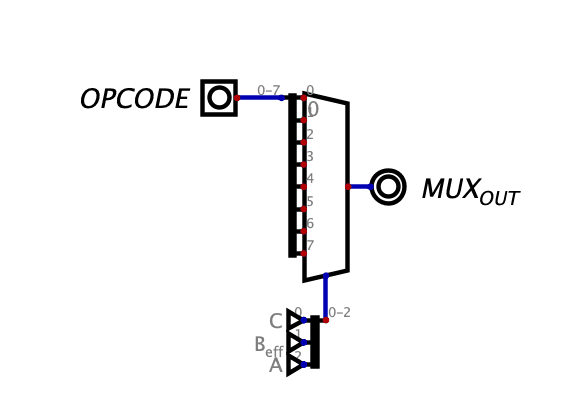

In routing the ALU, I came across a realization that the fact that the 125 + 138 combination defeats the optimization i was looking for. In fact, I need 3 chips for a single ALU-cell; but the 74251 offers same logical capacity without the physical chance of contention. Over the 74151, the 74251 offers a stronger drive strength, which was my initial worry when designing with 74151. 

Logical changes are none, but routing and metrics of area, and performance (by bus length) are better with the 74251.

*Retrospective technical illustration · opcode bits select the one-bit mux cell that motivated the 74251 redesign.*

