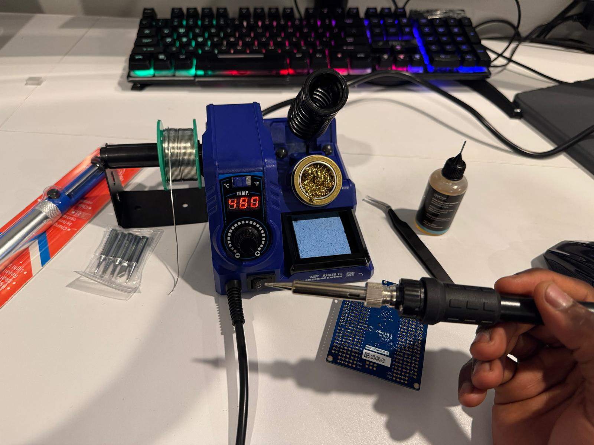

The new solder station arrived on campus from Amazon and works perfectly. Now, I’m just waiting on the custom PCB and DigiKey components to arrive so I can get to work and resume building project "Tomato."

  

> **Station in. Boards still inbound.** The iron works. Tomato waits on the custom PCB and DigiKey parts. Then: back to the build.

Having a proper iron is a hilarious contrast to my early engineering days. When I was 13, my family lived on a bus for two years while my dad was sick. We had no electricity, so sheer necessity drove me to rig up LEDs to old mobile phone batteries to give us light.

My "soldering iron" back then was just a nail heated red-hot in a fire. I’d hold it with pliers—or a makeshift wooden holder that frequently caught fire—to melt thick chunks of salvaged solder.

| Then | Now |
| ---- | --- |
| A nail, heated red-hot in a fire | WEP 926LED V3, **480 °C** on the display |
| Pliers — or a wooden holder that caught fire | Coil stand, brass wool, sponge |
| Salvaged chunks of solder | A spool on the station |
| Hand-crank a wind generator, stay under **5V**, charge to **4.1V** | Campus desk. Waiting on JLCPCB + DigiKey. |

To charge the batteries, I relied on a wind generator I had actually built myself _([See video of me rewinding my first wind generator at 11 years in Ghana](https://docs.google.com/videos/d/1zLeuVECxmtJ6nVa4QfNbt_4gfXpi5gCUJMtCwPADubI/play?usp=sharing))_.

Because it lacked working propellers at the time, I had to act as the wind. I would sit and hand-crank it with a piece of wood for hours every day, constantly watching a multimeter to ensure I generated just under **5V** to safely charge the batteries to **4.1V**.

It was quite the hustle, but we've come a long way. My family is healthy, and I'm currently pursuing computer engineering degree at an Ivy League. I loved that early ingenuity, but I'm thrilled to have real tools now. Back to the build!
