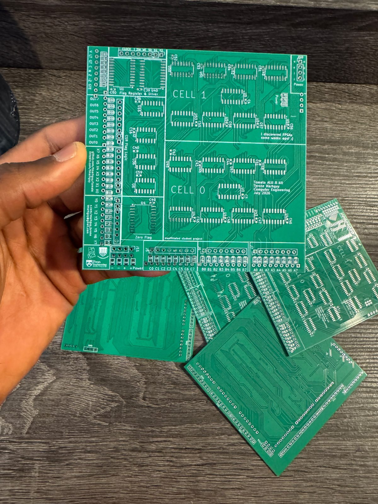
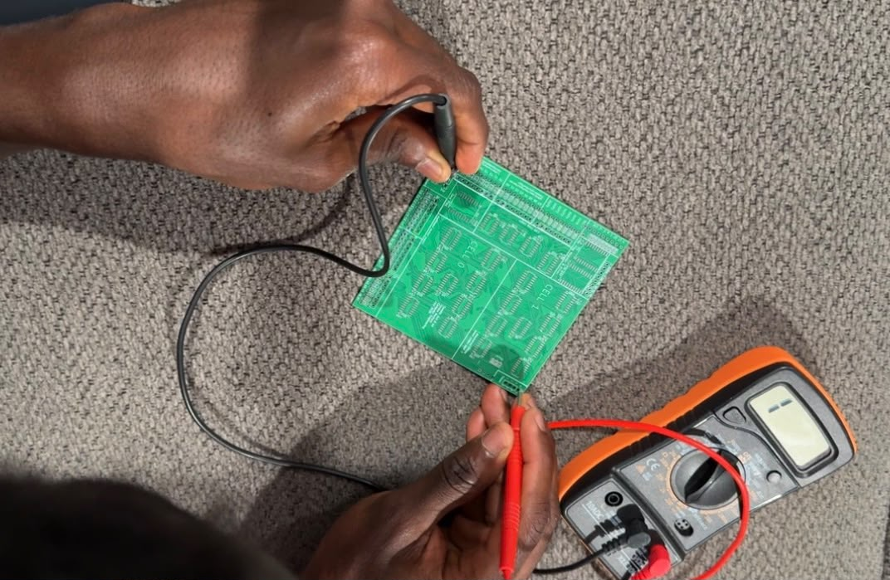

# PCBs Arrive!

The PCBs all just arrived! I ordered 5 of them, and I tested them with a continuity meter, particularly for the power connections, and I am happy to log that there are no islands! It is beautiful watching the board of such sophisticated nature, realizing that I remember placing every single trace!

  

<em>Five boards. Lot 07, as received.</em>

  

<em>Continuity on power. No islands.</em>

  <video src="../../media/logs/pcb_arrive.mp4" controls width="520"></video>

<em>The boards, in the round. ([video](../../media/logs/pcb_arrive.mp4))</em>

I had to admit to my roommate: isn't it hilarious that all this I have been working on, I did it all by myself? Buying a multimeter, an FPGA, using KiCad, down to this project. It has been a long and interesting journey!

The boards look stunning!
