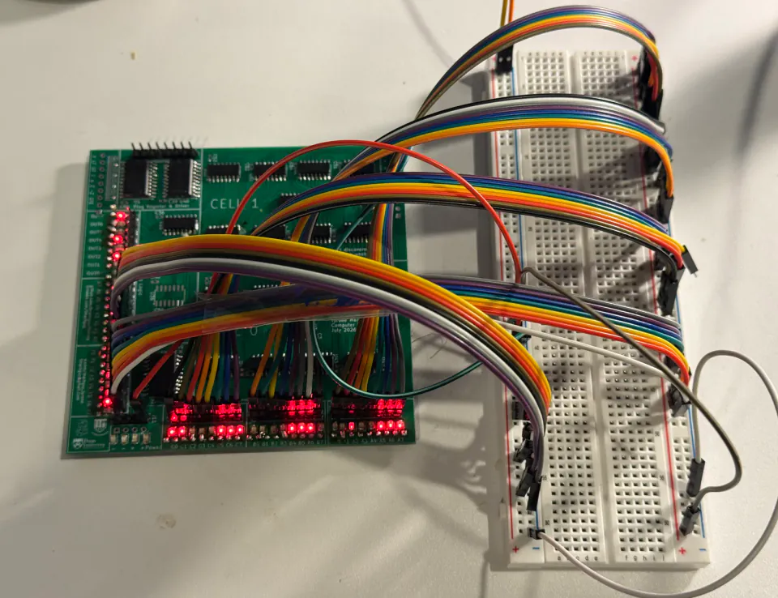
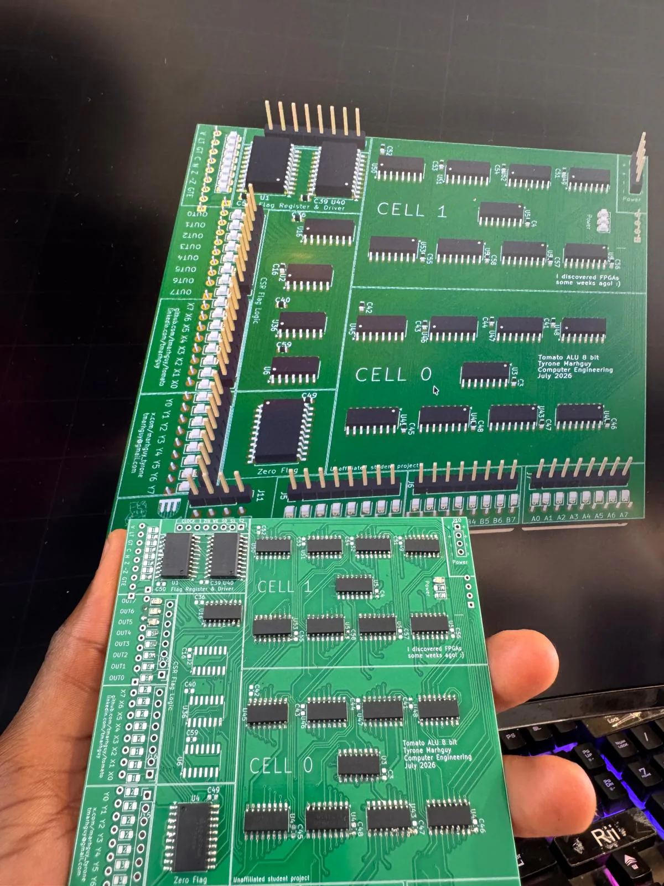

# First Phase of Assembly

**Date:** 2026-08-18  
**Status:** Populating `07_alu` — muxes and adders down, lamps started  
**Board:** [`07_alu`](../../hardware/kicad/boards/07_alu/README.md)  
**Related:** [Ordered Tomato](2026-08-07%20-%20Ordered%20Tomato.md) · [PCBs Arrive!](2026-08-15%20-%20PCBs%20Arrive!.md) · [Solder station arrives](2026-08-13%20-%20Solder%20Station%20Arrives.md)

---

Today is perhaps one of the most important ones of this project. I got the parts from DigiKey. There was an initial delay, but they replaced the order when I called. After weeks of staring at digital schematics and KiCad renders, having physical silicon show up at the door is a huge milestone.

  

<em>The box. DigiKey, 17 August 2026.</em>

With the components finally here, I cleared the desk, set up the flux and tweezers, and laid out the tools. The footprint on these SMD chips is a completely different object when you are holding them rather than placing them on a grid.

  

<em>The bench, ready.</em>

All parts have arrived. I have soldered every **74ACT151** on one of the boards, and each adder (**74ACT283**). The 74ACT series wants a steady hand. Laying down that much logic takes time and patience.

  <video src="../../web/assets/assembly/placing-and-soldering.mp4" controls width="70%"></video>

<em>Placing and soldering the 74ACT logic onto 07_alu.</em>

The LEDs are tiny. I have soldered about seven of them. Aligning them without bridging the pads is a test of endurance, but seeing those indicators sit on the copper makes it worth it.

  <video src="../../web/assets/assembly/soldering-led.mp4" controls width="70%"></video>

<em>Soldering the 0805 indicator LEDs.</em>

It is exciting seeing these parts for the first time and each of them fitting. I put the half-soldered board next to the simulation on the monitor. Looking back and forth between the digital truth table and the physical gates on the mat is surreal.

  

<em>Copper next to Digital. The same slice.</em>

Each one fit so nicely that it made the months of routing and DRC feel suddenly concrete. Designing the paths in KiCad is one thing. Seeing the copper line up with the pins is another. This board is finally coming to life.
