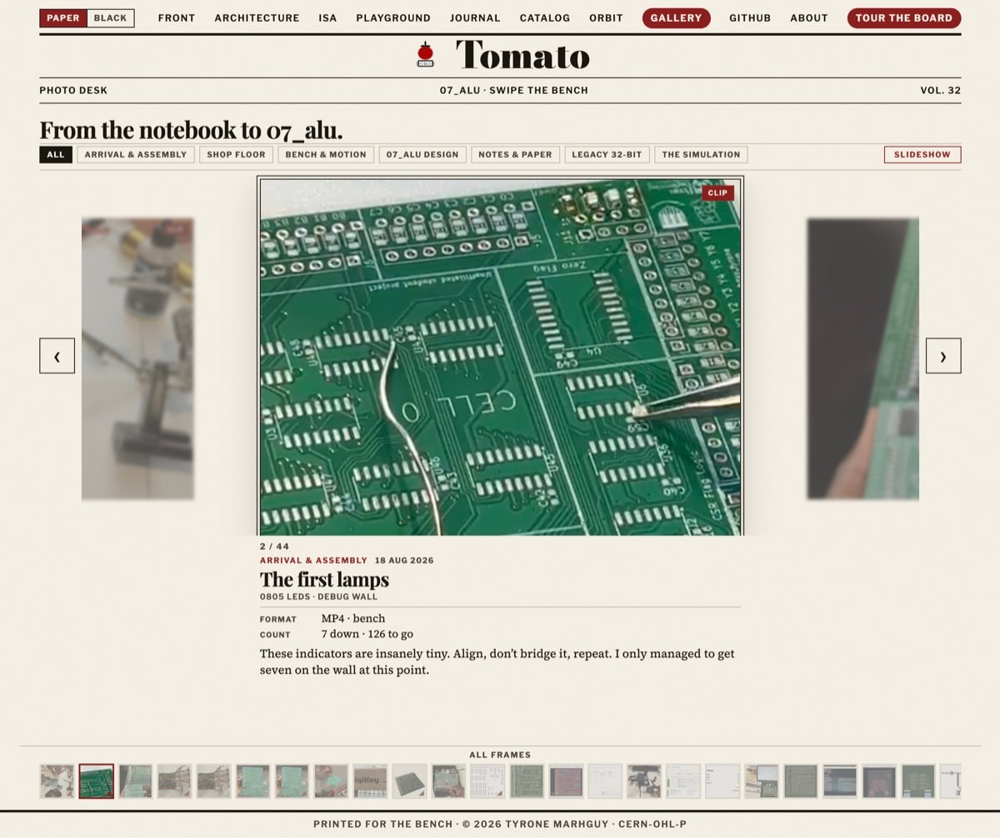

# The Gallery Paradox: Simplicity Over Scope

I've recently added a gallery integration to the site, and it brought up an interesting conflict. I was torn between making a comprehensive documentary of this whole journey versus simply posting updates on LinkedIn (among other places) and leaving the site as is. 

For now, the gallery is simply a slideshow. I initially tried multiple ambitious layouts, including an "issue-style" magazine format. While it looked great, I noticed that the gallery was becoming an entirely separate website within the main one.

I even added a "save scroll" option so you could keep it open like a real magazine. It was an amazing feature, but it suffered from the same problem: it felt like a second website inside the first. So, I decided to revert to the default style—a straightforward gallery slideshow with minimal text underneath to show exactly what was happening in the timeline back then. Sometimes, simplicity is best!
