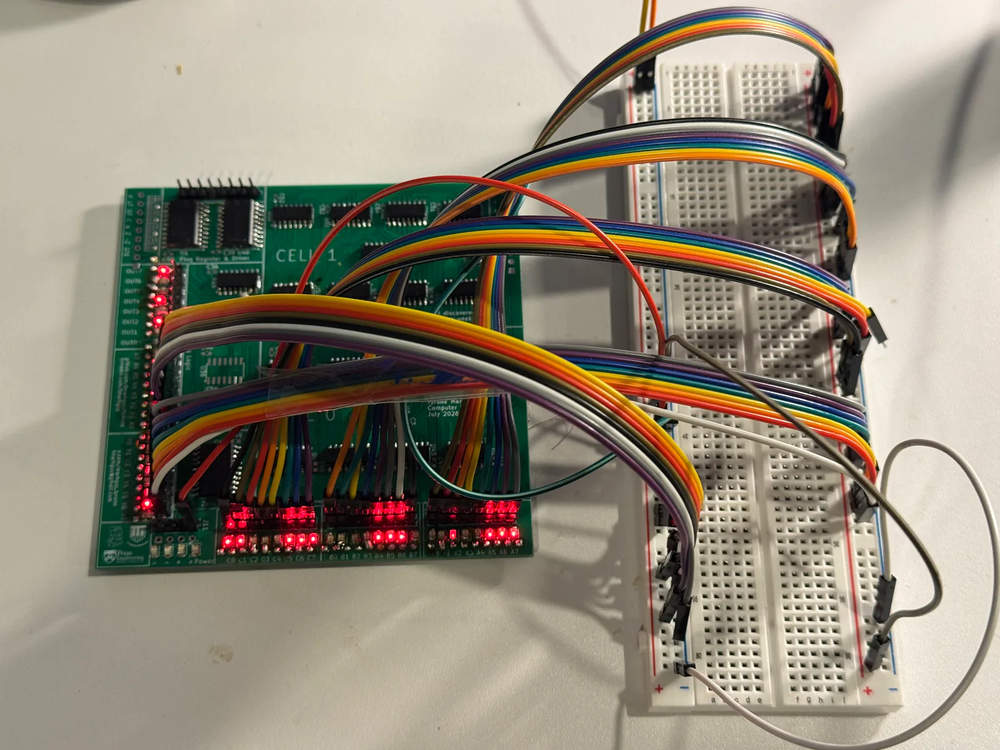

# First Lights and Flux: Assembly on the Bench

Soldering several tiny components is, unsurprisingly, delicate, error-prone, and time-consuming. But I have finally managed to solder all the multiplexers and adders down to the board! I also finished soldering all the LEDs and pin headers.

The best part? The board lights up—enough validation to confirm that nothing is shorted. I did encounter a few issues along the way, like a bad solder joint and an unsoldered pin. Armed with a flashlight, I kicked back in my chair to examine the board as closely as possible, spotting a bad solder joint (like the one attached here).

<video src="../../web/assets/assembly/work-setup.mp4" style="display: block; margin: 0 auto; width: 70%;" controls playsinline></video>

It works beautifully. I honestly haven't given myself a moment to celebrate reaching this point in the journey—from raw ambition, to ordering the PCBs, to finally having the soldered board lying on my desk. Maybe it's because recruiting season has already started, and the semester (my hardest, yet most fun one so far) is just beginning.

I left out the capacitors since they aren't essential for the board to work immediately. Granted, they are tiny 0603 models and only matter for power-hungry switching (dynamic power), which isn't a problem yet for basic LED testing. Brownouts are also out of the picture for now; they'll only reasonably become a problem when I do full-speed testing without those capacitors in place.

<video src="../../web/assets/assembly/work-setup.mp4" style="display: block; margin: 0 auto; width: 70%;" controls playsinline></video>