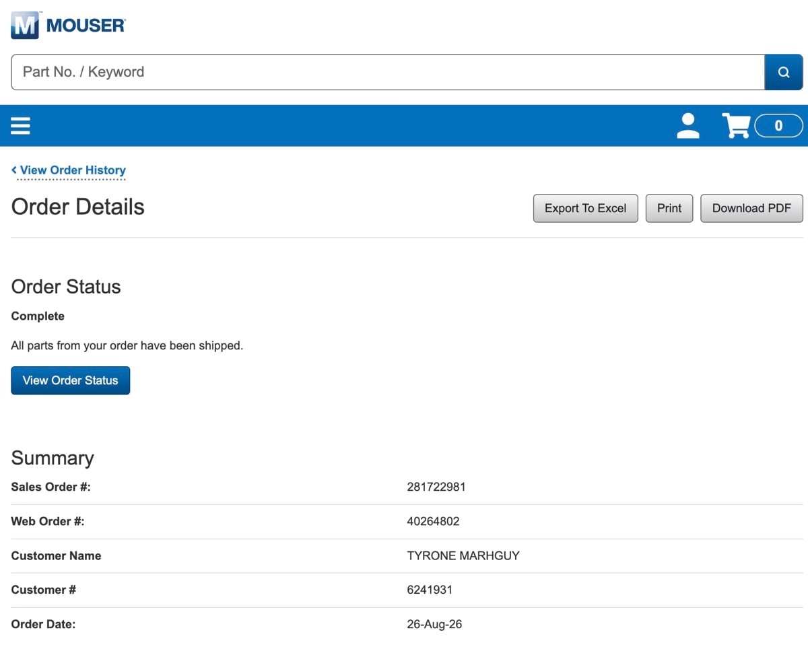
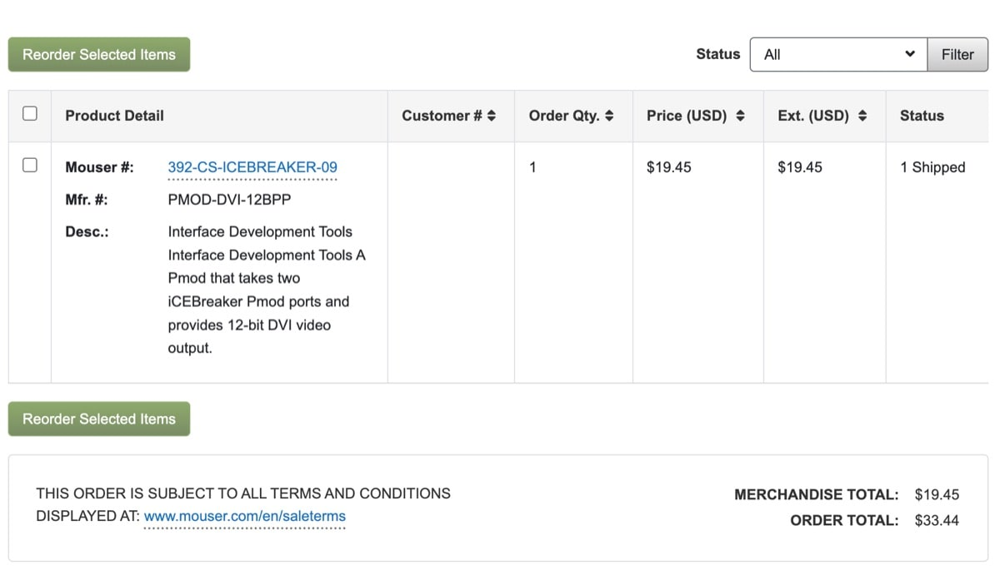

# The PMOD Pivot: Chasing Pixels on the FPGA

I tried connecting the VGA to my PC monitor, but the multiple adapter interfaces between the FPGA and HDMI (a VGA to HDMI converter) seem passive and simply won't work, no matter how many times I flashed a basic test pattern.

Given my time constraints and the speed at which I want to work, I've decided to use a PMOD instead, which is currently in transit. This will allow the FPGA to generate the VGA signal itself on pins other than the dedicated VGA ones.

I would love to explore the VGA issue and fix it properly, but purely from a strategic standpoint, that can wait. Granted, a CPU without a display is just a complex heater whose work remains fancifully abstract even to its builder.

When this PMOD arrives, I will test the basic signals and then move on to getting the Tomato board to work. I can't wait to finally demonstrate it running basic programs with my custom architecture—a feat I have been looking forward to for a long time!
