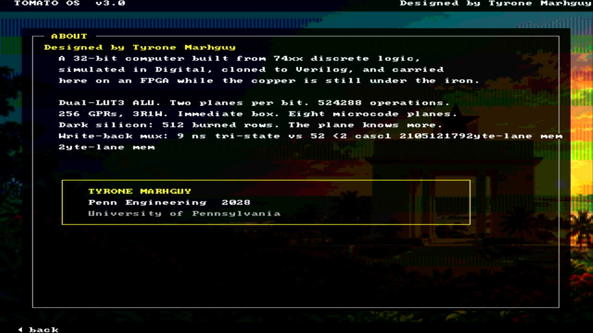
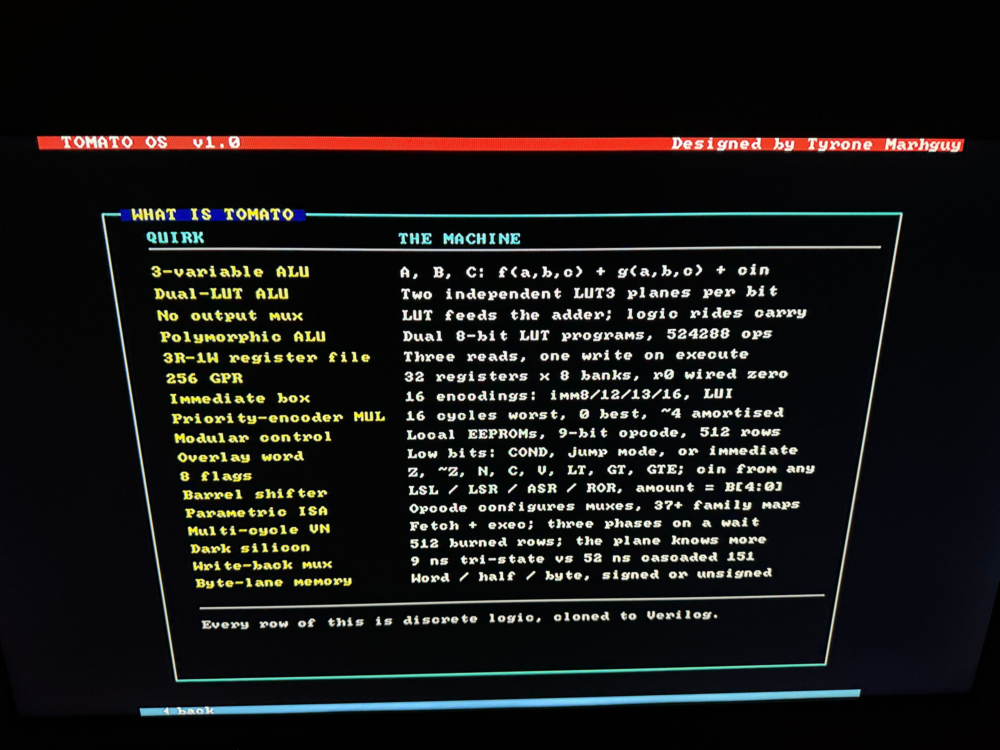

# One Press, One Key

Getting Tomato OS to work was thrilling, but it was honestly almost unusable at first. Just tapping the D-pad once would skip three or four menu entries. And clicking "About Tomato" would just flash it on screen for a frame before slamming straight back to the main menu. I initially thought it was just contact bounce or bad flash images, but I was wrong.

## Fixing the Keyboard Arithmetic

It turns out the bug wasn't bounce at all, it was my arithmetic! The keypad debounces by sampling the buttons slowly, which is fine, but the press *edge* was the problem. I was checking if a new press happened by comparing registers that only updated once per ~10 ms sample interval. So the edge signal stayed triggered for that whole 10 ms window. 

This wouldn't be an issue if the CPU just read the keypad once, but `menu_wait` polls the keyboard MMIO in a tight loop thousands of times! And because I made a fresh press outrank an unread one, the CPU just kept seeing "a fresh press is happening" for the whole window. 

I wrote a quick test to poll the keypad exactly like the OS does. One clean button push gave me 256 keycodes in simulation, and on real hardware it was giving me 65,536! No wonder the menu was jumping and the About screen was blinking away (since the ENTER press was still held when About's wait loop started, it just instantly went back to the menu).

To fix this, I made sure a button level has to hold steady for twelve consecutive samples (about 16 ms) to debounce properly. But more importantly, the *edge* for "a press just happened" must be exactly one clock cycle wide. So I now check that edge against the debounced state every single clock cycle, not every sample. One clock, one edge, one keycode! The CPU can poll a million times but only sees the press once. 

## The "What is Tomato" Screen

With the input finally working reliably, I could redesign the menu. I cut some of the bring-up screens that were just for testing (like the font chart and keypad tester) and kept a clean six-entry menu: **What is Tomato**, Fibonacci, Snake, Tetris, Racer, and About Tomato.

The **What is Tomato** screen is the one I really wanted. It lists all the quirks and features of the machine on one screen (like the 3-variable ALU, 3R-1W register file, and polymorphic LUT programs). But 17 rows of text is a lot, and I was running out of space in low memory!

Then I realized a fun trick: only `LA` (Load Address) is limited to the lower `0x1000` range. But a pointer table entry can hold a full 32-bit address, and my `puts` routine can print from anywhere! So I just moved all the text up to `0x1800` and kept a small pointer table in low memory. It worked perfectly.

I also finally got to use color! The desktop had been monochrome, so I added cyan, navy, and gold. It looks so much better now.

## Growing the Vocabulary

The last thing I wanted to fix was the assembly vocabulary. When writing TomatoOS, I kept having to write things like `CMP` then `BEQ` just to check if a register was zero. 

I didn't want to add rows to the actual silicon instruction set (`tomato.v1.csv`), because that would change the datapath and ROM. So instead, I created `tomato.v1.pseudo.csv` to add pseudo-instructions like `CALL`, `BEQZ`, `LI`, etc. These just expand into opcodes that are already burned and tested in silicon! 

I went ahead and rewrote 61 compare-and-branch pairs and 170 calls in the OS to use these new mnemonics. When I rebuilt it, the binary was byte-for-byte identical! It makes the source code so much easier to read without changing how the machine actually works. 

I am genuinely happy with how things are coming together. Having a screen that says what the machine is, in color, and with reliable controls makes all these months of building worth it!
