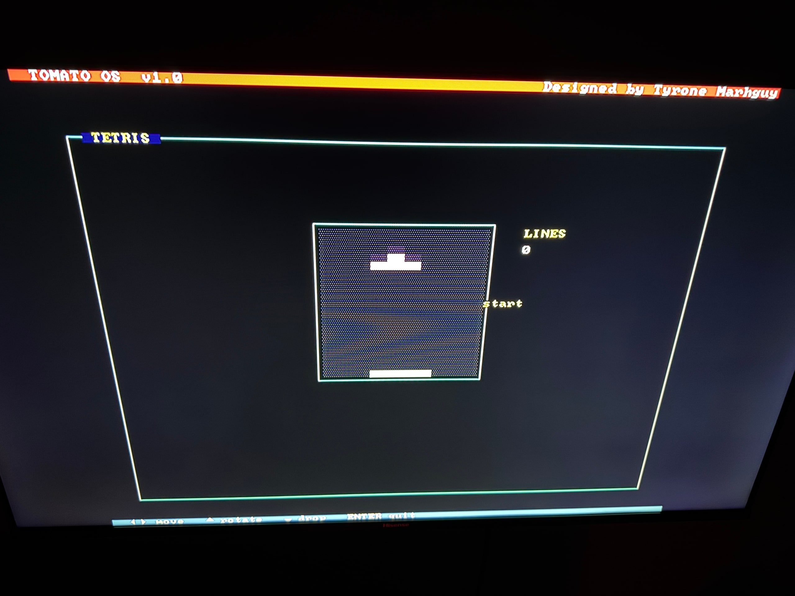
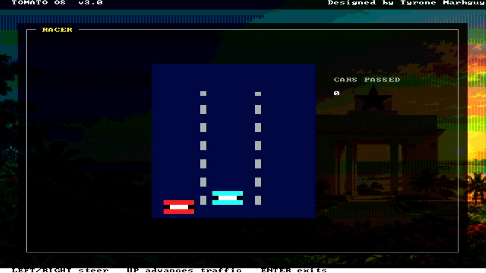
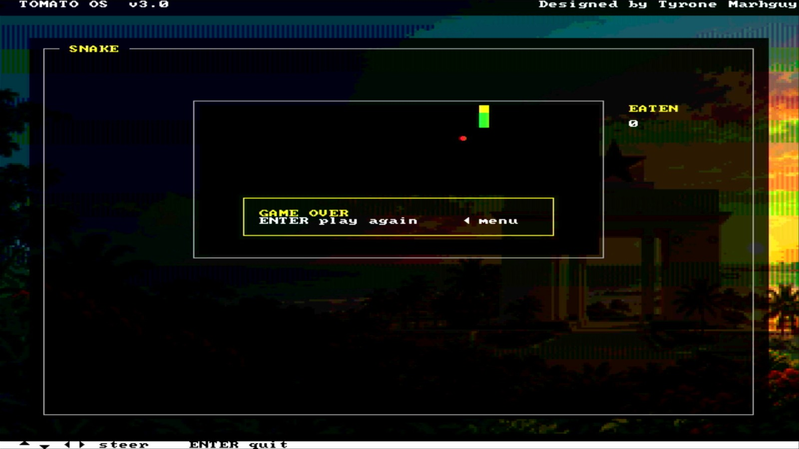
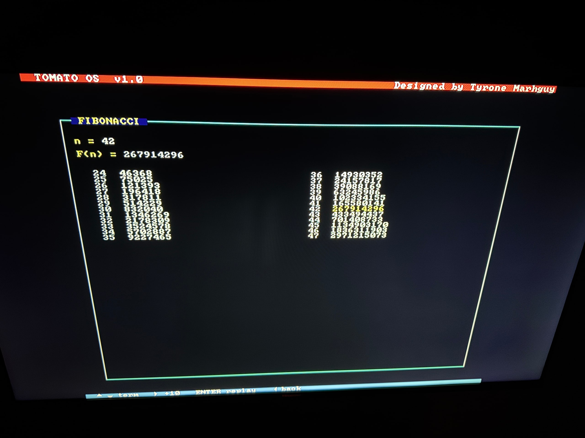

# Tomato works beautifully!

For all these months of working, I will say today was the most thrilling, mainly because **I got Tomato to render an HDMI signal and a GUI on my TV (or any screen for that matter)**. 
It gets exciting because it is running on over **2,300 lines of assembly code** as TomatoOS.

<video src="../../web/assets/os/hdmi-demo-games-ui.mov" controls="controls" width="800"></video>

I have ported games like Tetris, Racer, Snake, an About Me page, and Fibonacci. I will add more features like Ping Pong, Tribonacci, Space Shooters, and more!

## Keyboard Matrix

The keyboard matrix has limited the system input that I can reliably test. I am currently relying on the 5 buttons on the Nexys A7 board. I ordered a keyboard from Amazon and will convert it into a keyboard matrix; otherwise, I will solder one on a perfboard. With the keyboard matrix, I'll have more control over inputs, allowing for a more sophisticated user experience in terms of applications.

<video src="../../web/assets/os/keyboard-matrix-attempt.mp4" controls="controls" width="800"></video>

## Moving Forward

While this is exciting, I plan to reach the ultimate test, which is showing the steps it takes to actually compute operations. 

**The reality here is Tomato is not another RISC-V.** Its quirks alone point to a machine designed for extreme throughput at the lowest frequencies, doing things like `A + (B AND C)` in one cycle effortlessly. It is further running with **32,768 general-purpose registers** and extreme parametrization to allow other ISAs to natively run on it rather than using naive emulation.

So, I will design it to show how it crunches through what are normally multi-instructions in the lowest step. 

While these logs are meant to be more professional, I want to admit I am genuinely happy with how far Tomato has come. Many projects start and end halfway. This project has outlived the original design and has come so far that they are like Hydrogen and Osmium at their atomic levels :) 

I am also happy I kept one thing true: **making sure it can be easily implemented with readily available 74xx chips and discrete components.** It's all the more reason (and rather coincidentally) that the ALU resolved into a 3-variable engine, and the immediate box remained a driver + decoder (for output enable control) over a hierarchical multiplexer, keeping delay paths deterministic and fairly constant regardless of mux size.

As I take my second computer architecture class and explore new concepts, I plan to eventually tape Tomato out as a chip—or more importantly, its ALU, the star of this project! It's been a fun build, and I am glad I got to stay all these months building an intuition that only failing and persistence could teach.

If there are any personal goals, it's to keep learning and understanding computer architecture from end to end with no compromise and to grow into a deep chip designer, optimizer and one who keeps making unusual architectures for the given constraints!