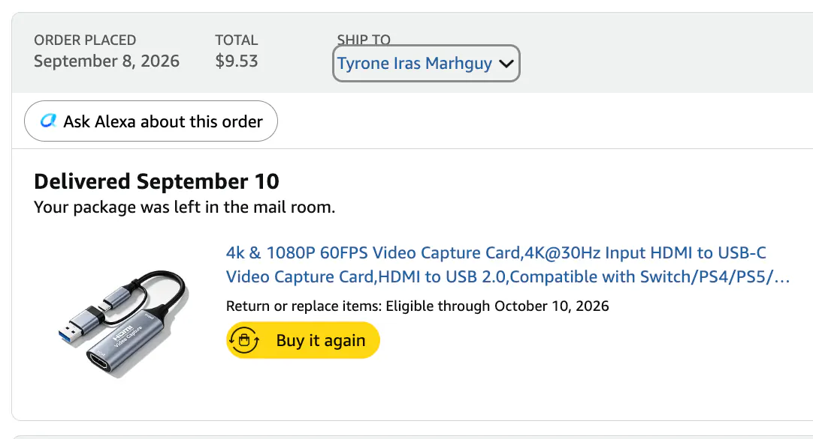
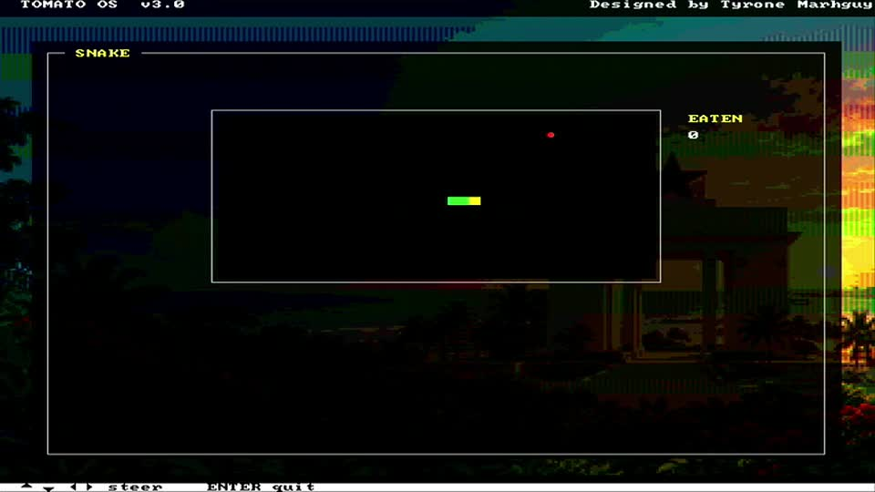

# HDMI, Properly Captured

The good part is that **Tomato works**, and the mere fact that it is not RISC-V already excites me. But capturing its HDMI output with a camera is interestingly unappealing—even to me, probably its biggest fan.

Pointing a phone at a monitor works, technically. It just does not do the machine justice.

So I ordered an **HDMI capture device**. Together with OBS Studio, I can now record the actual HDMI stream coming straight out of Tomato instead of filming the display from the outside.

*Physical hardware · the HDMI-to-USB capture adapter and manual, not a captured OS frame.*

*Order evidence · receipt for the capture device.*

*FPGA HDMI recording · direct Tomato OS output captured through the adapter; select the poster to play the MP4.*

That means clean recordings of TomatoOS, the applications, games, graphics, and whatever else I build next—and a much better record of what the machine actually looked like at each stage of development.

It is a small addition compared with designing the processor itself, but I am strangely excited about it.

There is something satisfying about getting to the point where the problem is no longer:

> **"Can this computer produce video?"**

but:

> **"How do I capture its video nicely?"**

Makeshift building sometimes involves doing things a little fancifully while you can :)
