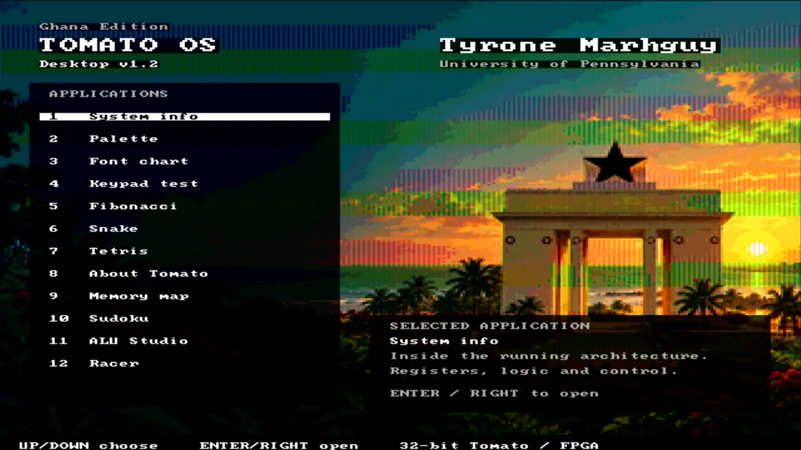

# Wallpaper, Polish, and the Rest of the Computer

The fall semester started, and I am taking arguably some of the hardest classes I could have put together:

- **ESE 5700 (Digital Integrated Circuits and VLSI-Fundamentals)**
- **CIS 5710 (Computer Organization and Design)**
- **ESE 5800 (Power Electronics)**
- **CIS 1912 (DevOps)**
- **EAS 2030 (Engineering Ethics)**

Most of the technical ones are master's-level courses.

To work on Tomato alongside **5.5 classes**, campus work, and midterms that only goodness knows why we are already writing when the semester started less than two weeks ago, means sacrificing from an already-low six hours of sleep at night.

But I choose to work on Tomato. **Passion and obsession always seem to beat the hurdles.**

Anyway, since the last pushes, I have worked on making the Tomato website as smooth as possible and, more importantly, making it less overwhelming for someone seeing the project for the first time.

The problem is that I have dived so deeply into this thing that I have built from the literal transistor up to writing its raw hex code for custom programs **by hand**.

It would probably be more surprising if *I* got overwhelmed by my own writing on the website.

The website seems easy now—or at least balanced enough for the skeptical engineer and the interested non-engineer alike. Tomato is sitting somewhere in the middle.

Granted, an engineer's real website has always been GitHub, not a vanilla `HTML + CSS + JS` website with a Gerber file somewhere inside it :)

What I find even more fascinating, though, is that **the hardware was always only a fragment of the story.**

The moment the architecture changes, you are looking at reinventing not just a "continent," but almost an entire **universe** just to run a program.

- The ISA changes.
- The assembler has to understand it.
- The software has to understand it.
- The operating system has to understand it.

And eventually, the applications sitting on top of all of that have to understand it too.

That entire toolchain is what I have been deeply optimizing.

TomatoOS now has applications, lists, graphics, input, and now even a **wallpaper**. It is kind of amazing watching the design slowly come to life.

In other words, it is becoming exactly what I dreamt it could be months ago, when I first found out that **building computers from scratch was even a thing people could do.**

Right now, I am polishing things as tiny as the spacing between text.

**A little quirk: I am not a perfectionist, but if the work is not up to the standard I know it can reach, I can almost immediately tell.**

That is where the obsession with this project has brought me.

I will make the next few polishes, lock in the now **2,987 lines of TomatoOS** as a stable version, push it to GitHub, and keep building on top of it.
