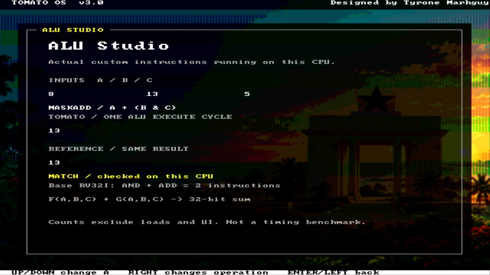

# ISA Upgrade: Nine New Tricks

Two days ago I wrote that assembly language was hiding half of my own machine from me. Tonight I did something about it. It is the follow-up to [When assembly is still too high-level for Tomato](<./2026-09-11%20-%20When%20assembly%20is%20still%20too%20high-level%20for%20Tomato.md>).

Here is the thing about Tomato's ALU. A normal processor does one small thing per step: add these two, or mask those two. Mine can chew on three values at once. It can take B AND C and add A, all in a single step, like it is nothing:

`A + (B AND C)`

Two of these combo moves already had names (MASKADD and XORAND). But the hardware could do plenty more that had no name at all, which meant no program could ever ask for them. Strange situation to be in. The machine is sitting there, capable, and my own vocabulary is what has been holding it back.

So I spent the evening naming nine of them. The easy and obvious ones first, then the carry and three-input ones:

*Conceptual FPGA HDMI illustration · ALU Studio demonstrates one compound operation, MASKADD; it is not evidence that all nine new instructions were tested in this frame.*

- **ANDN** keeps the bits of A except where B has them. Clearing bits without taking a detour through a NOT first.
- **ORN** is its mirror.
- **CSEL** picks A or B depending on C. Making a choice without branching off somewhere else, which is one of my favorite things a computer can do.
- **ANDADD, ORADD, XORADD** combine two values and then add the third, all in one step. Same family MASKADD comes from.
- **ADC and SBC** add and subtract while carrying the leftover from last time around. That is how you do arithmetic on numbers bigger than 32 bits.
- **RSB** subtracts backwards, B minus A. Distances stop needing a workaround.

That takes the burned count from 53 to 62.

The part I keep loving about this design: teaching the machine a new trick means touching nothing. No new chips and no rewiring. Each trick is one new row in the ISA file (`docs/isa/tomato.v1.csv`), and the tools pack it into the machine from there.

## The one I almost got wrong

I check every new trick in simulation before it goes anywhere near the machine, with answers I worked out by hand first. Good thing, because RSB was written down wrong. The way I had it, it would have answered zero every single time, forever, baked in. Caught it, fixed one number, and all nine pass now.

I also wrote a little test program (`software/asm/p0p1.s`) that runs all nine back to back and reports success only if every answer matches. It lives with the other test programs now, so the machine checks itself from here on. Everything old still passes too. The OS boots, the games play, nothing else moved.

Some evenings you solder. Some evenings you just give names to things the machine already knew how to do, and it feels like meeting more of it.
