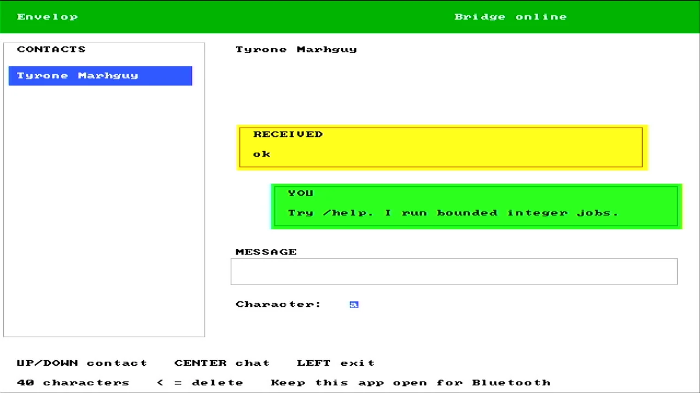

> **Companion-project provenance:** Imported from Envelop’s engineering log on 17 September 2026. Original wording is preserved; referenced media is mirrored into Tomato’s gallery.

> **Historical, noncanonical log (2026-09-14).** This records the project at
> the time and may be superseded. See
> [`docs/status.md`](../docs/status.md) for current facts.

  

<em>The hardware-side destination behind the native bridge work; dated evidence, not current availability.</em>

I have considered all the ways to reliably build envelop so that my attention doesn't move away. As, native wins. Website form factor will not have the needed permissions to bluetooth, and other useful config, espeically the network hosting.

Flutter for cross platorm will be a giangtic app afterwards. Other options may exist, but it makes sense to rather build for the features Ive always wanted, send, receeive and pretty much it, and rather quickly prototyp the sending and receiving to make it work.

As is, tomato responds beautifully, so