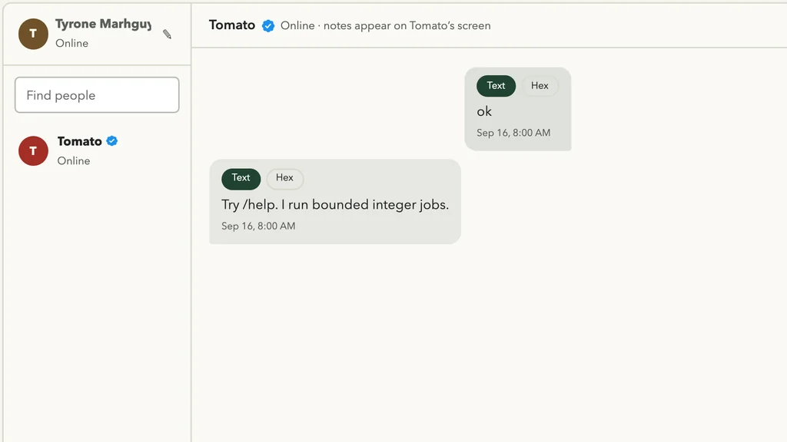

> **Historical, noncanonical log (2026-09-14).** This records the project at
> the time and may be superseded. See
> [`docs/status.md`](../docs/status.md) for current facts.

  

<em>The browser messenger Envelop became; current project illustration, not evidence for the dated claims below.</em>

Envelop will be a repo to hold the chat build for tomato! Think of it as the first bridge to connect tomato to the rest of the world!

The name is the point: an envelope is how you send a message in the pre-modern sense — paper, distance, arrival. Tomato is mid-modern / mid-antique; Envelop is the messenger that fits that story. (A short-lived “Pigeon” draft name is retired; everything is Envelop.)

It only makes sense to create a new project for it since it will contain apps for different platforms or at best a website among other low friction usage to conenect with tomato!
