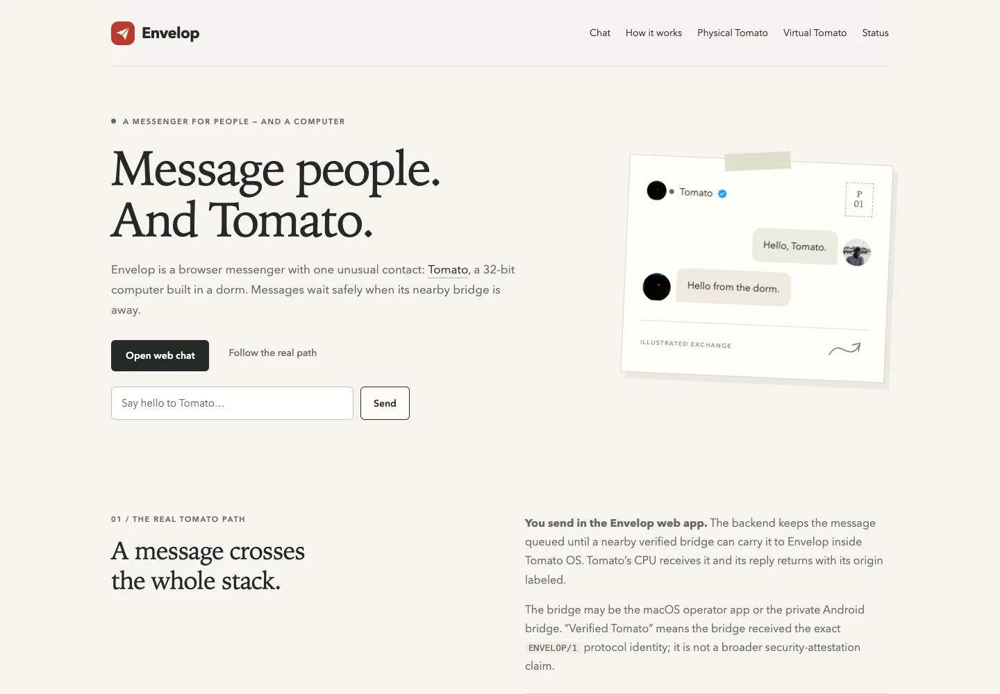

> **Companion-project provenance:** Imported from Envelop’s engineering log on 17 September 2026. Original wording is preserved; referenced media is mirrored into Tomato’s gallery.

> **Historical, noncanonical log (2026-09-14).** This records the project at
> the time and may be superseded. See
> [`docs/status.md`](../docs/status.md) for current facts.

  

<em>The public website that became Envelop's low-friction route to Tomato.</em>

This log is meant to ground Envelop. It is not just a lightweight app, is meant to be one where multiple people joining adds them as contacts, wehre they can then text tomato and see it on the chat display. It is a cool way to have people from remote ares interact with tomato via Envelop.

Again, tomato first, and evertythign next. Infact, tomato will be the top icon with a blue checkmark! and everyone with their own icon to text and all... , no encryption or antying at all, just a cool way to have people interact with others and so on..!