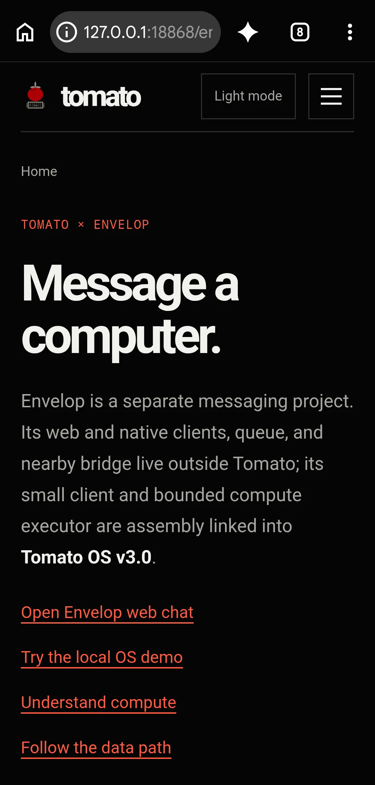

# Multiple Participants

Why should a messaging app exist only for two participants at a time? I am expanding so Tomato can connect with other users and participate in a conversation! It's just a few lines of code and RTL. That way, users can participate — in fact, I will make a website version for it too, and so forth. But the goal is to prove Tomato is a real computer that can communicate with others, from a hardware perspective.

*UI documentation · the current Envelop entry point in a real Infinix browser; no message was sent and no participant record is shown.*

It is looking exciting already, and all work and logs for Envelop live in its repo [Envelop](https://github.com/tmarhguy/envelop) — starting from [Envelop — Tomato gets a message app](<./2026-09-14%20-%20Envelop%20-%20Tomato%20gets%20a%20message%20app.md>).
