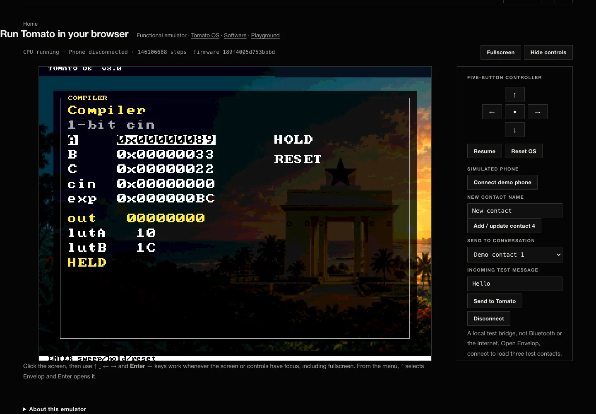

# Synthesis Bypass

I have spent the entire day, and much of that was waiting on synthesis, routing, and bitstream generation! In one case, I took a walk to bike around and after 36 mins, it was still running.

Fast iteration needs something more. As it is, I have already proven that Tomato works extensively. To iterate on Envelop, I have designed a Python preview script to allow me to interact with the code written, with button keys, like I would if the same code were burned to the FPGA.

*Browser emulation · the generated OS image in the functional CPU emulator; this preview shortens iteration but is not physical FPGA execution.*

This has been a tough friction point, and initially with my frustration with Vivado ([Exploring Beyond Vivado](<./2026-08-28%20-%20Exploring%20Beyond%20Vivado%20-%20Open-Source%20Synthesis%20Pivot.md>)), I lamented on the cycle taking forever — but I had not worked with FPGA enough to fully appreciate it if I skipped those layers into, say, a Python preview. But now, I have built sufficient base intuition to skip to Python.

This Python preview will act like a GitHub feature branch :) Maybe it took me too long to find this friction point and eliminate it! The realization of the hours this workflow will save me thrills me, but leaves me with at least two seemingly orthogonal thoughts:

- **Why didn't I think of this any earlier, and does the past time I put in go to waste?** I would answer that sometimes, our attentions are all in another direction and we don't focus on another. Also, until there's a real friction, you won't realize. In fact, before today, the whole workflow took at most 4 mins or less from code to bitstream on FPGA. Only today did I have to wait for so long, and eventually found an amortized way out. No time therefore has gone to waste, as I got to experience the workflow consistently — I even keep debugging the Makefile if there is an issue on different machines.
- **Why I never worked with others — maybe they would have shared insights that would lead to earlier thoughts on a preview mechanism.** Interesting fact is I love working with people, especially when they know their stuff too. In fact, I always allude to my high school, Achimota School science and math class. Everyone was so smart in their own ways, and that culture of excellence made the impossible on the outside world feel normal, a place where quirkiness from curiosity was allowed. In the case of Tomato, it so happens it always started as a personal learning experience — I wanted to understand computers — until it grew bigger and bigger. I've considered several times "recruiting interns", but the problem is the learning curve the project has reached. How do I explain building a computer from scratch (transistor level), combining it with 7 other custom-built boards, modular control, custom ISA, custom OS, custom hex firmware and assembler, custom app, the website flow, KiCad, routing, fabrication, soldering, FPGA toolchain, software simulation, without derailing my progress? I argue that there is a fine line between teaching and growing — but after so long, it'd take more to teach than to just finish. But granted, doesn't it make more sense that if you took a book to learn, you don't feel that pressure to "call" someone to sit next to you to view the same book? Everyone has their own paths to follow, and if most people wanted to, they could also join. It's more nuanced as I've framed, but Tomato has been fun. All this from the realization of seeking efficiency that Python just offered!
