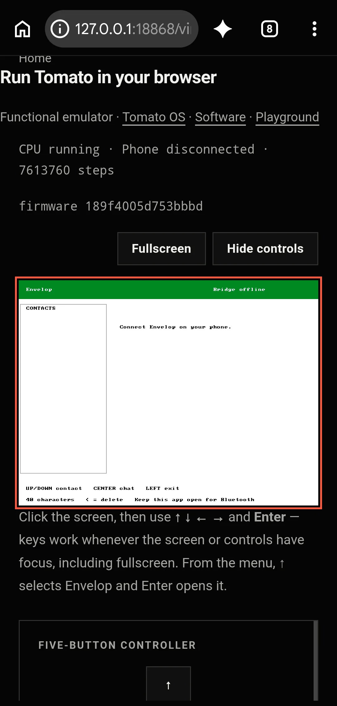

# Discard Previewer or Integrate

There was an enormous wait time to get the fresh bitstream from each iteration, and I thought to instead build a Python previewer which takes that assembly source file, Tomato OS, and renders the full experience. This way, I don't need to take a full trip to the FPGA for each iteration. I have been wondering why I didn't even think of this, but again it was only necessary until today, so it's fine.

Now, instead of discarding this or keeping this virtual render sitting in the repo unused, I am integrating it into the website so anyone can see what the FPGA would render, pixel for pixel. It is an amazing outcome for an unrelated problem I was solving.

*Browser emulation · current OS image with simulated peripherals and an offline bridge, shown at a real phone viewport; not FPGA hardware.*

It's live. `web/virtual.html` is ready — run it with `cd web && npm run serve`, open `/virtual.html`, and you're using Tomato OS (menu, games, Envelop + demo phone) with real firmware executing in the tab.

This follows [Synthesis Bypass](<./2026-09-14%20-%20Synthesis%20Bypass.md>) and [Envelop — Tomato gets a message app](<./2026-09-14%20-%20Envelop%20-%20Tomato%20gets%20a%20message%20app.md>).

## What got built

| Piece | What it does |
| ----- | ------------ |
| **`tools/build_web_image.py`** — the in-between script | OS assembly stays the single source of truth; it repacks derived artifacts only: **16,346 mem words** + **8 microcode planes** (the same `.vh` files the RTL includes) + font + palette + packed wallpaper = one **187KB `web/data/tomato-os.bin`**, plus a `tomato-os.json` manifest of source hashes. `--check` mode fails on stale data. |
| **`web/js/tomato-cpu.js`** — the CPU | Table-driven decode, dual-LUT ALU (including the quirky top-bit V), shifter/muldiv, byte lanes, banked regs, MMIO, tile RAM, and a line-for-line port of the ACI-mailbox radio model, so the firmware's BLE path runs unmodified. DOM-free, so Node tests it directly. |
| **`web/virtual.html` + `web/js/virtual.js`** | Broadsheet page, canvas renderer, D-pad + keyboard, demo-phone panel, firmware build id in the byline, honest **"functional emulator, behavior not timing"** label. |

Clear placement: first link in the homepage `#running` section, primary CTA on `os.html`, plus `software.html` and sitemap.

## Proof it's the real machine

`web/tests/tomato-emu.mjs`: **9 programs with the exact RTL-bench expects** (counter through `kb_mmio` — which caught one genuine TB-vs-hardware difference I documented in the test), plus full OS sessions: **boot → menu → Envelop → demo contacts → greetings on two contacts → disconnect**. Whole web suite: **80/80 green**, including a freshness test that re-hashes every source file so a stale image can't ship.

## Two things to know

- Game speed is virtualized off the ms timer, so it's true speed by construction.
- Rapid-fire input mid-BLE-transmit can still clobber an in-flight frame — that's firmware behavior worth a future `envelop_lite.s` look, not a web bug.

Also, to resolve the long hours of wait time, I am taking time to reuse caches. I was seemingly rebuilding from scratch, as I just discovered. Cache builds are significantly faster and in fact resolve to the same **3 mins 55 seconds** I knew of.
