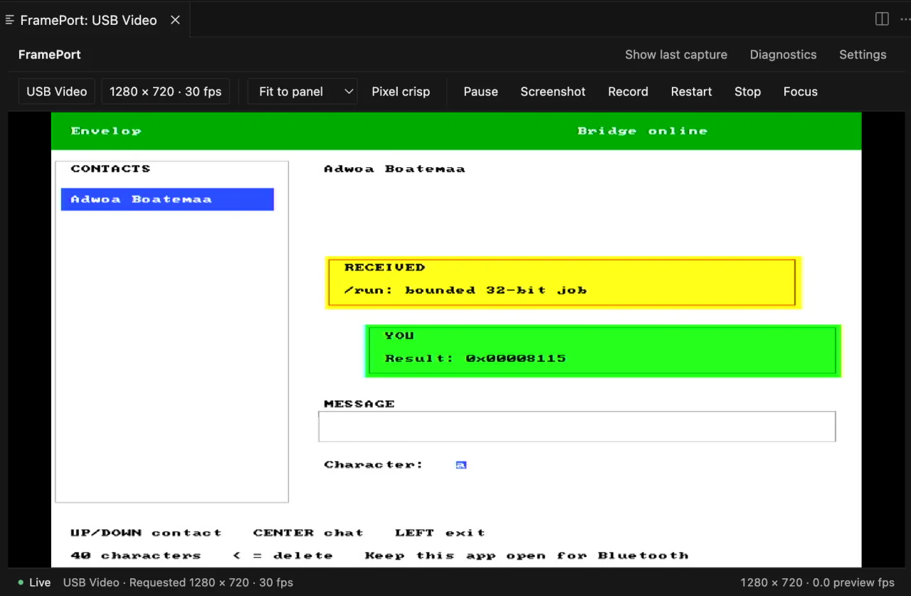

> **Companion-project provenance:** Imported from Envelop’s engineering log on 17 September 2026. Original wording is preserved; referenced media is mirrored into Tomato’s gallery.

> **Historical, noncanonical log (2026-09-15).** This records the project at
> the time and may be superseded. See
> [`docs/status.md`](../docs/status.md) for current facts and compute provenance.

  

<em>The compiler's destination made visible: a bounded job executed and displayed inside Tomato OS.</em>

The question arose: how do I meaningfully extract the right expression from something that is almost natural language?

That conversation naturally opened into compiler design — lexical structure, tokenization, parsing, syntax, and eventually lowering everything into something Tomato can actually execute.

(See why I love building? The concepts naturally come at you as you build :)

My first thought was fairly simple. Break the sentence into tokens.

For instance:

`What is 89 + 81 on Tomato?`

becomes roughly:

`What` · `is` · `89` · `+` · `81` · `on Tomato`

From there, `89`, `+`, and `81` are meaningful to the computation. The rest belongs to a small, explicitly defined set of grammatical filler.

The important part is that I do **not** want Envelope blindly throwing away every word it does not understand. That could quietly change the meaning of a request. Instead, the parser is deterministic: recognized filler can disappear, recognized operators and values become syntax, and anything genuinely unknown fails closed rather than being guessed.

So the actual path is closer to:

`user text → normalization → lexer → parser → syntax tree → Tomato IR → Tomato`

For example:

`What is 93 plus 47 minus 8 on Tomato?`

reduces to:

`93 + 47 - 8`

which parses as:

`(93 + 47) - 8`

and can then be lowered into Tomato operations and registers before being sent for execution.

Envelope therefore does the understanding and compilation. Tomato does the computation, just as intended!

That distinction matters to me. I do not want to quietly calculate the answer in Envelope and then make Tomato look responsible for it. If the result says it was executed on Tomato, the actual Tomato datapath should have produced it.

The wrong direction here would have been reaching for an LLM or some MCP-style abstraction just to understand a tiny arithmetic language. A small deterministic compiler is simpler, faster, fully testable, and much more interesting.

It also makes Tomato far nicer to chat with. Instead of ugly red parser errors, Envelope can always return something structured and meaningful: the expression it understood, a specific syntax error, an unsupported operation, or a clean fallback message.

And somehow, what started as “let me text my computer” has now casually wandered into compiler design, rightfully so!