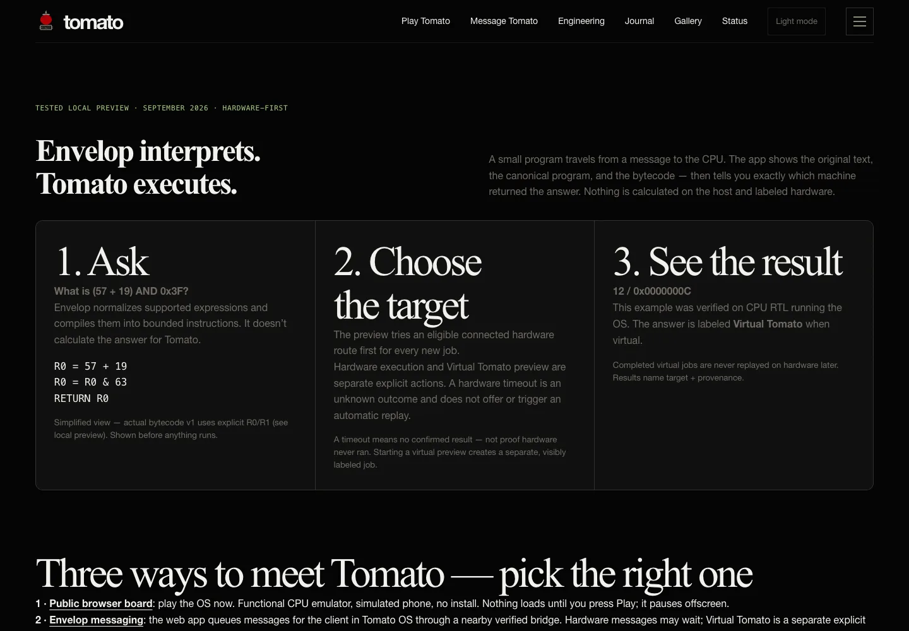

I wondered, what is the use of saying hello to tomato and getting a reponse, Hello {firstname}? It is cool, but withers too quickly. It would be completely orthogonal to build an AI model just for tomato, so instead, I am accessing the most precious hardwar on tomato: the ALU, a 524... configuration should be locally non-exhaustive to any human user.

To achieve this, inside a chat, you have the option to ask for instance, ADD 0x90... and so on, and it will reach tomato's ALU and a response will be returned. Pipeline is message in evelop -> internet and through local bluetooth to tomato in my dorm -> computes -> reutrns via bluetooth back to user.

This imo is closest anyone anywhere in the world can get as close as possible to toamto. Each user will have 8 virtual registers and so on. Thank goodness tehre are 32,... registers by design!

I however notieced not so many people can write quality assembly with no syntax and in the stule that tomat understands, so instead, I uypgraded envelop as a top level "cleaner" and precompiler. It converts into tomato assmebly, and shows you throughout the message that went to tomato, and whta tomato processed, including the hex code! So much transparency because, the goal is to see what tomato is really doing behind the sceneces and so on.

*UI documentation · hardware and virtual execution are separate, visibly labeled paths; this capture demonstrates provenance boundaries, not a completed hardware job.*

It is easy to wonder what component is really doing what especially when abstractions are involbe, but tomato is meant to audaciously be as transparent as linux if not way more transparent down to what each wire is conducting!

All features ahve been built and tested, and as usual, i will do a few housekeeping and tightening. As I will always alued to using the python previewer and cached rebuild, iteration as as fast as changing header size in an html!