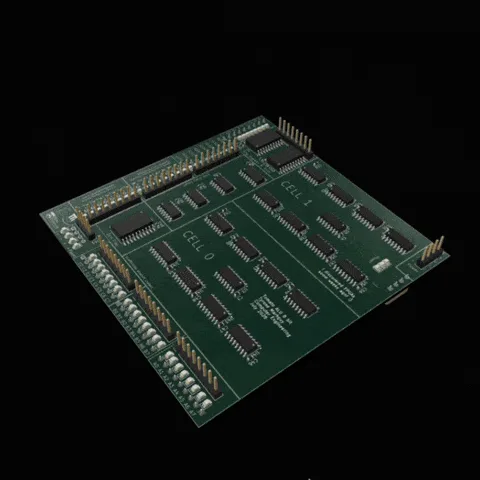
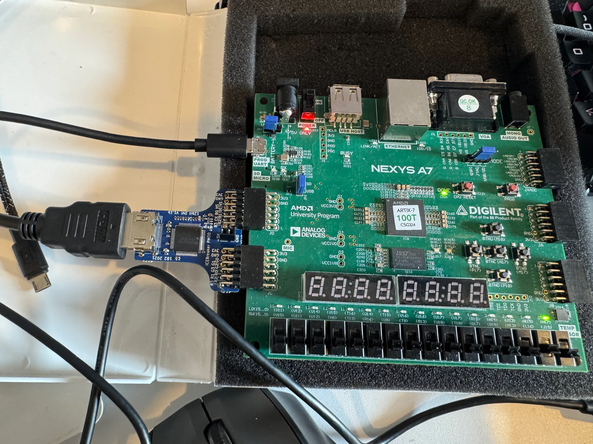

# Tomato — Hardware

<strong>Digital schematics · KiCad lots · FPGA · exported Verilog.</strong>

 

Where the machine lives in copper and fabric. Digital `.dig` files are the editable logic source. KiCad is the PCB. FPGA is the running CPU on a monitor. Exported Verilog is read-only.

**Project map:** [Root README](../README.md) · [Digital](digital/README.md) · [KiCad](kicad/README.md) · [FPGA](fpga/README.md) · [Verilog policy](verilog/README.md)

  
  

<em>Copper &amp; fabric · Lot 07 · Nexys A7</em>

| Path | Role | Authority |
|------|------|-----------|
| [`digital/`](digital/) | GUI + headless Digital schematics | Editable source of truth |
| [`kicad/`](kicad/) | Numbered PCB lots `01`–`08` | Fab / assembly |
| [`fpga/`](fpga/) | Nexys A7 — Tomato OS on HDMI | Open-source Yosys flow |
| [`verilog/`](verilog/) | Digital export policy | **Do not hand-edit** |

**Policy:** Edit Digital → export → copy into `verification/rtl/` or FPGA trees as needed. Never treat export folders as design source.

**Running machine:** [`fpga/README.md`](fpga/README.md) — CPU + Tomato OS, no Vivado.
