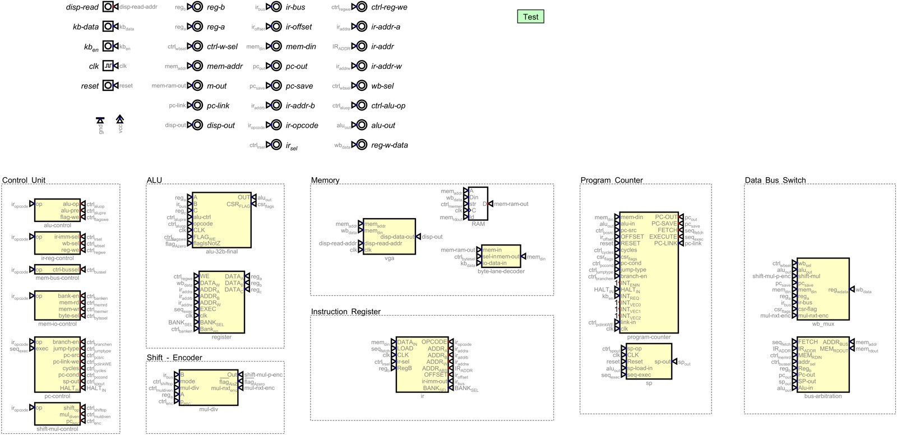

# Tomato — Digital

<strong>Schematic source of truth · Heinrich Hneemann's Digital.</strong>

 

GUI and headless simulation for the discrete datapath. `.dig` files under `modules/` are editable logic. Exported Verilog is a downstream artifact — regenerate, do not hand-patch.

**Project map:** [Hardware](../README.md) · [Root README](../../README.md) · [Verification](../../verification/README.md)

  

<em><code>main.dig</code> · editable schematic source of truth</em>

## Open and run

1. Install [Digital](https://github.com/hneemann/Digital) — `Digital.zip` from [Releases](https://github.com/hneemann/Digital/releases), run `Digital.jar` (Java).
2. **File → Open** → `hardware/digital/modules/main.dig`.
3. Press **Run** (or single-step the clock).

Other entry points: `alu-32b-final.dig` (ALU only), `alu-display-control.dig` (display bring-up), modular `*-control.dig` boards.

## Export rule

Copy Digital-export netlists into `verification/rtl/` (and FPGA trees when needed), then re-run sign-off. See [hardware/verilog/README.md](../verilog/README.md).
