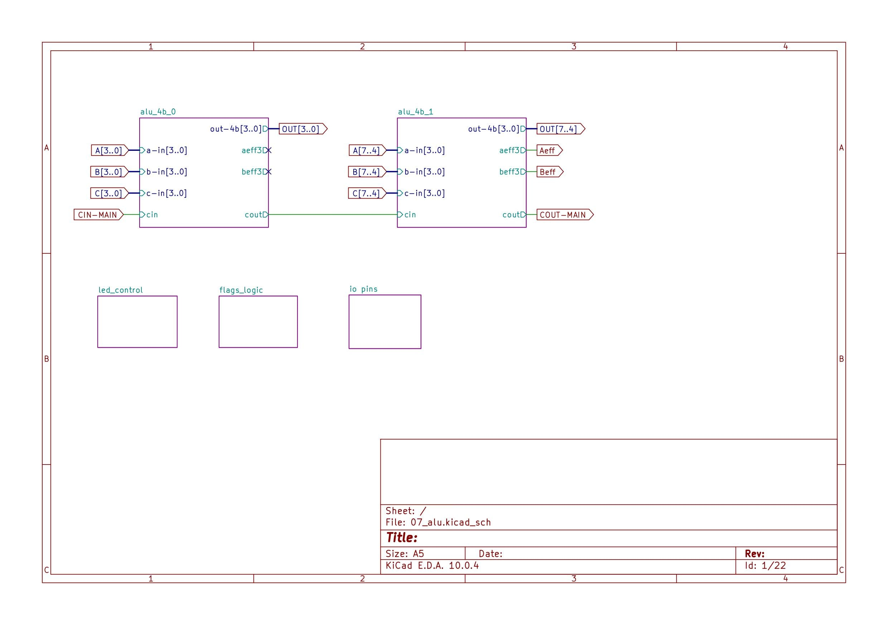
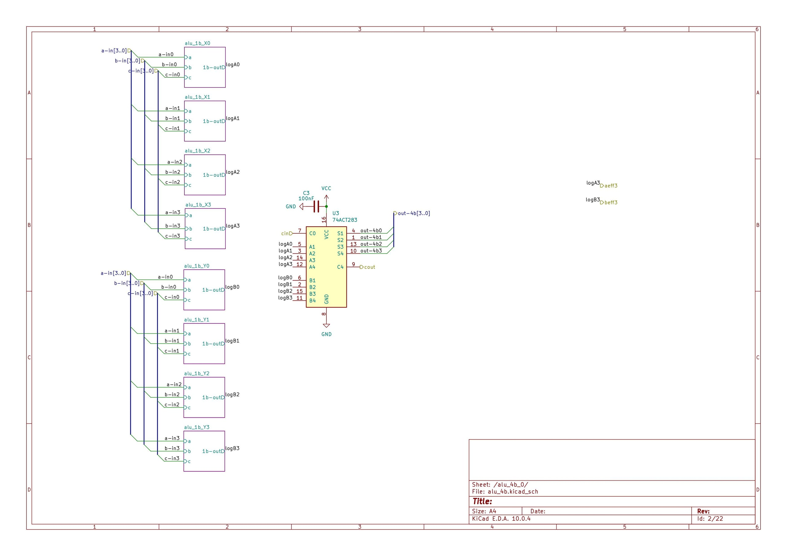
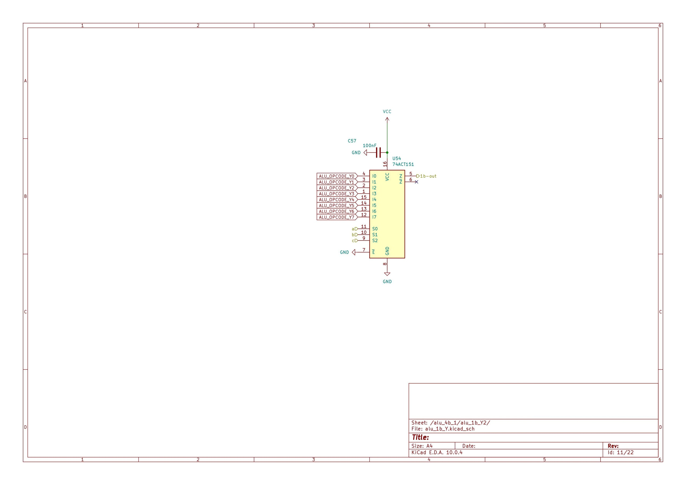
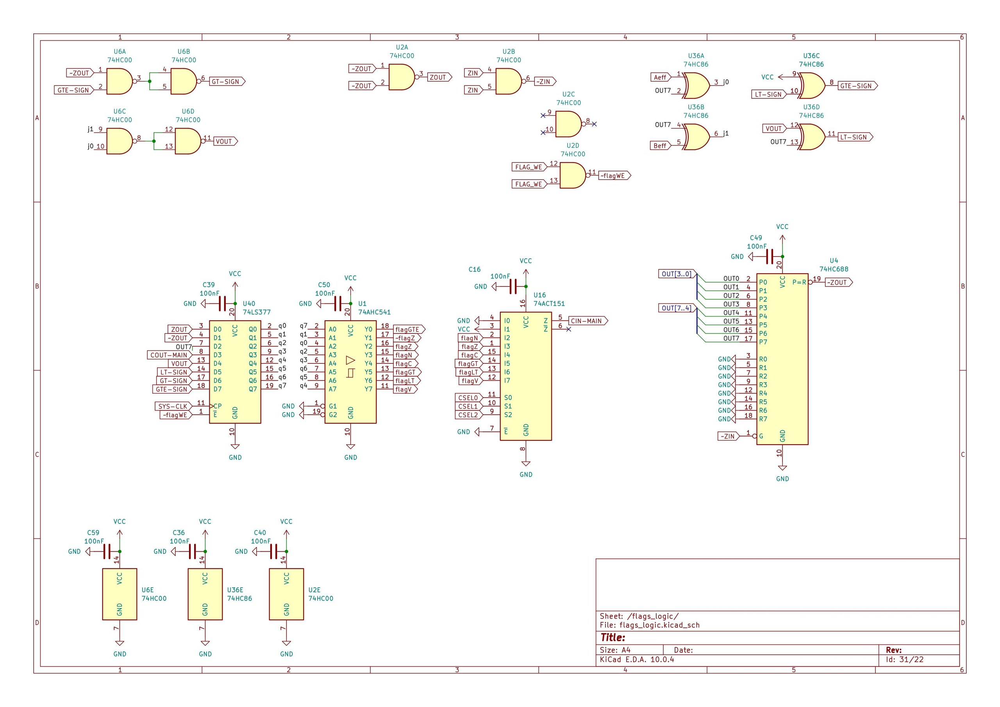
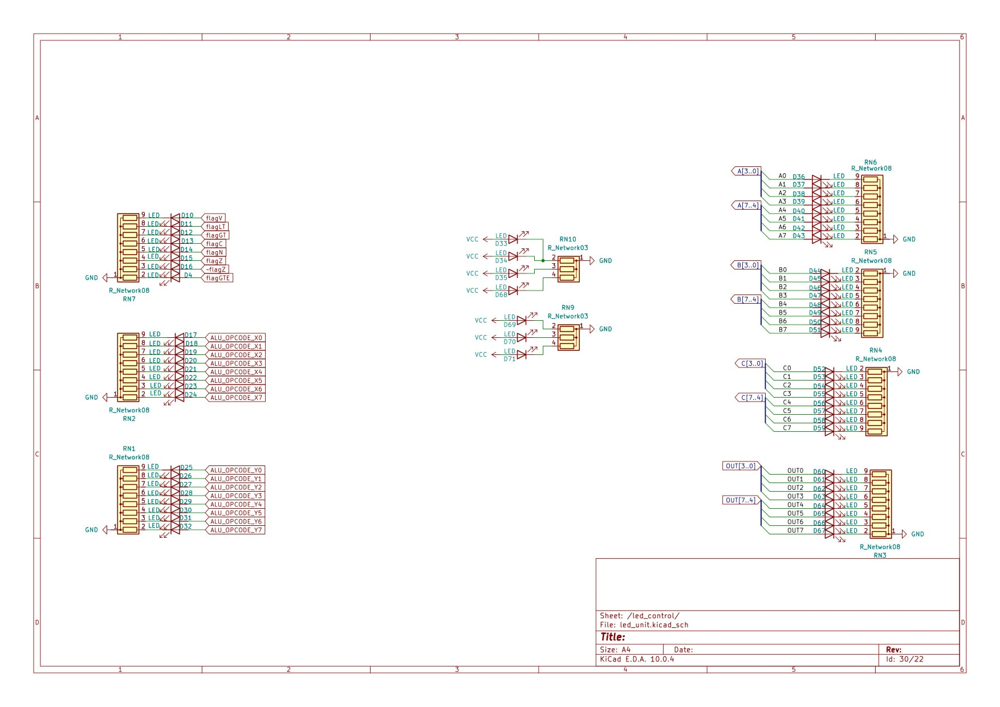
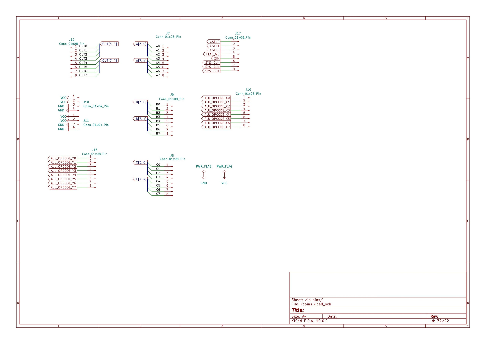

# 07 — Dual-LUT ALU PCB


The physical **32-bit ALU** for Tomato — two independent 3-input LUT planes per bit, summed through **74ACT283** nibble adders, with on-board flag logic, carry select, and a bring-up LED wall. Digital source of truth: [alu-32b-final.dig](../../../digital/modules/alu-32b-final.dig). KiCad project: [07_alu.kicad_pro](07_alu.kicad_pro).

---

## Table of Contents

- [At a glance](#at-a-glance)
- [Hierarchy](#hierarchy)
- [Schematics](#schematics)
- [PCB layout](#pcb-layout)
- [I/O and bring-up](#io-and-bring-up)
- [Project files](#project-files)
- [Related docs](#related-docs)

---

## At a glance

```
alu_out[n] = ( lutA(a,b,c) + lutB(a,b,c) + cin ) & 1   per bit, ripple across nibbles
```

| Item | Detail |
|------|--------|
| Board | `07_alu` — modular 74xx ALU (not the legacy 270mm transistor `01_alu`) |
| Topology | `alu_1b_X` + `alu_1b_Y` → `alu_4b` × 2 (ripple carry) → 8b slice on PCB |
| Key ICs | **74ACT151** (LUT3 mux), **74ACT283** (4b adder), **74HC688** (zero detect), **74LS377** (flag reg) |
| Layout | Routed — **0 unrouted** nets (see status below) |
| Silk | Tomato ALU branding, UPenn / author contact on copper |


*Figure 1 — 8-bit ALU PCB layout (`CELL 0` / `CELL 1`, flag logic, I/O headers).*

---

## Hierarchy

The KiCad tree mirrors the Digital verification ladder:

| Sheet | Role |
|-------|------|
| [07_alu.kicad_sch](07_alu.kicad_sch) | Top — two [alu_4b](alu_4b.kicad_sch) slices, `CIN-MAIN` / `COUT-MAIN` ripple |
| [alu_4b.kicad_sch](alu_4b.kicad_sch) | Four [alu_1b_X](alu_1b_X.kicad_sch) + four [alu_1b_Y](alu_1b_Y.kicad_sch) → one **74ACT283** |
| [alu_1b_X.kicad_sch](alu_1b_X.kicad_sch) / [alu_1b_Y.kicad_sch](alu_1b_Y.kicad_sch) | Single-bit **74ACT151** LUT3 (`lutA` / `lutB` programs via opcode buses) |
| [flags_logic.kicad_sch](flags_logic.kicad_sch) | Z/N/C/V, LT/GT/GTE, **74ACT151** carry select (`CSEL`) |
| [led_unit.kicad_sch](led_unit.kicad_sch) | Opcode, flag, and A/B/C/OUT bus LEDs for bench debug |
| [iopins.kicad_sch](iopins.kicad_sch) | Connector pinout — power, operands, opcodes, control |

Full CPU width is four 8-bit slices (or eight 4-bit cells) in the larger Tomato datapath; this board implements one **8-bit bring-up slice** with the same cell geometry used in simulation.

---

## Schematics

### Top sheet — two 4-bit ALU cells


*Figure 2 — `alu_4b_0` and `alu_4b_1` chained; `flags_logic`, `led_control`, and `iopins` sheets.*

### 4-bit slice — dual LUT into adder


*Figure 3 — `alu_1b_X0–X3` and `alu_1b_Y0–Y3` feed **U3 (74ACT283)**; `cinD` / `cout` nibble carry.*

### 1-bit LUT3 (`alu_1b_Y` example)


*Figure 4 — **74ACT151** as 3-input LUT: `a,b,c` select among `ALU_OPCODE_Y0–Y7`.*

### Flag logic


*Figure 5 — Zero compare (**74HC688**), flag register (**74LS377**), **74ACT151** `CIN-MAIN` mux from `CSEL` + latched flags.*

### LED bring-up panel


*Figure 6 — Visualize `ALU_OPCODE_X/Y`, flags, and A/B/C/OUT buses on the bench.*

### I/O connectors


*Figure 7 — Headers for A/B/C/OUT, opcode buses, `CSEL`, `FLAG_WE`, `SYS-CLK`, power.*

---

## PCB layout

| Asset | Description |
|-------|-------------|
| [alu_8b_pcb.png](../../../../media/kicad/07_alu/pcb/alu_8b_pcb.png) | 2D layout — cells, flag block, silkscreen |
| [alu_8b_3d.gif](../../../../media/kicad/07_alu/pcb/alu_8b_3d.gif) | 3D board view |
| [status_bar.png](../../../../media/kicad/07_alu/pcb/status_bar.png) | DRC/route status — **760 pads**, **388 vias**, **2345** segments, **183 nets**, **0 unrouted** |


*Figure 8 — 3D render of the assembled 8-bit ALU board.*

---

## I/O and bring-up

From [iopins.kicad_sch](iopins.kicad_sch):

| Group | Signals |
|-------|---------|
| Operands | `A[7:0]`, `B[7:0]`, `C[7:0]` |
| Result | `OUT[7:0]` |
| LUT programs | `ALU_OPCODE_X0–X7`, `ALU_OPCODE_Y0–Y7` (8-bit truth table per LUT plane) |
| Carry select | `CSEL0–CSEL2` → `CIN-MAIN` |
| Flags | `FLAG_WE`, `ZIN`; outputs `flagZ/N/C/V`, LT/GT/GTE |
| Clock | `SYS-CLK` (flag register) |

Suggested flow: program opcode buses for a known LUT pair (e.g. add = `0x96` on both planes), wiggle operands on headers, read **OUT** on LEDs or scope — same spirit as [alu-display-control.dig](../../../digital/modules/alu-display-control.dig) on the full CPU.

---

## Project files

| File | Purpose |
|------|---------|
| [07_alu.kicad_pro](07_alu.kicad_pro) | KiCad project |
| [07_alu.kicad_sch](07_alu.kicad_sch) | Root schematic |
| [07_alu.kicad_pcb](07_alu.kicad_pcb) | PCB layout |
| [alu_1b_X.kicad_sch](alu_1b_X.kicad_sch), [alu_1b_Y.kicad_sch](alu_1b_Y.kicad_sch) | Bit slices |
| [alu_4b.kicad_sch](alu_4b.kicad_sch) | Nibble cell |
| [flags_logic.kicad_sch](flags_logic.kicad_sch), [led_unit.kicad_sch](led_unit.kicad_sch) | Status + debug |
| [iopins.kicad_sch](iopins.kicad_sch) | Connector map |

Media exports (figures above): [media/kicad/07_alu/](../../../../media/kicad/07_alu/).

---

## Related docs

| Doc | Topic |
|-----|-------|
| [Root README](../../../../README.md) | Project overview |
| [74251 carry mux log](../../../../docs/log/2026-06-26%20-%20ALU%20-%20Redesign%20with%2074251.md) | Why **74251/ACT151** over **74151** + tri-state |
| [Mode mux elimination](../../../../docs/log/2026-06-27%20-%20Elimination%20of%20Mode%20Multiplexers.md) | LUT3 feeds adder directly |
| [ALU segment display](../../../../docs/log/2026-06-19%20-%20ALU%20segment%20display%20design.md) | Display strategy on full CPU |
| [verification/README.md](../../../../verification/README.md) | Formal + UVM sign-off on Digital export |

**Author:** Tyrone Marhguy — see [Author](../../../../README.md#author) in root README.
