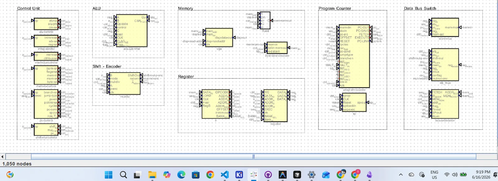

# Tomato — Microcode

<p align="center"><strong>Per-board EEPROM images · packed from the ISA CSV.</strong></p>

 

Per-board 8-bit EEPROM images for Tomato control decode. Digital format: `v2.0 raw`.

**Authority (512 rows):** [`docs/isa/tomato.v1.csv`](../docs/isa/tomato.v1.csv)

**Project map:** [Root README](../README.md) · [ISA](../docs/isa/README.md) · [FPGA burn](../hardware/fpga/core/README.md)

<p align="center">
  
</p>
<p align="center"><em>Modular decode · local EEPROMs travel with the datapath</em></p>

```bash
python3 tools/gen_microcode_v1.py              # pack hex + mem from the CSV
python3 tools/burn_microcode_to_digital.py     # optional Digital board burn
```

Also writes `$readmemh`-ready `*.mem` under `microcode/` and `hardware/fpga/core/tb/mem/`.

| File | Board | Fields |
|------|-------|--------|
| `alu_control_1.hex` | ALU | `alu_op[7:0]` → lutA / lutB |
| `alu_shift_control.hex` | ALU | `csel[2:0]`, `flag-we`, `shift_op[5:4]`, `mul_div_en`, `pc_enc` |
| `ir_reg_control.hex` | IR/reg/WB | `ir_imm_sel[3:0]`, `wb_sel[6:4]`, `reg_we[7]` |
| `mem_bus_control.hex` | Mem bus | `ctrl_bussel[2:0]`, `alusel[3]` |
| `mem_io_control.hex` | Mem I/O | `bank_en`, `mem_rd`, `mem_wr`, `byte_sel[6:3]` |
| `pc_control.hex` | PC | `branch_en`, `jump_type`, `pc_src[4:2]`, `pc_link_we`, `cycles[7:6]` |
| `pc_sp_mul_control.hex` | PC/SP | `pc_cond[2:0]`, `sp_op[5:4]` |
| `shift_mul_control.hex` | Shift/mul (spare) | `shift_op[1:0]`, `mul_div_en` |

## Legacy

Pre-v1 **1024-row** images: [`legacy-1024/`](legacy-1024/).
