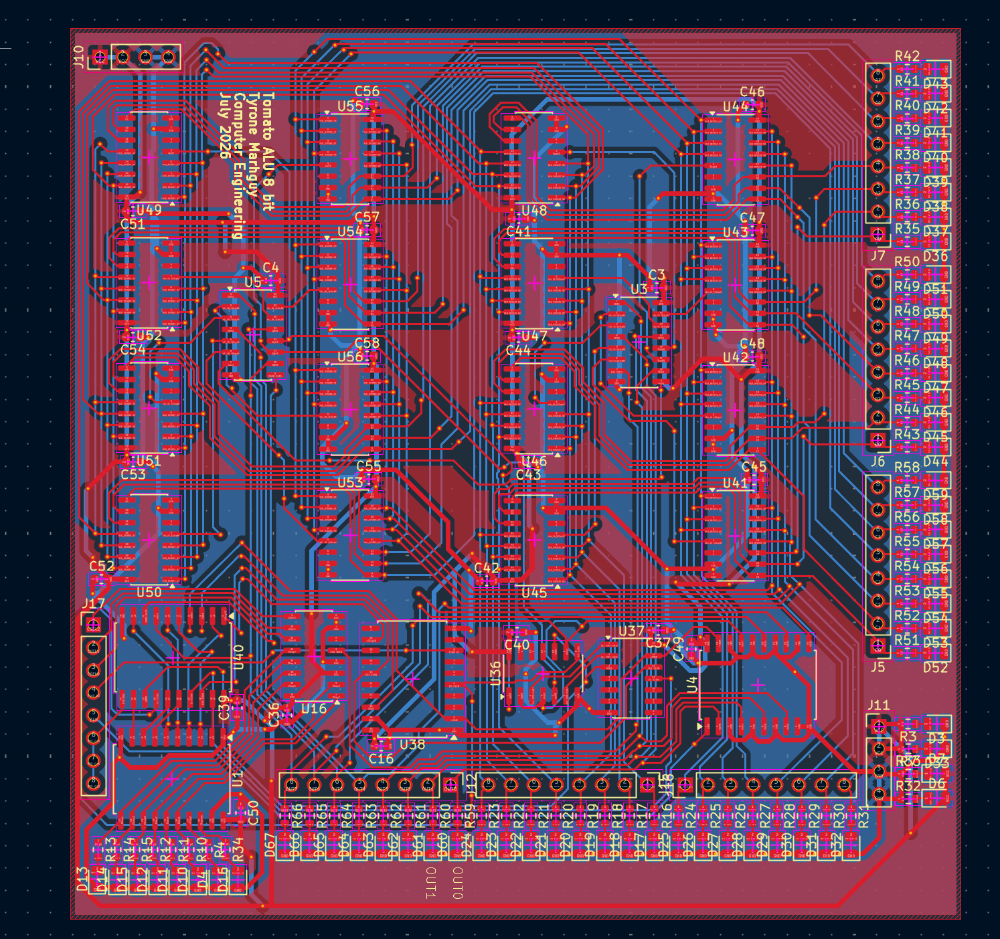

# Tomato — ALU verification

<p align="center"><strong>Formal · directed · UVM sign-off for the dual-LUT ALU.</strong></p>

 

Layered sign-off for the **Tomato dual-LUT 32-bit ALU**: independent 3-input LUT planes per bit, ripple carry across byte slices, flag latches on the top 8b slice — `out = f(a,b,c) + g(a,b,c) + cin`. Proof runs from the 1-bit programmable-LUT cell up through the exported 32-bit netlist.

**Tools:** SymbiYosys formal (1b → 8b → 32b comb + sequential flag cover), Icarus directed replay of Digital test vectors, Questa UVM with a shared reference model.

**FPGA dual-LUT ALU:** [gauntlet/](gauntlet/) — Verilator **10B** (8b) + **130B** (32b) and SymbiYosys on a copy of [`hardware/fpga/core/rtl/alu.v`](../hardware/fpga/core/rtl/alu.v). `make gauntlet_smoke` · `make gauntlet_claim`.

**Harness root:** `verification/` · **RTL policy:** Digital exports in `rtl/` are read-only copies — regenerate from [alu-32b-final.dig](../../hardware/digital/modules/alu-32b-final.dig), then re-run sign-off.

**Project map:** [Root README](../README.md) · **ASIC metrics:** [synthesis/README.md](synthesis/README.md) · **Carry benchmark:** [test/README.md](../test/README.md)

<p align="center">
  
</p>
<p align="center"><em>What gets proved · Dual-LUT slice hierarchy</em></p>

---

## Table of Contents

- [Summary (latest run)](#summary-latest-run)
- [What each layer proves](#what-each-layer-proves)
- [Quick start](#quick-start)
- [Layout](#layout)
- [Sign-off criteria](#sign-off-criteria)
- [Known limits](#known-limits)
- [Related docs](#related-docs)

---

## Summary (latest run)

**Date:** 2026-06-19 · **Netlist:** `rtl/alu-32b-final.v` (Digital export)

| Step | Tool | Scope | Result | Notes |
|------|------|-------|--------|-------|
| G | `generate.py` | 91-op table + 476 directed vectors | **PASS** | Skips 6 flag-only vectors (exp=`x`) |
| F1 | SymbiYosys | `alu-1b-final` — LUT3 + G/P | **PASS** | k-induction, z3 |
| F2 | SymbiYosys | `alu-8b-final` — per-bit LUT3 + G/P | **PASS** | k-induction, z3 |
| F3 | SymbiYosys | `alu-32b-final` — 12 spot properties | **PASS** | fast regression |
| F4 | SymbiYosys | `alu-32b-final` **full comb equiv** | **PASS** | ~74 s — all inputs, `CSR_FLAG[4]` as `flag_c` |
| F5 | SymbiYosys | flags reachability | **PASS** | cover mode |
| L | Verilator | Lint all slices | **PASS** | |
| D | Icarus | **476/476** vectors vs golden | **PASS** | no skips; `flag_c` 0/1 for `csel=10` |
| U | Questa UVM | 1b + 8b + 32b | **Requires Questa** | scoreboard uses full golden |

```bash
make signoff        # fast CI (~35 s): spot formal + directed + lint
make signoff_full   # adds formal_32b_equiv end-to-end comb proof
```

From repo root: `make test` runs `make -C verification signoff`.

---

## What each layer proves

| Layer | Proven property |
|-------|-----------------|
| **Formal 1b** | For all inputs: `MUX_OUT = OPCODE[{C,B_eff,A_eff}]`, `G = A_eff & B_eff`, `P = A_eff ^ B_eff`. Complete programmable-LUT plane for one bit. |
| **Formal 8b** | Same relations applied independently to each of 8 bit-slices (parallel 1b composition). |
| **Formal 32b equiv** | `Out === golden(..., CSR_FLAG[4])` for all inputs (`make formal_32b_equiv`) |
| **Formal 32b spot** | 12 fast regression properties — subset of equiv (`make formal_32b`) |
| **Formal 32b flags** | Cover: FLAG_WE reachability (`make formal_32b_flags`) |
| **Directed** | **476/476** vs unified golden (all `csel`, all opcodes) | `make directed` |
| **UVM 1b** | Scoreboard on every stimulus: MUX_OUT + G + P vs `alu_ref_model_pkg`. Exhaustive test: 128-row `0x96` table + 256× LUT sweep + G/P corners. |
| **UVM 8b** | Full 8b `out`, `G`, `P` vs ref model; random, CLA boundary, and logic-sweep sequences. |
| **UVM 32b** | Clock-driven env; comb `Out` check + `CSR_FLAG` when `FLAG_WE`; 91-op coverage bin; SVA `FLAG_WE → !$isunknown(CSR_FLAG)`; 7 tests + full regression. |

---

## Quick start

```bash
cd verification

# No commercial simulator license required
make signoff              # fast CI (~35 s)
make signoff_full         # + 32b equiv prove (~3 min)
make formal_32b_equiv     # full comb proof (~74 s)
make directed             # 476 vectors (Icarus)
make generate             # regenerate op table + vectors (when scripts/generate.py present)

# Questa required (vlog/vsim on PATH)
make uvm_1b_exhaustive
make uvm_8b_full
make uvm_32b_regression   # directed + ops91 + edge + flag + 10k random
make uvm_regression       # 1b exhaustive + 8b full + 32b regression

# Sky130 synthesis characterization
make synth                # see synthesis/README.md
```

**Dependencies (local sign-off):** `python3`, `yosys`, `symbiyosys` (`sby`), `z3`, `iverilog`, `verilator`.

**UVM:** [Questa Intel FPGA Starter](https://www.intel.com/content/www/us/en/software-kit/750666/intel-quartus-prime-lite-edition-design-software-version-23-1-for-windows.html) or equivalent with `vlog`/`vsim`.

**Before first run:** copy Digital-export netlists (`alu-1b-final.v`, `alu-8b-final.v`, `alu-32b-final.v`) into `rtl/` — see [rtl/README.md](rtl/README.md). The synthesis tree also holds a current `alu-32b-final.v` copy under `synthesis/rtl/`.

---

## Layout

```
verification/
├── README.md           ← you are here
├── Makefile            ← all targets (signoff, formal, UVM, synth)
├── rtl/                → [rtl/README.md](rtl/README.md) — Digital-export DUT netlists
├── formal/             → [formal/README.md](formal/README.md)
├── directed/           → [directed/README.md](directed/README.md)
├── gauntlet/           → [gauntlet/README.md](gauntlet/README.md) — FPGA ALU 10B/130B + SymbiYosys
├── synthesis/          → [synthesis/README.md](synthesis/README.md) — Yosys → Sky130 HD
├── uvm/                → [uvm/README.md](uvm/README.md)
│   ├── common/         → ref model, op table, directed vectors (generated pkgs committed)
│   ├── alu_1b/         → [uvm/alu_1b/README.md](uvm/alu_1b/README.md)
│   ├── alu_8b/         → [uvm/alu_8b/README.md](uvm/alu_8b/README.md)
│   └── alu_32b/        → [uvm/alu_32b/README.md](uvm/alu_32b/README.md)
└── scripts/            → generate.py (vector + op table codegen, when present)
```

Generated at build time (gitignored in root `.gitignore`): `work/`, `results/`, `formal/alu_*_verify/`, `directed/run_extracted_tb.v`, `synthesis/reports/`, `test/reports/`.

---

## Sign-off criteria

**Scope reminder:** this harness signs off the **ALU export**, not the full Tomato CPU, ISA decode, memory system, or FPGA top.

| Metric | Target | Command |
|--------|--------|---------|
| Formal 1b LUT + G/P | PASS (prove) | `make formal_1b` |
| Formal 8b per-bit | PASS (prove) | `make formal_8b` |
| Formal 32b equiv | PASS (all inputs) | `make formal_32b_equiv` |
| Formal 32b spot | PASS (fast) | `make formal_32b` |
| Formal 32b flags | PASS (cover) | `make formal_32b_flags` |
| Formal inventory | **5/5 jobs**; **19 assert + 20 cover** (40+48 elaborated) | `make formal_inventory` → [formal/PROPERTY_INVENTORY.md](formal/PROPERTY_INVENTORY.md) |
| Directed vectors | 476/476 pass vs ALU golden | `make directed` |
| FPGA ALU (core copy) | SymbiYosys 1b+8b+32b; Verilator 10B / 130B | `make gauntlet_claim` → [gauntlet/](gauntlet/) |
| Lint | 0 errors | `make lint` |
| UVM `op91_cp` | Covergroup over **91 ALU control-table rows** (not 512 CPU opcodes, not toggle/branch %) | `make uvm_32b_ops91` (Questa) |
| UVM directed replay | 476 vectors | `make uvm_32b_directed` |
| UVM full regression | 0 scoreboard errors | `make uvm_32b_regression` |

---

## Known limits

| Limit | Status |
|-------|--------|
| Scope = **ALU only** | Full CPU / FPGA / ISA ROM are **not** covered by this harness |
| `op91_cp` | 91 **ALU** `(lut,ctrl,csel)` table rows — **not** 512 ROM opcodes, not code coverage |
| Toggle / branch / line coverage | **Not measured** here |
| `csel==2'b10` carry-fed logic | **Closed** — unified ripple-LUT golden; `Flag_C` primary input in formal |
| Directed 476 vectors | PASS vs golden; many vectors exercise modes beyond the 91 named rows |
| Sequential `CSR_FLAG` prove | **Cover + UVM** — SMT latch prove not feasible; use `alu_32b_flag_test` |
| UVM in CI | Questa not wired in GitHub Actions yet |

---

## Related docs

| Doc | Link |
|-----|------|
| Tomato architecture | [Root README](../README.md) |
| Synthesis (Sky130 metrics) | [synthesis/README.md](synthesis/README.md) |
| Kogge-Stone benchmark | [test/README.md](../test/README.md) |
| 91-op control map (authority) | [docs/alu/alu-1b/alu_control_map.tex](../docs/alu/alu-1b/alu_control_map.tex) |
| Digital source schematic | [alu-32b-final.dig](../hardware/digital/modules/alu-32b-final.dig) |
| Root shortcut | `make test` → `make -C verification signoff` |
