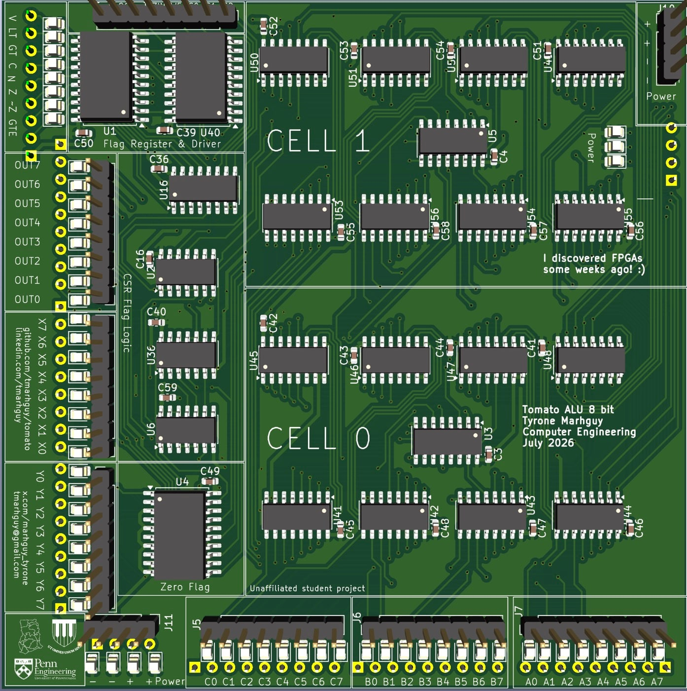
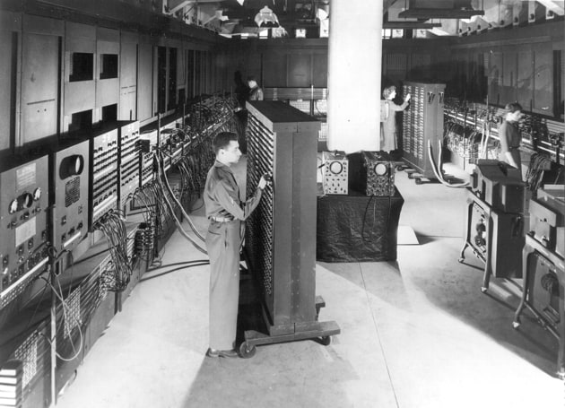
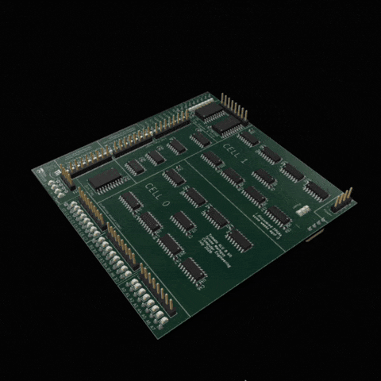

<h1 align="center">TOMATO</h1>
<p align="center"><strong>32-bit Computer.</strong> The oddest machine still built from chips.</p>


<p align="center">
  
</p>
<p align="center"><em>Vol. 32 · No. 1 · Magnesium Alley, Ashtown-Bay Perimeter · August 2026</em></p>

This is not a SaaS product page. It is not a bloated React template. It is a **90s broadsheet**—typeset in Playfair and Source Serif—that acts as a temporal bridge to the hardware. It features a fully interactive 3D KiCad GLB of [`07_alu`](https://tomato.tmarhguy.com/board.html), a bit-level **[Dual-LUT playground](https://tomato.tmarhguy.com/playground.html)**, and the project's **[engineering journal](https://tomato.tmarhguy.com/journal.html)**.

**Live:** [tomato.tmarhguy.com](https://tomato.tmarhguy.com/)  
**Core CPU architecture:** [Root README](../README.md)  
**Design journal:** [docs/log/](../docs/log/)


---

## The Lore: Why a Newspaper?

The hardest parts of engineering are often the non-technical ones—like deciding how to present bare-metal silicon on the modern web.

A Stripe-style landing page would try to sell a machine that isn't for sale. A generic React SPA has no connection to **74xx** chips or the era they dominated. Tomato physically belongs to the **70s, 80s, and 90s**. Social media didn't exist then, but newspapers did.

So, the site is a broadsheet published in **Magnesium Alley, Ashtown-Bay Perimeter** (a fictionalized Silicon Valley set in [Ghana](https://en.wikipedia.org/wiki/Ghana)). The physical copper, however, is inbound to **Philadelphia**. The front page features the nameplate, the deck, and classifieds for the **eight PCB lots**. The 3D render of the ALU sits on the page like a photoengraved magnesium plate.

That aesthetic choice forced strict technical constraints: **no frameworks**, **no component libraries**, and **no absolute URLs**. The payoff is that the site *is* the journal, not just a brochure with a link to one.

<p align="center">
  
  
</p>
<p align="center"><em>Left: Board render · Right: Routed top copper — The same plates featured in Fig. 1.</em></p>

---

## Design Constraints & Impact

Every choice on this site mirrors the architectural constraints of the CPU itself: cut the bloat, ensure it routes cleanly, and make it functional on the bench.

- **Static HTML over SPA:** Tomato’s KiCad GLB is <mark style="background:#d6e8ff;color:#1e4a7a;padding:0.05em 0.28em;border-radius:2px">~31 MB</mark> with <mark style="background:#d6e8ff;color:#1e4a7a;padding:0.05em 0.28em;border-radius:2px">~41k primitives</mark>. A heavy JS framework wouldn't survive a magazine column format. `web/` deploys as a raw folder. Vercel install command: `echo "no-install"`.
- **Relative Links Only:** Nested pages (`journal/…`, `boards/…`), local `python3 -m http.server`, and Vercel all break if assets are rooted at `/css/…`. Everything is strictly relative so the paper works on [tomato.tmarhguy.com](https://tomato.tmarhguy.com/), a local preview, or a subdirectory checkout.
- **Single-File CSS:** Playfair, Source Serif, Libre Franklin, cream stock, and a red tomato over a DIP. No design systems. One stylesheet (`css/magazine.css`) powers the entire site, with the 3D viewer being the sole opt-out.
- **KiCad’s Native Copper:** No artificial gold restyling. The export matches the physical board: **FR4 core black**, silk white, copper untouched. Fig. 1 and the interactive GLB use the exact same material palette.
- **Demand-Rendered 3D:** <mark style="background:#d6e8ff;color:#1e4a7a;padding:0.05em 0.28em;border-radius:2px">41k draw calls</mark> will melt a browser if left spinning in the background. The board merges materials at load and only renders when the camera moves or the user is actively on-screen.
- **The Forge in the Paper:** [`source.html`](https://tomato.tmarhguy.com/source.html) pulls the live GitHub repo directly into the broadsheet layout so you never have to break the vintage immersion to view the code.

<p align="center">
  
  
</p>
<p align="center"><em>Then: ENIAC at the Moore School (U.S. Army). Now: The 07_alu slice.</em></p>

---

## Core Features

### 1. 3D Immersion: The Bench & The Viewer

We run two cameras on one model (`assets/pcb/alu.glb`), exported directly from **KiCad 10**.

- **[The Bench](https://tomato.tmarhguy.com/)** (`js/bench.js`): Embedded on the front page. Drag, iso/side toggle, spin. Dimmed slightly so the cream paper still reads.
- **[The Viewer](https://tomato.tmarhguy.com/viewer.html)** (`js/viewer.js`): A dedicated, full-screen studio tour. Press **I** for a cinematic, monotonic orbit that lands on the upright isometric view. Any manual input aborts the tour.

### 2. The Playground

The [`playground.html`](https://tomato.tmarhguy.com/playground.html) interface is `07_alu` on a wire. It’s a **bit-level Dual-LUT emulator** running in the browser. Toggle operands, flip both LUT opcodes, and assert carry. If the Dual-LUT architecture doesn't survive a bit-flip in the browser, it won't survive a logic probe on the physical bench.

<p align="center">
  
</p>
<p align="center"><em>Lot 07 in the round · the slice the playground runs · <a href="https://tomato.tmarhguy.com/playground.html">open the playground</a></em></p>

### 3. The Journal & Boards

The journal takes [`docs/log/`](../docs/log/) and typesets it. It contains <mark style="background:#d6e8ff;color:#1e4a7a;padding:0.05em 0.28em;border-radius:2px">21 dispatches</mark>, tracking the build from the first gate to the final copper route. The **[boards catalog](https://tomato.tmarhguy.com/boards.html)** tracks all <mark style="background:#d6e8ff;color:#1e4a7a;padding:0.05em 0.28em;border-radius:2px">8 lots</mark>. Lot **07** is **routed and ordered**. The remaining lots (Shift, Memory, Register File, PC) are currently being plumbed while the fab runs.

---

## Repository Map

```text
web/
├── index.html              # The Front Page
├── architecture.html       # Datapath & Overlay Word
├── isa.html                # 512-row ROM & Mnemonic logic
├── playground.html         # Dual-LUT Emulator
├── journal.html            # Log Index
├── journal/*.html          # Typeset design logs
├── boards.html             # Lots 01–08 tracking
├── boards/*.html           # Individual board specs
├── board.html              # Embedded 3D bench
├── viewer.html             # Full-screen immersion viewer
├── source.html             # GitHub rendered in-paper
├── about.html              # The Correspondent
├── css/magazine.css        # The core broadsheet stylesheet
├── css/viewer.css          # Black studio lighting
├── js/                     # Engine: bench, viewer, alu emulator, forge
├── assets/pcb/alu.glb      # KiCad 07_alu export (~31 MB)
├── tests/                  # Custom sanity + emulator test suite
├── CNAME                   # tomato.tmarhguy.com
└── ATTRIBUTION.md
```

---

## Local Development & Testing

**Preview:**
Because of the GLB and ES modules, you must serve the directory (do not open via `file://`).

```bash
cd web && python3 -m http.server 8080
```

**Sanity Tests:**
There is no bundler. A silent 404 is the primary failure mode. `tests/site-sanity.mjs` is a custom, zero-dependency Node script that walks every HTML file to catch dead links, missing assets, root-absolute paths, and JS syntax errors.

```bash
cd web && npm test
# Or from the repo root: make web-test
```

---

## Deployment

- **Live origin:** [tomato.tmarhguy.com](https://tomato.tmarhguy.com/)
- **GitHub Pages (authority):** `.github/workflows/pages.yml` publishes `web/` on push to `main`. `CNAME` is `tomato.tmarhguy.com`. `.nojekyll` keeps underscored directories from being ignored.
- **Vercel:** Optional mirror. The root `vercel.json` serves `web/` and runs `npm test` as the build. Do **not** point `tomato.tmarhguy.com` at Vercel — that hostname is the Pages custom domain (`alu.tmarhguy.com` is the Vercel site).

### Custom domain DNS (Namecheap)

`tmarhguy.com` is on Namecheap BasicDNS (`pdns1.registrar-servers.com`). GitHub Pages 301s `tmarhguy.github.io/tomato/` to `tomato.tmarhguy.com`. If this CNAME is missing, **both** URLs look dead (`InvalidDNSError` in Pages settings).

In Namecheap → Domain List → `tmarhguy.com` → Advanced DNS, add:

| Type | Host | Value | TTL |
|------|------|-------|-----|
| CNAME | `tomato` | `tmarhguy.github.io.` | Automatic |

No A record on `tomato`. Do not CNAME it to `cname.vercel-dns.com`.

Then in the repo: **Settings → Pages**. Wait until the DNS check is green, then enable **Enforce HTTPS**. GitHub already has a cert for this hostname.

---

## Author

**Tyrone Marhguy** — Computer Engineering ’28, [University of Pennsylvania](https://www.upenn.edu/)

A look at the bottom left of the physical `07_alu` board reveals three silkscreened marks: **Penn Engineering, Achimota School, and the Ghana flag**. That silk is why the paper is printed in Ashtown Valley, even when the copper lands in Philadelphia.

| Links | |
| --- | --- |
| **Paper** | [tomato.tmarhguy.com](https://tomato.tmarhguy.com/) |
| **Repo** | [github.com/tmarhguy/tomato](https://github.com/tmarhguy/tomato) |
| **Email** | [tmarhguy@gmail.com](mailto:tmarhguy@gmail.com) |
| **Twitter** | [@marhguy_tyrone](https://twitter.com/marhguy_tyrone) |
