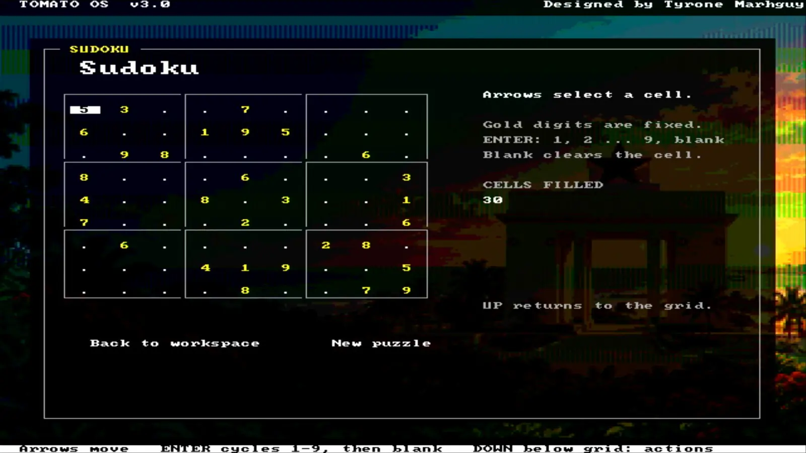
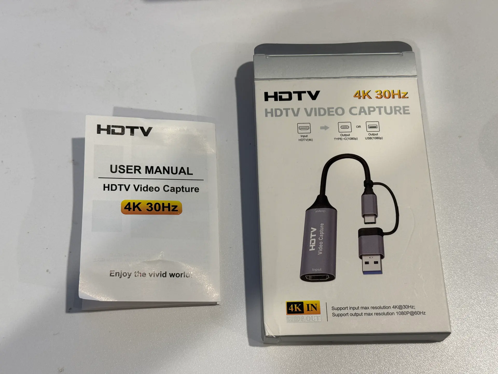

<h1 align="center">TOMATO</h1>
<p align="center"><strong>32-bit Computer.</strong> The oddest machine still built from chips.</p>

 

<p align="center">
  
</p>
<p align="center"><em>Vol. 32 · No. 1 · Magnesium Alley, Ashtown-Bay Perimeter · August 2026</em></p>

This is not a SaaS product page. It is not a bloated React template. The live site is a static paper—Libre Franklin and Source Serif 4—that acts as a temporal bridge to the hardware. It features a fully interactive 3D KiCad GLB of [`07_alu`](https://tomato.tmarhguy.com/board.html), **[Virtual Tomato](https://tomato.tmarhguy.com/virtual.html)** in the browser, a bit-level **[Dual-LUT playground](https://tomato.tmarhguy.com/playground.html)**, **[ALU verification sign-off](https://tomato.tmarhguy.com/verification.html)** (SymbiYosys, 476 directed, 10B/130B Verilator), and the project's **[engineering journal](https://tomato.tmarhguy.com/journal.html)**. The old newspaper plates remain as history (`broadsheet.html`); they are not the current design authority.

**Live:** [tomato.tmarhguy.com](https://tomato.tmarhguy.com/)  
**Core CPU architecture:** [Root README](../README.md)  
**Design journal:** [docs/log/](../docs/log/)

### Run locally

Do not open HTML via `file://` — the GLB and ES modules need a server. Use the repository server so cache headers, gzip, and ES modules match deployment:

```bash
cd web && npm run serve
# http://localhost:8080/
```

`npm run serve:plain` is a last-resort Python server with no cache or compression.

---

## Current website direction

The homepage leads with the interactive ALU board and the sentence “A computer whose logic changes with each instruction.” The text keeps its natural height; the board fills the remaining opening viewport. The site explains the configurable datapath, running FPGA software, discrete build, hardware compiler, and verification with diagrams and working examples.

Read [`docs/status.md`](../docs/status.md) and [`docs/documentation-policy.md`](../docs/documentation-policy.md) before changing design or project claims. They record current facts, evidence boundaries, and which source wins. The old newspaper presentation is historical context, not the current design authority.

<p align="center">
  
  
</p>
<p align="center"><em>Left: Board render · Right: Routed top copper — The same plates featured in Fig. 1.</em></p>

---

## Design Constraints & Impact

Every choice on this site mirrors the architectural constraints of the CPU itself: cut the bloat, ensure it routes cleanly, and make it functional on the bench.

- **Static HTML over SPA:** The shipped `07_alu` GLB is **1.26 MB** Draco (**9** meshes). The raw KiCad export behind it is still ~**31 MB** / ~**41k** primitives — that file does not go in the tab. `web/` deploys as a raw folder. Vercel install command: `echo "no-install"`.
- **Relative Links Only:** Nested pages (`journal/…`, `boards/…`), local `npm run serve`, and Vercel all break if assets are rooted at `/css/…`. Everything is strictly relative so the paper works on [tomato.tmarhguy.com](https://tomato.tmarhguy.com/), a local preview, or a subdirectory checkout.
- **Shared identity:** `css/landing.css` owns the homepage, `css/site.css` plus `css/brand.css` carry identity across the reference pages, `css/navigation.css` is the chrome, `css/virtual.css` is the emulator, and `css/viewer.css` keeps the 3D workspace full-screen. Pages use a static header/footer and a responsive all-pages menu.
- **KiCad’s Native Copper:** No artificial gold restyling. The export matches the physical board: **FR4 core black**, silk white, copper untouched. Fig. 1 and the interactive GLB use the exact same material palette.
- **Demand-Rendered 3D:** The optimized GLB is nine draws. A raw KiCad dump is still **~41k**. The loader skips client merge when mesh count is under 32, and the canvas only renders when the camera moves or the board is on-screen.
- **The Forge in the Paper:** [`source.html`](https://tomato.tmarhguy.com/source.html) pulls the live GitHub repo directly into the broadsheet layout so the design and its source can be explored together.

<p align="center">
  
  
</p>
<p align="center"><em>Then: ENIAC at the Moore School (U.S. Army). Now: The 07_alu slice.</em></p>

---

## Core Features

### 1. 3D Immersion: The Bench & The Viewer

We run two cameras on one model (`assets/pcb/alu.glb`), exported directly from **KiCad 10**.

- **[The Bench](https://tomato.tmarhguy.com/)** (`js/bench.js`): Embedded on the front page. Drag, iso/side toggle, spin. Dimmed slightly so the cream paper still reads.
- **[The Viewer](https://tomato.tmarhguy.com/viewer.html)** (`js/viewer.js`): A dedicated, full-screen studio tour. Press **I** for a cinematic, monotonic orbit that lands on the upright isometric view. Any manual input aborts the tour.

### 2. The Playground

The [`playground.html`](https://tomato.tmarhguy.com/playground.html) interface is `07_alu` on a wire. It’s a **bit-level Dual-LUT emulator** running in the browser. Toggle operands, flip both LUT opcodes, and assert carry. If the Dual-LUT architecture doesn't survive a bit-flip in the browser, it won't survive a logic probe on the physical bench.

### 3. Virtual Tomato

[`virtual.html`](https://tomato.tmarhguy.com/virtual.html) boots the shipped OS image (`data/tomato-os.bin`) in a functional ISA emulator (`js/tomato-cpu.js`). It is host-budgeted behavior, not a 6.25 MHz or cycle-accurate machine. On phones, the D-pad uses `touch-action: manipulation` so double-tap zoom does not steal control taps. The homepage embed (`js/virtual-embed.js`) is the same engine with less chrome.

<p align="center">
  
</p>
<p align="center"><em>Lot 07 in the round · the slice the playground runs · <a href="https://tomato.tmarhguy.com/playground.html">open the playground</a></em></p>

### 4. The Journal & Boards

The journal takes [`docs/log/`](../docs/log/) and typesets it. It currently runs to **44 dispatches**, tracking the build from the first gate to the chips on the copper. The **[boards catalog](https://tomato.tmarhguy.com/boards.html)** tracks all **8 lots**. Lot **07** is **soldered** and on the bench. The remaining boards progress alongside the working FPGA machine.

### 5. The Gallery

[`gallery.html`](https://tomato.tmarhguy.com/gallery.html) is the plate room — the renders, the copper, and the bench photographs, laid out as a bound pictorial rather than a grid of thumbnails.

---

## What the paper is now describing

[`architecture.html`](https://tomato.tmarhguy.com/architecture.html), [`isa.html`](https://tomato.tmarhguy.com/isa.html), and [`software.html`](https://tomato.tmarhguy.com/software.html) cover the datapath, the ROM plus assembler vocabulary, and Tomato OS on HDMI. The burned ISA is **61 instructions plus NOP, 62 burned rows** in a 512-row control ROM. The architectural register file is **32,768 × 32-bit** locations — that is the primary count, because discrete is the superior design constraint. FPGA implementation remains **256 × 32-bit** entries (`{bank[2:0], register[4:0]}`, `r0` hardwired to zero) because there is no space for more on that fabric; the current burned ISA addresses that 256-entry FPGA array. Envelop messaging and the compute boundary live on [`envelop.html`](https://tomato.tmarhguy.com/envelop.html) and [`compute.html`](https://tomato.tmarhguy.com/compute.html). Source: [hardware/fpga/core](../hardware/fpga/core/README.md) · [software/os/tomato_os.s](../software/os/tomato_os.s).

### Tomato OS on the glass

**TOMATO OS v3.0** runs on the Nexys; **Desktop v1.2** is the workspace UI revision, not the OS version. The menu has **14 entries**. Ghana wallpaper, Sudoku, and a real HDMI capture path—not a phone pointed at the monitor. Live sheet: [`os.html`](https://tomato.tmarhguy.com/os.html). Dispatches: [wallpaper](https://tomato.tmarhguy.com/journal/wallpaper-polish.html) · [Sudoku](https://tomato.tmarhguy.com/journal/sudoku.html) · [HDMI capture](https://tomato.tmarhguy.com/journal/hdmi-captured.html).

<p align="center">
  
</p>
<p align="center"><em>Desktop v1.2 · wallpaper on the FPGA</em></p>

<p align="center">
  
  &nbsp;
  
</p>
<p align="center"><em>Sudoku on glass · HDMI capture path</em></p>

---

## Repository Map

```text
web/
├── index.html              # Front page
├── virtual.html            # Tomato OS in the browser (functional emulator)
├── envelop.html            # Messaging product boundary
├── compute.html            # Hardware vs virtual compute labels
├── architecture.html       # Datapath & overlay word
├── isa.html                # 61 instructions + NOP, 62 burned rows
├── software.html           # Assembler, Tomato OS, stack
├── os.html                 # Desktop v1.2 / OS v3.0 sheet
├── playground.html         # Dual-LUT emulator
├── status.html             # What exists today
├── faq.html                # FAQ
├── journal.html            # Log index
├── journal/*.html          # Typeset design logs (44)
├── boards.html             # Lots 01–08 tracking
├── boards/*.html           # Individual board specs (8)
├── board.html              # Embedded 3D bench
├── viewer.html             # Full-screen immersion viewer
├── gallery.html            # Plate room
├── verification.html       # ALU sign-off
├── source.html             # GitHub rendered in-paper
├── broadsheet.html         # Historical newspaper layout
├── about.html              # The correspondent
├── 404.html                # Missing page
├── css/site.css            # Current identity
├── css/landing.css         # Homepage
├── css/virtual.css         # Emulator + D-pad
├── css/navigation.css      # Shared chrome
├── css/viewer.css          # Black studio lighting
├── js/tomato-cpu.js        # Functional CPU core (DOM-free, Node-tested)
├── js/virtual.js           # Full-board emulator UI
├── js/virtual-embed.js     # Homepage emulator embed
├── data/tomato-os.bin      # Repacked firmware image (tools/build_web_image.py)
├── assets/pcb/alu.glb      # Draco 07_alu (1.26 MB, 9 meshes)
├── tests/                  # Sanity + emulator regressions
└── ATTRIBUTION.md
```

---

## Local Development & Testing

**Preview** (same as [Run locally](#run-locally) above):

```bash
cd web && npm run serve
# → http://localhost:8080/
```

**Sanity Tests:**
There is no bundler. A silent 404 is the primary failure mode. `tests/site-sanity.mjs` walks every HTML file for dead links, missing assets, root-absolute paths, and JS syntax. After CSS/JS edits, refresh content hashes so browsers do not keep a stale D-pad or emulator:

```bash
cd web && npm run hash:assets && npm test
# Or from the repo root: make web-test
```

---

## Deployment

- **Live origin:** [tomato.tmarhguy.com](https://tomato.tmarhguy.com/)
- **Vercel:** The root `vercel.json` serves `web/`, installs nothing (`echo "no-install"`), and builds with `npm run hash:assets && npm test`. No framework.
- **CI:** `.github/workflows/web.yml` runs `npm test` on web PRs and pushes to `main`. There is no GitHub Pages workflow.

### Custom domain DNS (Namecheap)

Same pattern as `alu.tmarhguy.com`. In Namecheap → Domain List → `tmarhguy.com` → Advanced DNS:

| Type | Host | Value | TTL |
|------|------|-------|-----|
| CNAME | `tomato` | `cname.vercel-dns.com.` | Automatic |

Add `tomato.tmarhguy.com` as a domain on the Vercel project. Clear any custom domain under the repo **Settings → Pages** so GitHub stops 301ing `github.io/tomato` at a dead hostname.

---

## Author

**Tyrone Marhguy** — Computer Engineering ’28, [University of Pennsylvania](https://www.upenn.edu/)

A look at the bottom left of the physical `07_alu` board reveals three silkscreened marks: **Penn Engineering, Achimota School, and the Ghana flag**. That silk is why the paper is printed in Ashtown Valley, even when the copper lands in Philadelphia.

| Links | |
| --- | --- |
| **Paper** | [tomato.tmarhguy.com](https://tomato.tmarhguy.com/) |
| **Repo** | [github.com/tmarhguy/tomato](https://github.com/tmarhguy/tomato) |
| **Email** | [tmarhguy@gmail.com](mailto:tmarhguy@gmail.com) |
| **Twitter** | [@marhguy_tyrone](https://twitter.com/marhguy_tyrone) |
